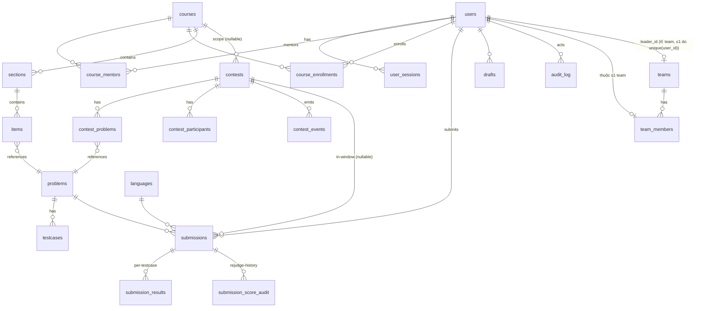

# BCN Judge — Thiết kế hệ thống

| | |
|---|---|
| Trạng thái | Bản nháp **v0.5** — 01/09/2026 (v0.2: áp dụng phản biện vòng 1; v0.3: áp dụng phản biện vòng 2 + rebase lên requirements v0.5 — xem §14; v0.4: delta **Team & Leader** theo requirements v0.7 — ADR-14, §2.8; v0.5: áp dụng phản biện **vòng 3** trên delta Team & Leader — xem §14) |
| Nguồn | `/sc:design` — hội đồng 3 đề xuất độc lập (reuse-first / security-first / product-first) + 3 giám khảo chấm chéo + phản biện; bản này khởi đi từ đề xuất thắng cuộc (reuse-first) và ghép các khuyến nghị của giám khảo |
| Yêu cầu gốc | `docs/requirements.md` **v0.7** (v0.4 chốt sidebar là **thanh icon ~48px + tooltip, bấm icon đổi nội dung khung đầu tiên**; v0.5 sửa 32 phát hiện của vòng review song song — thang điểm chuẩn hoá 0–100, cap testcase 10 MB/file · zip 64 MB · 128 MB/bài, run 6/phút, cap 3 PENDING/người, hai chế độ khung đầu. Thiết kế đã rebase theo v0.5 ở vòng 2 — §14; v0.6 tất toán ba nợ của vòng 2 — cuối §14; v0.7 thêm nhóm **FR-J Team & Leader** + 2 dòng ma trận quyền + US-12 + Q17 — phủ ở delta v0.7, §14) |

Quy ước: văn bản tiếng Việt; định danh code, tên bảng/cột, route, cờ docker, tên thư viện giữ nguyên tiếng Anh. Mọi ID `FR-*` / `NFR-*` / `US-*` / `Q*` tham chiếu `docs/requirements.md` v0.7.

---

## 0. Quyết định chính

Mỗi quyết định ghi theo dạng ADR: **Quyết định / Lý do / Phương án đã loại / Hệ quả**.

### ADR-1 · Stack & bố cục repo: sao chép stack imath-test, repo ba-cây, không monorepo workspaces

- **Quyết định**: React 19 + Vite 8 + TypeScript + Tailwind v4 cho SPA; Hono 4 + Drizzle ORM + Postgres 17 + Node 22 chạy bằng `tsx` cho API và worker; repo mô phỏng đúng bố cục ba-cây của imath-test (root SPA, `server/` tự cài riêng, không có `shared/` vì chưa cần engine dùng chung).
- **Lý do**: đội 1–2 người bán thời gian đang vận hành đúng stack này ở production (iexam.vn); script deploy, runbook, thói quen debug chuyển sang nguyên vẹn. Khoảng 1/3 v1 (auth, khoá học, render Markdown+KaTeX, deploy) đã có mẫu chín.
- **Phương án đã loại**: Next.js 16 + Prisma (question-generator) — framework khác họ, `AGENTS.md` của chính nó cảnh báo lệch training data; npm workspaces kiểu đề xuất security — thêm cấu trúc cho một SPA không tiêu thụ engine chung nào.
- **Hệ quả**: types API bị lặp giữa `src/types/api.ts` và server (đúng như imath làm) — chấp nhận, rẻ nhất cho 2 người.

### ADR-2 · Trình soạn code: CodeMirror 6

- **Quyết định**: CodeMirror 6 (`codemirror` meta + `@codemirror/lang-cpp`, `@codemirror/lang-python`, `@codemirror/search`, theme sáng/tối).
- **Lý do**: ~300 KB tree-shaken, cảm ứng và IME tiếng Việt tốt (FR-E9 yêu cầu editor *dùng được* dưới 900px), không cần web-worker plumbing, CSP giữ được `script-src 'self'`.
- **Phương án đã loại**: Monaco (~5 MB, worker + Vite plugin, README tự nhận không hỗ trợ mobile); Ace (legacy, IME yếu). Cả ba đề xuất và cả ba giám khảo đồng thuận — không có tranh chấp.
- **Hệ quả**: không có IntelliSense — chấp nhận, bài tập stdin/stdout không cần.

### ADR-3 · Split pane: tự viết `SplitPane` (~150 dòng), có spike cảm ứng trước khi chốt

- **Quyết định**: component tự viết dùng pointer events + `setPointerCapture` (một code path cho chuột lẫn cảm ứng), clamp tối thiểu 320px theo pixel, nhớ tỉ lệ qua localStorage. **Trước khi viết**: spike nửa ngày kéo vạch chia trên iPad + Android thật (kỷ luật ghép từ đề xuất product); nếu spike fail, fallback đã khoanh sẵn là `react-resizable-panels` với API component giữ nguyên hình dạng.
- **Lý do**: FR-E1 quy định tối thiểu **theo pixel** (~320px) trong khi `react-resizable-panels` ràng buộc theo phần trăm — 150 dòng tự sở hữu rẻ hơn việc đánh vật với ranh giới px/% và quirks iOS của thư viện.
- **Phương án đã loại**: `react-resizable-panels` làm mặc định (giữ làm fallback); `allotment`, `react-split-pane` (kém bảo trì / lỗi React 19).
- **Hệ quả**: đội tự chịu edge case kéo-thả; spike tuần 4 là cổng quyết định, ghi vào §11.

### ADR-4 · Cơ chế sandbox: Docker-per-submission qua dockerode, testcase vào bằng stdin

- **Quyết định**: mỗi submission một container (`sleep infinity` + `docker exec` từng phase), điều khiển bằng `dockerode` qua Docker Engine API; **giữ nguyên seccomp và AppArmor mặc định của Docker**; input testcase bơm qua stdin của exec — **không bao giờ tồn tại dưới dạng file trong container**; expected output không bao giờ vào container (so sánh ở worker).
- **Lý do**: Docker đã được BCN xác nhận có trên server (Q3); cơ chế này là một module (`judge/sandbox.ts`) + một `run.sh` ~50 dòng, không có profile seccomp/AppArmor tự chế nào phải bảo trì; stdin-delivery làm cho US-6 ("đọc thư mục testcase") bất khả thi về cấu trúc chứ không phải nhờ quyền file.
- **Phương án đã loại**: `ioi/isolate` trong container cứng hoá (đề xuất security) — bring-up gồm remount cgroup, CAP_SYS_ADMIN, AppArmor profile riêng, agent protocol riêng, tự ước lượng 10–14 tuần: vượt ngân sách 8 tuần và là đúng loại phức tạp mà đội 2 người không nên debug 8 giờ tối ngày contest (chính đề xuất đó thừa nhận fallback của nó là docker-run); judge0 (kéo theo Rails+Redis), nsjail (cần nới seccomp), gVisor (chậm 2–10× với workload syscall-nặng, phá công bằng TLE); mount thư mục testcase vào container (đề xuất product) — để hidden input nằm sau đúng một lớp quyền file 0640.
- **Hệ quả**: đo lường bằng GNU `time` + `memory.events` thay vì meta file của isolate — bù bằng bảng quyết định verdict kiểm thử từng dòng (§10); interface `sandbox.ts` được giữ hẹp để có thể thay isolate sau này nếu cần.

### ADR-5 · Ranh giới worker ↔ Docker: giữ `docker.sock` trong worker ở v1, bù bằng tách quyền DB + khoá userns

- **Quyết định**: socket Docker không bao giờ vào container `api`; worker nói chuyện Docker qua **`tecnativa/docker-socket-proxy` ngay trong v1** (sửa vòng 2 — nâng từ post-v1: một service compose, không đổi code worker; chỉ mở container create/exec/attach/wait/kill/remove + image inspect; socket thô chỉ mount vào proxy). Bù đắp bắt buộc trong v1: (a) **ba role Postgres** `bcn_migrate` / `bcn_app` / `bcn_worker` — worker **không có grant nào** trên `users`, `user_sessions`, ghi `settings`, `audit_log`; (b) provisioning đặt `user.max_user_namespaces=0` và giữ `kernel.apparmor_restrict_unprivileged_userns=1`; (c) worker không bao giờ nội suy dữ liệu người dùng vào chuỗi shell — chỉ argv array, source vào bằng tar bytes, input bằng stdin; (d) **secrets scoped theo service** (§8, sửa vòng 2): env của worker chỉ có `DATABASE_URL_WORKER` — không `SESSION_SECRET`, không `DATABASE_URL_APP`, không `POSTGRES_PASSWORD`.
- **Lý do**: đường Docker ≈ root trên host — thừa nhận thẳng, và phải nói cho đúng tầng (sửa vòng 2): **ba role PG chỉ chặn cú chiếm tầng SQL** (worker bị lừa chạy truy vấn sai chỗ), **không chứa được một RCE trong process worker** — RCE cầm được đường Docker là root host (đọc mọi testcase, đọc env, ghi đè tuỳ ý), và socket-proxy thu hẹp bề mặt nhưng *không đóng hẳn* (container create vẫn nhận `HostConfig.Binds` → bind mount `/` là chiếm host; proxy không lọc được body). Điều làm rủi ro chấp nhận được ở v1: bề mặt RCE của worker nhỏ (parse JSON/buffer thù địch, không eval, không deserialize mở), 300 tài khoản do admin cấp, có danh tính, thu hồi được (Q2), và secrets-scoping khiến RCE không nhặt thêm chìa khoá nào. Giám khảo bảo mật muốn loại socket hoàn toàn (agent + isolate); bản này theo đa số về tính khả thi 8 tuần và ghi disagreement tại §12.
- **Phương án đã loại**: agent TCP + isolate (xem ADR-4); worker trên host trong nhóm docker (vẫn root-equivalent, phá runbook compose); rootless Docker ngay trong v1 (mong manh với cgroup limits — nhưng là đường post-v1, xem Hệ quả).
- **Hệ quả**: trong v1, một RCE trong worker được coi là **chưa bị chứa ở tầng host** — tài liệu không tuyên bố khác đi. Đường chứa thật, post-v1 có tên: chạy runner dưới **rootless Docker / user daemon tách riêng**, hoặc tách worker sang **VPS judge riêng** (đường mở rộng tải §9 kiêm luôn đường bảo mật — máy judge không giữ secret nào ngoài `DATABASE_URL_WORKER`).

### ADR-6 · Hàng đợi: Postgres (`FOR UPDATE SKIP LOCKED` + `LISTEN/NOTIFY`), claim tuần tự hoá bằng advisory lock

- **Quyết định**: bảng `submissions` là hàng đợi; claim bằng CTE `SKIP LOCKED`, bọc trong `pg_advisory_xact_lock(hashtext('judge_claim'))` (ghép từ đề xuất security) để luật "một RUNNING mỗi người" (FR-F5) không còn race.
- **Lý do**: ≤ 1 submission/giây ở đỉnh; Postgres đã được backup, đã có transaction — thêm Redis/BullMQ là thêm một stateful service thứ hai để cài, giám sát, backup cho đúng cùng một việc.
- **Phương án đã loại**: Redis + BullMQ; RabbitMQ; hàng đợi in-memory (mất bài khi crash — vi phạm NFR-5).
- **Hệ quả**: advisory lock đưa claim về tuần tự (chi phí ms) — không đáng kể ở quy mô này; hai worker process vẫn cùng claim được. Sửa vòng 1: run **không còn ưu tiên tuyệt đối** trên submit — claim nhận băng ưu tiên theo slot, có luật đảo băng chống đói submit (§4.2), và luật một-RUNNING-mỗi-người áp **theo từng kind** (một submit RUNNING **và** một run RUNNING đồng thời mỗi người — đúng nguyên văn FR-F5 v0.5; sửa vòng 2: vòng 1 từng gộp hai kind vào một suất, làm run 30 s của member chặn chính submit contest của họ).

### ADR-7 · Realtime: SSE; kênh contest có bảng sự kiện bền với seq cursor

- **Quyết định**: SSE (`streamSSE` của Hono) cho verdict từng testcase và cập nhật bảng xếp hạng. Kênh submission replay từ `submission_results` (ghi trước, notify sau — không có khe hở). Kênh contest được lót bằng bảng **`contest_events`** (seq bigint identity) — reconnect bằng `Last-Event-ID` replay từ DB, purge sau 7 ngày (ghép từ đề xuất product: "no event is load-bearing only in memory" — đúng phút contest mở là lúc deploy blue/green không được phép nuốt sự kiện).
- **Lý do**: chỉ có luồng server→client; SSE là HTTP thuần qua Caddy sẵn có (một matcher `flush_interval -1`), tự reconnect. Polling 2 giây × 120 người là ~60 req/s vô ích đúng lúc VPS bận nhất; giữ polling làm đường lùi khi `EventSource` lỗi.
- **Phương án đã loại**: WebSocket (`@hono/node-ws` + upgrade + client lib cho zero lợi ích); polling-only.
- **Hệ quả**: thêm một bảng nhỏ + cron purge; đổi lại T0-unlock và standings không mất sự kiện qua deploy.

### ADR-8 · Lưu testcase: `bytea` trong Postgres

- **Quyết định**: input/expected của testcase là cột `bytea` trong bảng `testcases`; ảnh bài đọc cũng vào bảng `files`.
- **Lý do**: kích thước bị chặn (FR-D4 v0.5: 10 MB/file, zip upload ≤ 64 MB, 128 MB/bài — sửa vòng 2, trước đây trích bản cũ "vài MB" với cap tự đặt 16/200) → toàn bộ kho ~vài GB, tầm thường với TOAST. Đổi lại trên một VPS: **một artifact backup duy nhất** (`pg_dump` phủ cả DB lẫn testcase — NFR-7 trong một dòng cron), upload transactional (không file mồ côi), và **không một judge path nào cần host bind mount** — cái bẫy kinh điển "worker-trong-container đưa path của chính nó cho `docker run -v` nhưng daemon resolve theo host" bị *thiết kế loại bỏ*, không phải né tránh; input vào sandbox bằng stdin nên không có file để trộm.
- **Phương án đã loại**: file trên volume (đề xuất security/product) — cần path giống hệt giữa 3 container, backup hai artifact, quét mồ côi hằng đêm, và hai nguồn sự thật (product tự nhận là Risk 5 của nó); S3/R2 (phụ thuộc ngoài + secret + latency cho một công cụ CLB). Giám khảo thiên vận hành có thể thích file — disagreement ghi tại §12.
- **Hệ quả**: nếu tương lai cần testcase hàng trăm MB thì phải di trú ra file — chấp nhận, ngoài phạm vi CLB.

### ADR-9 · Bảng xếp hạng: truy vấn dẫn xuất on-demand; mốc thời gian = `received_at`

- **Quyết định**: standings là **một truy vấn SQL** trên submissions của contest (cache in-process 2 giây), không có bảng materialized, không có event-log điểm số. `received_at` do Postgres `now()` đóng dấu một lần lúc INSERT là chiếc đồng hồ duy nhất; predicate cửa sổ **không bao giờ** nhìn `finished_at` — bài nhận 19:59:58 chấm xong 20:00:10 vẫn tính (US-11, NFR-5). Sửa vòng 1 — **rejudge không bao giờ kéo submission rời `done`**: rejudge đi qua bảng `rejudge_queue` (§2.6), worker chấm *shadow attempt* (`attempt+1` trên PK `submission_results` sẵn có) trong khi verdict/`passed_weight` hiện hành vẫn phục vụ standings, rồi một transaction hoán đổi kết quả + ghi `submission_score_audit` — nếu flip về `pending` thì predicate `status='done'` sẽ làm bảng chung cuộc mất dòng suốt cửa sổ rebuild, đúng cái lỗi delete-and-rebuild mà ADR này tuyên bố loại bỏ.
- **Lý do**: ~75k dòng trường hợp xấu ≈ hàng chục ms; on-demand thì rejudge, sửa `end_at` giữa contest, freeze, practice mode đều **đúng theo cấu trúc** — không có gì để drift, không có cửa sổ rebuild sai bảng.
- **Phương án đã loại**: `contest_score_events` (đề xuất product) — cấu trúc dẫn xuất phải bảo trì: sửa `end_at` giữa chừng không được replay, rejudge có cửa sổ delete-and-rebuild trong đó bảng live sai. Thanh lịch nhưng là máy móc thừa ở ≤300 người; ICPC-flip của bản này retroactive y như vậy vì tính lại từ verdict + `received_at` đã lưu.
- **Hệ quả**: nếu một contest vượt ~2 000 người tham gia thì materialize đúng truy vấn này — đường nâng cấp một chiều, đã ghi chú; test §10.6 ghim thuộc tính "sửa `end_at` giữa contest vẫn đúng" để chống bị "tối ưu hoá" sau này.

### ADR-10 · Dữ liệu ẩn: kỷ luật không-bao-giờ-ghi cho output testcase ẩn

- **Quyết định** (ghép từ đề xuất product, nâng cấp thiết kế reuse): cột `stdout`/`stderr` của `submission_results` — những cột member có thể được serve — **NULL theo cấu trúc tại thời điểm ghi** cho mọi testcase ẩn; chỉ ghi cho testcase mẫu và run input tự nhập. Nhu cầu mentor xem "output của testcase ẩn fail đầu tiên" chuyển sang cột riêng `mentor_stdout` (≤4 KB), nằm ngoài whitelist member và typed `never` trong serializer member. Sửa vòng 1: run validate của mentor (`run_target='validate'`, §5) ghi `mentor_stdout` cho **mọi** testcase fail — US-2 cần match/diff từng test; vẫn chỉ là cột mentor-only, kỷ luật không-ghi cho cột member giữ nguyên.
- **Lý do**: biến NFR-2 từ lời hứa của serializer thành bất biến lúc ghi — bug serializer không thể rò cái chưa từng được lưu. Chi phí: một quyết định schema, zero runtime.
- **Phương án đã loại**: lưu chung một cột và tin serializer (reuse gốc) — bị hai giám khảo đánh dấu là bề mặt rò.
- **Hệ quả**: ba lớp phòng thủ độc lập: không-ghi (write-time) → whitelist serializer (type-level `never`) → canary test grep mọi byte member thấy (§10).

### ADR-11 · Topology deploy: một VPS, một compose, API blue/green, một worker

- **Quyết định**: Caddy (TLS + SPA static + proxy) → api-blue/api-green (blue/green, script copy từ imath) → Postgres 17; một service `worker` (không blue/green: SIGTERM → ngừng claim → chấm nốt → thoát; bài bị cắt được reaper nhặt lại — gián đoạn chấm ~1 phút khi deploy là chấp nhận được theo NFR-5).
- **Lý do**: blue/green worker mua ~50 giây đổi lấy gấp đôi bộ phận chuyển động — sai chiều đánh đổi cho đội này.
- **Phương án đã loại**: hai VPS (API/judge tách) — ghi làm đường mở rộng, chưa cần; Kubernetes/nomad — không bàn.
- **Hệ quả**: VPS 4 vCPU / 8 GB; sizing chi tiết §9.

### ADR-12 · Tái sử dụng nguyên vẹn từ imath-test (danh sách chốt)

- **Quyết định**: copy gần nguyên vẹn — `server/src/auth/{session,middleware,hash,routes}.ts` (đổi tên role), `lib/{apiResponse,rateLimit,parseBody,clientIp,cookies}.ts`, `db/{pool,migrate}.ts`, `config.ts` (zod-validate env, fail fast — bài học `AI_KEY_ENC_KEY`), pattern `app.ts` build-không-serve, `serialize/` discipline của `question.ts`; SPA: `vite.config.ts` (bỏ PWA/obfuscateMtef), `eslint.config.js` + `eslint-rules/` **verbatim** (cả `no-oversized-components` 250 dòng lẫn `no-regex-lookbehind` — NFR-8), bộ UI kit (`Button, Modal, Drawer, Toast, Badge, Input, Skeleton, ConfirmDialog`), renderer `src/components/math/{rendering,sanitize,loadKatex,katexOptions}.ts` (bỏ nhánh bảng biến thiên); hạ tầng: `Caddyfile`, `docker-compose*.yml`, `Dockerfile`, `deploy/{deploy,production-deploy,spa-release,provision-vps,check-migrations-safe,resource-monitor,test-zero-downtime}.sh`.
- **Lý do**: từng file đã qua sự cố production; kiểm kê tái sử dụng đã xác minh trước.
- **Phương án đã loại**: viết mới cho "sạch" — không có giá trị với đội này.
- **Hệ quả**: mọi khác biệt so với imath là chủ đích và được ghi trong tài liệu này.

### ADR-13 · TLE-skip: là setting admin, mặc định TẮT

- **Quyết định**: `tle_skip_threshold` trong `settings` (mặc định `0` = tắt): khi > 0, N testcase TLE **liên tiếp** thì các testcase còn lại đánh `TLE` với `detail='skipped_consecutive_tle'`, không chạy, không tính điểm.
- **Lý do**: FR-F2 quy định chấm **toàn bộ** testcase và điểm một phần là nền tảng chấm — mặc định phải tuân thủ (giám khảo coverage đánh lỗi đề xuất security vì bật mặc định). Nhưng một bài 20 test × 2 s của member đang loay hoay chiếm trọn một slot 40+ giây đúng giờ contest — admin cần cái van này (giám khảo vận hành yêu cầu). Setting hoá cả hai ý.
- **Phương án đã loại**: bật mặc định (lệch FR-F2); không có van (rủi ro NFR-4 giờ cao điểm).
- **Hệ quả**: khi bật, tài liệu mentor phải nói rõ; UI verdict hiển thị "bỏ qua sau N TLE liên tiếp".

### ADR-14 · Leader là chức danh trên team, không phải vai trò hệ thống; bất biến team thi hành ở tầng DB

- **Quyết định**: `users.role` giữ nguyên ba giá trị `('admin','mentor','member')` — **không** thêm `'leader'`. Leader là cột `teams.leader_id` (chức danh do admin gán — FR-J1); quyền leader là một guard đọc cộng thêm (`teamRole()`, §8) trên vài route dưới `/api/member`, không middleware vai trò mới, không nhánh serializer theo role mới. Hai bất biến của FR-J1 thi hành ở **Postgres**: *mỗi member ≤ 1 team* = `unique (user_id)` trên `team_members`; *leader phải là thành viên của chính team* = composite FK `teams (id, leader_id) → team_members (team_id, user_id)` `deferrable initially deferred` (§2.8).
- **Lý do**: §3 requirements v0.7 nói thẳng "Leader không phải vai trò hệ thống thứ tư", và toàn bộ guard / ma trận / serializer đã xây trên đúng ba vai trò — thêm vai trò thứ tư là đụng mọi `require*` + bảng test ma trận cho một quyền chỉ-đọc phạm vi hẹp, trong khi leader vẫn là member đang đi học (nộp bài, thi contest): vai trò kép buộc mô hình hoá bằng mảng role hoặc hai tài khoản, đều đắt hơn một cột. Bất biến đặt ở DB theo đúng tiền lệ composite-FK chống-lệch của §2.6: guard API có bug thì cấu trúc vẫn chặn — member trong 2 team hay leader đứng ngoài team **không thể tồn tại**, không phải "không nên tồn tại".
- **Phương án đã loại**: thêm `'leader'` vào `users.role` (phá "mỗi tài khoản có đúng một vai trò hệ thống" của requirements §3, nhân đôi guard); bảng `team_leaders` riêng (FR-J1 đòi đúng **một** leader — cột NOT NULL nói điều đó rẻ hơn một bảng + unique); thi hành app-level + test (khả thi, nhưng ở đây DB-level chỉ tốn một unique + một FK, không trigger — rẻ hơn cả bài test bảo vệ nó).
- **Hệ quả**: mutation team đi `tx()` (FK deferred kiểm ở commit — tạo team + dòng thành viên của leader trong một transaction); gỡ thành viên đang là leader bị FK chặn → API trả 409 `leader_must_be_member`, phải đổi leader trước — đúng UX FR-J1 "đổi leader bất kỳ lúc nào"; drizzle-kit không sinh `deferrable` — dòng SQL này viết tay trong file migration đã commit (additive, qua `check-migrations-safe.sh`). Vì leader đồng thời là member đang thi (chính lý do chọn chức danh thay vai trò), source bài nộp của đồng đội thuộc contest còn trong cửa sổ bị hoãn tới sau `end_at` (§5 — vòng 3, chặn kênh sao chép trong-contest phá FR-I5).

---

## 1. Stack & bố cục repo

**Stack** (giống imath-test ở mọi chỗ imath-test có lựa chọn):

| Tầng | Lựa chọn | Nguồn tái sử dụng |
|---|---|---|
| SPA | React 19 + Vite 8 + TypeScript + Tailwind v4 (`@tailwindcss/vite`), react-router-dom v7, zustand 5, @tanstack/react-query 5, lucide-react | imath-test root — `vite.config.ts` (bỏ PWA + obfuscateMtef), `eslint.config.js` + `eslint-rules/` verbatim |
| API | Hono 4 + `@hono/node-server`, Drizzle ORM 0.45 + `pg` 8, zod 3, `@node-rs/argon2` 2, Node 22, chạy bằng `tsx` (không build step) | `imath-test/server` — `app.ts` pattern, `lib/apiResponse.ts` (envelope `{success,data,meta}` v2), `lib/{rateLimit,parseBody,clientIp,cookies}.ts`, `db/{pool,migrate}.ts`, `config.ts`, `index.ts` (graceful shutdown), `auth/*` gần nguyên vẹn |
| Judge worker | Cùng package `server/`, entrypoint thứ hai `src/worker.ts`; `dockerode` ^4 + `tar-stream` ^3 nói chuyện với Docker qua `tecnativa/docker-socket-proxy` (ADR-5, vòng 2 — socket thô chỉ mount vào proxy) | mới (điểm duy nhất chưa có tiền lệ trong workspace) |
| Queue | Bảng Postgres + `FOR UPDATE SKIP LOCKED` + `pg_advisory_xact_lock` + `LISTEN/NOTIFY` | idiom transaction/advisory-lock từ imath (`db/pool.ts tx()`, `migrate.ts`) |
| Realtime | SSE (`hono/streaming` `streamSSE`) + bảng `contest_events` seq-cursor; fallback polling = chính JSON GET đó | thay thế poll loop `useExamEvents` của imath |
| Markdown+LaTeX | `marked` 18 + `katex` 0.17 + `dompurify` 3 + `highlight.js` 11 (core + c/cpp/python/java/javascript) | copy `src/components/math/*` của imath, bỏ nhánh bảng biến thiên, thêm code renderer highlight.js |
| Code editor | CodeMirror 6 (ADR-2) | mới |
| Proxy/TLS/deploy | Caddy + blue/green compose + deploy scripts | copy `server/{Caddyfile,docker-compose*.yml,Dockerfile}` + `server/deploy/*.sh`, đổi tên |

**Bố cục repo** (mô phỏng cấu trúc ba-cây của imath-test để script và config rơi vào đúng chỗ):

```
bcn-judge/
  package.json vite.config.ts tsconfig*.json eslint.config.js eslint-rules/   # cây SPA
  index.html src/ tests/                       # vitest glob tests/** như imath root
  server/                                      # package.json + node_modules riêng, như imath
    package.json tsconfig.json vitest.config.ts Dockerfile Caddyfile
    docker-compose.yml docker-compose.local.yml .env.example
    drizzle/                                   # SQL sinh ra, commit vào repo
    deploy/                                    # script copy (deploy.sh, production-deploy.sh, ...)
    src/
      app.ts index.ts worker.ts config.ts
      auth/{session,middleware,hash,routes}.ts # copy, đổi tên role
      db/{schema,pool,migrate,seed,grants}.ts  # grants.ts: 3 role PG (ADR-5)
      lib/{apiResponse,rateLimit,parseBody,clientIp,cookies,audit,zipImport}.ts
      routes/{admin/,mentor/,member/,health.ts}
      serialize/{problem,submission,contest}.ts + tests
      judge/{queue,sandbox,runner,compare,verdict,languages}.ts
      contest/{access,standings}.ts
      realtime/{bus,sse}.ts
    runner/
      images/{gcc/Dockerfile,python/Dockerfile,openjdk/Dockerfile,node/Dockerfile}
      images/common/run.sh                     # bake vào mọi image tại /opt/judge/run.sh
      abuse/                                   # fork bomb, flood, net, fs probe + suite
  docs/{requirements.md,design.md}
  scripts/run-local.sh                         # docker PG :5433 + migrate + seed + api + worker + vite
```

Một Docker image server phục vụ cả hai vai: service `api-*` chạy `node --import tsx src/index.ts`, service `worker` chạy `node --import tsx src/worker.ts`. Runner image tách riêng, nhỏ, theo ngôn ngữ (§3). Không dùng npm workspaces; types API mirror ở `src/types/api.ts` đúng như imath.

Tooling: `npm run dev` (Vite :5174 proxy `/api`,`/auth` → :8099), `bash scripts/run-local.sh` full stack, root `npm test` (tests/**), `cd server && npm test` (unit; `INTEGRATION=1` cần DB tên chứa `test`; `DOCKER=1` cho suite sandbox). Lint baseline **0** ngay từ đầu; hai rule ESLint custom ở mức error từ ngày một.

---

## 2. Mô hình dữ liệu

Quy ước copy từ imath: `id text primary key default gen_random_uuid()::text`, `citext` cho email/username/code, `timestamptz` mọi nơi, soft delete bằng `deleted_at`, enum bằng cột `text` + CHECK (thêm giá trị mới an toàn online dưới `check-migrations-safe.sh`). Schema Drizzle tại `server/src/db/schema.ts`; SQL do `drizzle-kit generate` sinh và commit.



### 2.1 Danh tính & phiên (copy imath)

- **users** — `id`, `email citext unique not null`, `username citext unique` (FR-A1 cho phép email *hoặc* tên đăng nhập), `display_name text not null`, `role text not null check (role in ('admin','mentor','member'))`, `password_hash text`, `hash_algo text` (chỉ `'argon2id'`; bỏ nhánh firebase_scrypt), `must_change_password boolean not null default true` (FR-A2), `totp_secret text` (giữ TOTP admin tuỳ chọn của imath), `disabled boolean not null default false` (FR-A4: khoá vẫn giữ bài nộp/tiến độ), `created_at`, `last_login`, `deleted_at`. Index `(role)`.
- **user_sessions** — verbatim imath: `token_hash bytea pk` (SHA-256 của token ngẫu nhiên 32 byte; token thô chỉ nằm trong cookie httpOnly), `user_id fk cascade`, `created_at`, `expires_at`, `revoked_at`, `ip inet`, `user_agent`. Index `(user_id)`. Logout = revoke (FR-A1).
- Không có bảng `password_resets` trong v1 — không có hạ tầng email; admin reset = đặt mật khẩu sinh sẵn + `must_change_password` (FR-A3).

### 2.2 Khoá học & nội dung

- **courses** — `id`, `code citext unique not null` (mã ngắn, kiêm mã tự-ghi-danh FR-B4), `name text not null`, `description_md text`, `status text not null default 'draft' check (status in ('draft','open','archived'))` (FR-B1/B7), `self_enroll boolean not null default false` (FR-B4, S), `created_by fk users`, `created_at`, `updated_at`, `archived_at`.
- **course_mentors** — PK ghép `(course_id fk cascade, user_id fk cascade)`, `assigned_by`, `assigned_at` (FR-B2).
- **course_enrollments** — `id`, `course_id fk`, `user_id fk`, `status text not null default 'active' check (status in ('active','removed'))`, `enrolled_by`, `enrolled_at`, `removed_at`; `unique (course_id, user_id)`; index `(user_id, status)`. Gỡ ghi danh = flip status; bài nộp không đụng tới (FR-B3). Mẫu từ `class_enrollments` của imath.
- **sections** — `id`, `course_id fk cascade`, `title text not null`, `position int not null`, timestamps. Index `(course_id, position)`. Không unique trên position → reorder (FR-C1 lên/xuống M, kéo thả S) = một batch UPDATE trong `tx()` không phải nhảy múa constraint.
- **items** — `id`, `section_id fk cascade`, `kind text not null check (kind in ('lesson','problem'))`, `title text not null`, `position int not null`, `status text not null default 'draft' check (status in ('draft','published'))` (FR-C3), `visible_from timestamptz` (FR-C4, S), `lesson_body_md text`, `problem_id fk problems`, timestamps; `check ((kind='lesson') = (problem_id is null))`. Bài đọc là nội dung inline thuộc khoá (FR-C2); **bài tập là tham chiếu, không bao giờ sao chép** — chính quyết định đó *là* FR-D8: cùng một dòng `problems` xuất hiện trong nhiều items và nhiều `contest_problems`, sửa testcase một nơi lan mọi nơi, rejudge (FR-D9) có một mái nhà duy nhất. Index `(section_id, position)`.

### 2.3 Ngân hàng bài & testcase

- **problems** — `id`, `title text not null`, `statement_md text not null`, `input_desc_md`, `output_desc_md`, `constraints_md`, `examples jsonb not null default '[]'` (`[{input, output, explanation}]` — ví dụ minh hoạ của FR-D1, tách khỏi testcase mẫu có chấm điểm), `time_limit_ms int` (NULL → default hệ thống), `memory_limit_mb int` (NULL → default) (FR-D1), `difficulty text check (difficulty in ('easy','medium','hard'))`, `tags text[] not null default '{}'`, `allowed_language_ids text[]` (NULL → mọi ngôn ngữ đang bật; FR-D2), `compare_mode text not null default 'trim' check (compare_mode in ('trim','exact','float'))` + `float_eps double precision` (FR-D5: 'trim' M, 'exact' S, 'float' để sẵn schema cho C), `starter_code jsonb not null default '{}'` (`{languageId: source}`, FR-D3 S), `solution_language_id text`, `solution_source text` (FR-D6/D7 — chỉ mentor thấy qua serializer), `solution_visibility text not null default 'mentor' check (solution_visibility in ('mentor','after_ac','after_contest'))` (FR-D7 + mức S), `testcase_rev int not null default 1` (bump khi testcase đổi; submission chụp lại nó → hiện banner "chấm trên bộ test cũ" và dẫn tới rejudge), `validated_testcase_rev int`, `validated_at timestamptz` (FR-D6 — ghi khi một lần validate xanh trên toàn bộ testcase, giữ ngoài `submissions` vì kết quả run bị purge 24 h; dùng cho **cổng mềm** khi publish — sửa vòng 2 theo đúng FR-D6 v0.5: chưa từng validate / validate gần nhất fail / `validated_testcase_rev ≠ testcase_rev` hiện hành → 409 kèm cảnh báo, đi tiếp với `confirm:true`, không chặn cứng — §5), `scope_course_id fk courses` (**NULL = ngân hàng toàn CLB**, admin + người tạo sửa; **non-NULL = thuộc khoá đó**, mentor của khoá sửa — đây là luật ai-được-sửa-bài-dùng-chung mà giám khảo yêu cầu ghi rõ), `created_by`, `created_at`, `updated_at`, `deleted_at`. Index `(scope_course_id)`, GIN trên `tags`.
- **testcases** — `id`, `problem_id fk cascade`, `position int not null`, `kind text not null check (kind in ('sample','hidden'))`, `weight int not null default 1` (FR-D4), `input bytea not null`, `expected bytea` (**nullable — sửa vòng 2** cho FR-D6 S "testcase chỉ có input, generate điền expected": bài còn testcase `expected IS NULL` bị chặn cứng ở publish item/contest — guard §5; validate `generate=true` là đường điền), `input_bytes int not null`, `expected_bytes int`, `input_sha256 bytea not null`, `created_at`, `updated_at`. Index `(problem_id, position)`.

**Blob testcase sống ở đâu: Postgres `bytea` — đã chốt (ADR-8).** Cap thi hành trong `settings`, khớp nguyên văn FR-D4 v0.5 (sửa vòng 2): 10 MB/file, 128 MB/bài, file zip upload ≤ 64 MB; lỗi vượt cap **nêu rõ file nào vượt**. Quy mô CLB ~200 bài × 20 test × ~200 KB median ≈ vài GB — thoải mái với TOAST. Ảnh bài đọc (FR-C2) cùng luật: bảng **files** — `id`, `kind text check (kind in ('image'))`, `bytes bytea not null`, `mime`, `width`, `height`, `sha256 bytea`, `created_by`, `created_at`; serve tại `GET /api/files/:id` với `Cache-Control: private, max-age=31536000, immutable`; resize ≤1000px qua `sharp` (module ảnh của imath, sink R2 thay bằng bảng này). Truy cập file là **id-capability có chủ đích**: bất kỳ user đã đăng nhập nào cầm UUID (không đoán được, không liệt kê được) đều đọc được — không authz theo khoá/item; đổi lại `Cache-Control: private` để proxy chung không giữ bản sao (sửa vòng 1). **Giới hạn nói thẳng (vòng 2)**: mô hình id-capability **không tương thích với nội dung embargo nằm trong ảnh** — UUID chỉ lộ qua `statement_md` (member chưa thấy đề thì chưa có id), nhưng một ảnh *tái sử dụng* từ nội dung đã công khai thì người từng thấy nó vẫn đọc được; quy ước soạn bài bắt buộc (ghi trong Trợ giúp mentor, §6): **đề contest embargo không được đặt nội dung quyết định chỉ trong ảnh** — văn bản đề phải tự đủ, ảnh cho đề embargo phải là ảnh upload mới, không tái sử dụng.

### 2.4 Ngôn ngữ & cấu hình

- **languages** — `id text pk` (`'c11'`,`'cpp17'`,`'python3'`,`'java17'`,`'node20'`), `name`, `version_label`, `image text not null` (vd `ghcr.io/nvhbmt/bcnjudge-runner-gcc:14`), `source_filename text not null` (`main.c`), `compile_argv jsonb` (string[]; NULL = không biên dịch), `run_argv jsonb not null` (string[] với placeholder `{memory_mb}`/`{time_s}` — Java cần `-Xmx{memory_mb}m`), `time_factor numeric(4,2) not null default 1` (FR-D2: Python ×3), `memory_extra_mb int not null default 0` (python3 +32, java +256), `cm_mode text` (id ngôn ngữ CodeMirror), `enabled boolean not null default false`, `position int`. Seed: c11, cpp17, python3 bật (FR-F7 M); java17, node20 có sẵn nhưng tắt (S). Thêm Go = INSERT một dòng + build/pull image — **zero deploy app** (FR-H1, NFR-9, US-8).
- **settings** — `key text pk`, `value jsonb`, `updated_at`, `updated_by`. Keys: `default_time_limit_ms` (1000), `default_memory_limit_mb` (256), `max_source_bytes` (65536), `max_custom_input_bytes` (65536), `submissions_per_minute` (6), `runs_per_minute` (6 — FR-F5/FR-H2 v0.5; sửa vòng 2, trước đây 12), `max_pending_submissions_per_user` (3 — FR-F5 v0.5, cap PENDING mỗi người; sửa vòng 2, câu M này trước đây bị bỏ sót), `max_output_bytes` (8388608), `compile_time_limit_ms` (15000), `compile_memory_mb` (1024), `max_testcase_file_bytes` (10485760 — FR-D4 v0.5), `max_testcases_total_bytes_per_problem` (134217728 — FR-D4 v0.5), `max_zip_bytes` (67108864 — FR-D4 v0.5), `tle_skip_threshold` (0 = tắt, ADR-13), `judge_paused` (false), `banner` (FR-H5 S), `discord_kick_locks_password_accounts` (false — bộ quét Discord `auth/discordSweep.ts` có khoá cả tài khoản có mật khẩu không; kết quả lượt quét gần nhất ghi ở khoá `discord_sweep_last`, ngoài `JudgeSettings`). Phủ FR-H2/F5.

### 2.5 Contest

- **contests** — `id`, `course_id fk courses` (**NULL = toàn CLB** — Q12 là giá trị cột, không phải câu hỏi schema), `title`, `description_md`, `start_at timestamptz not null`, `end_at timestamptz not null` (`check (end_at > start_at)`), `status text not null default 'draft' check (status in ('draft','published'))` (FR-I2; *Sắp diễn ra / Đang diễn ra / Đã kết thúc* **dẫn xuất** từ thời gian — không bao giờ lưu, đồng hồ là thẩm quyền duy nhất, FR-I1), `scoring text not null default 'sum_score' check (scoring in ('sum_score','icpc'))` + `penalty_minutes int not null default 20` (Q13 flip bằng đổi một giá trị dòng; ICPC chỉ cần verdict + received_at vốn đã lưu), `sequential boolean not null default false` (FR-I8 / Q15), `freeze_minutes int not null default 0` (FR-I10 S / Q14), `created_by`, timestamps, `deleted_at`. Index `(status, start_at)`.
- **contest_problems** — `id`, `contest_id fk cascade`, `problem_id fk`, `position int not null`, `label text` ('A','B',…), `max_score int not null default 100` (FR-I2); `unique (contest_id, problem_id)`; index `(contest_id, position)`.
- **contest_participants** (ghép từ đề xuất security) — PK `(contest_id fk cascade, user_id fk)`, `first_opened_at timestamptz not null default now()`. Tạo lười khi member mở contest lần đầu. Cho FR-I7 phân biệt *chưa từng mở* với *mở rồi nhưng chưa nộp*, và trồng sẵn dòng cần thiết nếu Q14 flip sang khung giờ tính theo từng người (thêm cột `started_at` sau, không phá schema).
- **contest_events** (ADR-7) — `seq bigint generated always as identity pk`, `contest_id fk cascade`, `kind text` (`'started'`,`'standings.changed'` — **bỏ `'ended'`, sửa vòng 2**: không component nào phát nó và không client nào được phép chờ nó — đúng lớp lỗi "sự kiện không ai phát" mà fix vòng 1 #15 xử cho `'started'`; practice mode là dẫn xuất cấu trúc theo giờ + countdown `meta.serverTime`, §7), `payload jsonb`, `created_at`. Index `(contest_id, seq)`; unique partial `(contest_id, kind) where kind = 'started'`. Chỉ là **phương tiện vận chuyển SSE có replay** — *không phải* nguồn sự thật điểm số (ADR-9). Người phát `'started'` có tên (sửa vòng 1): **API chèn lười, idempotent** (unique partial ở trên nuốt va chạm) tại request hợp lệ đầu tiên chạm contest sau `start_at` — vẫn không có timer server-side; client chưa chạm thì countdown + refetch theo `meta.serverTime` tự đứng vững (§4.3). Purge sau 7 ngày (worker main loop, §3).

### 2.6 Bài nộp & chấm

- **submissions** — `id`, `seq bigint generated always as identity unique` (thứ tự FIFO + cursor SSE), `kind text not null check (kind in ('submit','run'))` (chạy thử dùng chung bảng + queue; FR-F1), `user_id fk not null`, `problem_id fk not null`, `item_id fk items` (ngữ cảnh khoá, nullable), `contest_id fk`, `contest_problem_id fk` (cả hai NULL ngoài contest; FR-I4), `language_id fk not null`, `source text not null`, `source_bytes int not null`, `custom_input bytea` (run với input tự nhập; FR-F1b), `run_target text check (run_target in ('samples','custom','validate'))` (chỉ run; `'validate'` = FR-D6 chấm lời giải mẫu trên **toàn bộ** testcase — sửa vòng 1, trước đây không có giá trị nào cho hình dạng run này), `status text not null check (status in ('pending','running','done'))`, `verdict text check (verdict in ('AC','WA','TLE','MLE','RE','CE','IE'))`, `passed_weight int`, `total_weight int` (FR-F2 v0.5 — **điểm bài chuẩn hoá 0–100**: `score = round(passed_weight::numeric / total_weight × 100, 2)`, **dẫn xuất một chỗ** trong serializer + SQL leaderboard, không lưu cột; điểm contest = passed/total × max_score làm tròn 2 chữ số, FR-I5. Sửa vòng 2: bản trước ghi "điểm = Σ trọng số test AC" thô — thiếu chuẩn hoá ×100 làm bài 20 test nặng gấp 20 lần bài 1 test trong tổng khoá), `time_ms_max int`, `memory_kb_max int`, `compile_output text` (≤64 KB), `testcase_rev int` (rev của bài lúc chấm), `received_at timestamptz not null default now()` (**mốc thời gian contest duy nhất**, NFR-5), `started_at`, `finished_at`, `queued_ms int`, `judge_ms int` (NFR-10), `worker_id text`, `heartbeat_at timestamptz`, `attempt int not null default 0`, `priority smallint not null default 1` (0=run, 1=submit **và** validate — sửa vòng 1; rejudge không đi qua priority nữa mà qua bảng `rejudge_queue` bên dưới), `ie_reason text`, `ie_retry boolean not null default true`.
  Toàn vẹn tham chiếu contest (sửa vòng 1, chống gian lận điểm ở tầng DB): `contest_problems` có `unique (id, problem_id)` và submissions mang composite FK `(contest_problem_id, problem_id) references contest_problems (id, problem_id)` — một submission **không thể** trỏ contest problem A mà chấm bài B, kể cả khi guard API có bug; items cùng mẫu: `unique (id, problem_id)` + composite FK `(item_id, problem_id)`.
  Indexes: partial `(priority, seq) where status='pending'` (claim); `(user_id, problem_id, seq desc)` (lịch sử FR-G1); `(contest_id, contest_problem_id, user_id, received_at)` (standings); `(problem_id, seq desc)` (mentor duyệt FR-G3); partial `(heartbeat_at) where status='running'` (reaper); partial `(received_at) where kind='run'` (purge run sau 24 h).
- **submission_results** — PK `(submission_id, attempt, position)`; `testcase_id fk testcases on delete set null` (giữ lịch sử khi testcase bị xoá — chốt điểm giám khảo hỏi; `position`, `is_sample` là snapshot lúc chấm nên dòng vẫn tự đủ nghĩa), `is_sample boolean not null`, `verdict text not null check (verdict in ('AC','WA','TLE','MLE','RE','IE'))`, `time_ms int`, `memory_kb int`, `exit_code int`, `term_signal int`, `detail text` (`output_limit`, `skipped_consecutive_tle`, tên signal… — cột lưu đủ cho mentor; member chỉ thấy `detail` của test **mẫu**, test ẩn bị serializer rút về token chung không exit code/tên signal — §5, sửa vòng 2), `stdout text`, `stderr text` (**cột member có thể được serve — theo ADR-10 chỉ được ghi cho `is_sample=true` hoặc run input tự nhập; với testcase ẩn NULL theo cấu trúc**; cap 64 KB / 8 KB), `mentor_stdout text` (≤4 KB/test; với submit: chỉ testcase ẩn **fail đầu tiên**; với run validate: **mọi** testcase fail — ADR-10 sửa vòng 1; chỉ mentor/admin thấy, typed `never` trong serializer member), `first_diff_line int`. Giữ `attempt` trong PK → kết quả trước-rejudge tồn tại vĩnh viễn (FR-D9 "kết quả cũ giữ trong lịch sử").
- **submission_score_audit** — theo mẫu `score_recompute_audit` của imath, kèm trigger append-only: `id`, `submission_id`, `verdict_before/after`, `passed_weight_before/after`, `reason` (`'rejudge:testcase_rev 3→4'`, `'manual'`), `actor`, `at`. Rejudge ghi mỗi submission một dòng.
- **rejudge_queue** (sửa vòng 1, ADR-9; **vòng đời claim riêng — sửa vòng 2**) — `submission_id fk pk`, `requested_at`, `actor`, `reason`, `claimed_by text`, `claimed_at timestamptz`, `shadow_attempt int`. Claim = `UPDATE ... SET claimed_by=$me, claimed_at=now(), shadow_attempt=<max(attempt) hiện có + 1> WHERE claimed_by IS NULL` (`FOR UPDATE SKIP LOCKED`, transaction ngắn — **không** giữ row lock suốt lượt chấm, **không** delete-on-claim), **chỉ khi cả hai băng run/submit trống**; số shadow attempt cấp *tại claim* nên hai slot không bao giờ va PK `(submission_id, attempt, position)`. Reaper riêng: `claimed_at < now()−5min` ∧ claimer mất heartbeat (bảng `workers`) → `claimed_by=NULL` — worker chết giữa shadow attempt thì rejudge được worker khác nhặt lại, không biến mất không dấu vết (submission vẫn `done` nên reaper thường không nhìn thấy nó). Hoàn tất: transaction hoán đổi kết quả (§7) DELETE dòng queue. **Fencing của shadow write dùng predicate riêng** `WHERE rejudge_queue.claimed_by = $me` — predicate `status='running'` của §3.2 chỉ áp cho attempt thường (sửa vòng 2: hai câu vòng 1 mâu thuẫn trực diện — submission rejudge nằm ở `done`, áp predicate 'running' thì mọi shadow write khớp 0 hàng và rejudge không bao giờ chạy được). Submission không bao giờ rời `status='done'` vì rejudge.
- **drafts** — PK `(user_id, problem_id, language_id)`; `source text`, `updated_at` (FR-E6 S đồng bộ server; nháp local là localStorage). **Chặn kênh ghi vô hạn (sửa vòng 2)**: `problem_id`/`language_id` là FK thật; `source` cap `max_source_bytes` (413 khi vượt); PUT đòi quyền thấy bài (item published đã ghi danh / contest trong phạm vi — cùng guard suy-từ-handle của đường submit, §5) nên không tồn tại draft cho bài không được thấy; xô rate riêng 30/phút; tối đa 50 dòng/user (LRU server-side, khớp cap trình duyệt của FR-E6 v0.5).
- **workers** — `id text pk` (hostname+pid), `slots int`, `version text`, `started_at`, `last_seen_at`. Heartbeat 10 s; trang FR-H3 đọc bảng này.
- **audit_log** — `id`, `actor_id`, `action text`, `entity_type`, `entity_id`, `before jsonb`, `after jsonb`, `ip inet`, `at` (FR-H4 S; helper `lib/audit.ts` gọi từ mutation mentor/admin; bảng có từ v1, độ phủ tăng dần).

### 2.7 Dẫn xuất chứ không lưu (ít bất biến để vỡ hơn ở ≤300 người)

- **Tiến độ** (FR-G2/G4/B5): `DISTINCT ON (user_id, problem_id)` trên submissions **mang `item_id` thuộc items đã xuất bản của khoá** (chốt vòng 2 — FR-D8 chia sẻ bài theo *tham chiếu*: AC cùng `problem_id` trong contest CLB hay khoá khác **không** tự cộng vào khoá này; `item_id` sinh ra chính để mang ngữ cảnh đó, index sẵn). Ma trận 300×50 gộp ~50k dòng trong hàng chục ms.
- **Bảng xếp hạng contest** (FR-I5): một truy vấn SQL (§7), cache 2 s. Không bảng `contest_scores`, không job rebuild; rejudge nhất quán theo cấu trúc.
- **Bảng xếp hạng khoá** (FR-G6): cùng họ truy vấn — trên submissions mang `item_id` của các bài tập đã xuất bản trong khoá (**cùng phạm vi ngữ cảnh với Tiến độ** — chốt vòng 2), mỗi (user, problem) lấy submission tốt nhất; `best_points` = **tỉ lệ testcase đúng × điểm tối đa theo độ khó** (v0.8: `round(passed/total × max_points, 2)`, `max_points` = `CASE difficulty` đọc từ settings `points_easy/medium/hard/unset` ngay trong SQL — `lib/settings.ts::maxPointsSql`, bản TypeScript `maxPointsFor` có test canh khớp; trước v0.8 là thang 0–100 của FR-F2 v0.5); xếp theo `sum(best_points) desc, count(verdict='AC') desc, last_gain asc` (v0.8 đảo hai khoá đầu — điểm trước AC, vì bài khó đáng nhiều điểm hơn), trong đó `last_gain` = **thời điểm submission cuối cùng làm tăng điểm của user** (MAX theo user; ASC giữa các user — sớm hơn xếp trên; một định nghĩa duy nhất dùng chung với §7, sửa vòng 1). Route §5; cập nhật qua invalidation react-query khi có verdict (§6).

**Kiểm tra flip Q12–Q15**: Q12 = tính NULL của `course_id`; Q13 = giá trị `scoring` (+`penalty_minutes` có sẵn); Q14 = `start_at/end_at` là mốc bất kỳ (contest 2 giờ chỉ là cửa sổ ngắn hơn; núm vặn tải là `WORKER_SLOTS`, không phải schema) + `contest_participants` trồng sẵn cho khung giờ per-user; Q15 = boolean `sequential`. **Không câu nào cần migration để flip.** **Q17 (v0.7)**: vế *team theo khoá* cũng chỉ là tính NULL của `teams.course_id` (§2.8); vế *member nhiều team* là ngoại lệ có tên duy nhất — cần một migration mô tả trước ở §2.8 (an toàn online nhưng là DROP CONSTRAINT — đi qua lối tay của gate chỉ-additive §9, sửa vòng 3), không rewrite dữ liệu.

### 2.8 Team & Leader (FR-J — requirements v0.7)

- **teams** — `id`, `name text not null`, `description_md text`, `leader_id text not null` (composite FK bên dưới — **đúng một leader, là thành viên của team**, FR-J1), `course_id fk courses` (**NULL = team toàn CLB — giá trị duy nhất ở v1**; cột trồng sẵn cho Q17 theo đúng mẫu Q12 của `contests.course_id`), `created_by fk users`, `created_at`, `updated_at`. Xoá team là DELETE thật (cascade sang `team_members`, ghi `audit_log`): không bảng chấm nào trỏ vào teams, nên FR-J1 "xoá team hay gỡ thành viên không ảnh hưởng bài nộp và tiến độ" đúng **theo cấu trúc**, không cần soft delete.
- **team_members** — PK ghép `(team_id fk teams on delete cascade, user_id fk users)`, **`unique (user_id)`** (mỗi member ≤ 1 team — FR-J1/Q17, thi hành DB-level), `added_by`, `added_at`.
- **Bất biến leader-là-thành-viên: DB-level, đã chọn có lý do (ADR-14)** — `teams` mang composite FK `(id, leader_id) references team_members (team_id, user_id) deferrable initially deferred`. Chọn DB-level thay vì app-level+test vì đúng tiền lệ §2.6 (composite FK giữ bất biến kể cả khi guard API có bug) với chi phí một dòng SQL viết tay trong migration; `deferred` để giải vòng tròn teams ↔ team_members: tạo team + dòng thành viên của leader trong **một** `tx()`, FK kiểm ở commit. Hệ quả thao tác: gỡ thành viên đang là leader → FK chặn (409 `leader_must_be_member`, đổi leader trước); đổi leader = một UPDATE `leader_id`, commit fail nếu leader mới chưa là thành viên.
- **Không cột dữ liệu chấm nào ở đây** (nối dài §2.7): bảng tiến độ team FR-J2 là **dẫn xuất** — cùng họ truy vấn tiến độ/leaderboard khoá, thêm join `team_members`, phạm vi ngữ cảnh `item_id` giữ nguyên (§2.7); tình trạng contest đang diễn ra (đã nộp/chưa, điểm hiện tại) từ submissions trong cửa sổ + `contest_participants` + truy vấn §7 lọc theo danh sách thành viên. Không bảng điểm team → không drift, rejudge tự nhất quán.
- **Kiểm tra flip Q17** (giả định của requirements đổ thì sao): (a) *team theo khoá* — đã là giá trị cột `course_id` (NULL → non-NULL, zero migration — mẫu Q12); (b) *một member thuộc nhiều team* — **một migration mô tả trước, an toàn online nhưng KHÔNG additive (sửa vòng 3)**: drop unique `team_members (user_id)` (PK ghép `(team_id, user_id)` sẵn có trở thành ràng buộc duy nhất) — DROP CONSTRAINT cần lối đi tay qua gate chỉ-additive `check-migrations-safe.sh` của §9, đúng như dòng `deferrable` viết tay của ADR-14; dữ liệu v1 thoả ràng buộc lỏng hơn một cách tầm thường, không rewrite. **Tổ hợp (a)+(b)** — team theo khoá VÀ member nhiều team cùng lúc — không giữ được bất biến "≤1 team mỗi khoá" chỉ bằng hai bước trên: `course_id` nằm trên `teams`, không biểu diễn được unique per-course trên `team_members` mà không denormalize; khi cả hai flip cùng lúc cần thêm cột `course_id` denormalize trên `team_members` + `unique (user_id, course_id)` — vẫn additive, mô tả trước cho trung thực (vòng 3); (c) *mentor cũng gán leader* — thuần route/guard, không đụng schema. FR-J5/J6 (S, hoãn — §13): `?groupBy=team` trên standings là biến thể truy vấn §7, ghi chú nhắc nhở là bảng `team_notes` additive thêm sau — cả hai không nợ schema.

---

## 3. Sandbox & judge worker

Worker (`server/src/worker.ts`) là một process Node trong một service compose, cùng image với API, nói chuyện Docker qua `docker-socket-proxy` (`DOCKER_HOST=tcp://docker-proxy:2375` — ADR-5, vòng 2; socket thô chỉ mount vào proxy). Nói chuyện với Docker Engine API bằng `dockerode` (không dùng CLI: khỏi nhét 60 MB docker-cli vào image; `putArchive`/`exec`/`wait`/`kill` là first-class với stream). Chạy `WORKER_SLOTS` (mặc định 2) slot async song song; mỗi slot sở hữu tối đa một container sandbox. Vòng lặp chính của worker kiêm việc vệ sinh mỗi giờ (hai DELETE idempotent — an toàn nếu sau này thêm worker service thứ hai; sửa vòng 1, trước đây không ai được nêu tên làm việc này): xoá run cũ hơn 24 h và `contest_events` cũ hơn 7 ngày. **Khi một lần gọi sandbox thất bại, worker log kèm dòng lệnh `docker run`/`docker exec` tương đương** (ghép từ đề xuất product) — giữ stream-handling của dockerode nhưng có lệnh copy-paste được lúc debug 11 giờ đêm.

### 3.1 Images

Một image mỗi ngôn ngữ, build từ `runner/images/*/Dockerfile`, đẩy lên GHCR, pin bằng tag trong `languages.image`:

- `bcnjudge-runner-gcc:14` — `debian:bookworm-slim` + `gcc g++ time procps util-linux coreutils` (~450 MB) — phục vụ c11 + cpp17
- `bcnjudge-runner-python:3.12` — `python:3.12-slim` + `time procps` (~180 MB)
- `bcnjudge-runner-openjdk:17`, `bcnjudge-runner-node:20` — build sẵn, tắt mặc định (S)

Mọi image bake `/opt/judge/run.sh` (root-owned, **0700** — uid 1000 không đọc được, chặn exfil nguyên văn qua `#embed`/`.incbin`; cơ chế của run.sh vẫn coi như công khai, không dựa vào obscurity — sửa vòng 1; ~50 dòng POSIX sh — toàn bộ phần judge trong container). **Khởi động worker: probe từng ngôn ngữ đang bật bằng một lần biên dịch hello-world thật trong sandbox** (ghép từ đề xuất security — mạnh hơn `docker image inspect`: bắt được image tồn tại nhưng không biên dịch nổi); ngôn ngữ fail bị tắt trong config in-memory + cảnh báo trên trang admin thay vì xả một chuỗi IE vào member (FR-H3/FR-F8).

### 3.2 Vòng đời container (một container mỗi submission)

Cờ `docker create` (đặt qua `HostConfig` của dockerode):

```
--init                                   # tini làm PID 1, gặt zombie fork-bomb
--network none                           # NFR-1: không mạng, không bao giờ
--read-only                              # rootfs bất biến
--tmpfs /w:rw,nosuid,nodev,size=64m,uid=1000,gid=1000,mode=0755   # workdir: source + artifact
                                         #  biên dịch — uid sandbox SỞ HỮU /w (sửa vòng 2, xem phase 1)
--tmpfs /tmp:rw,noexec,nosuid,nodev,size=16m,mode=1777  # scratch ghi được duy nhất
--memory 1024m --memory-swap 1024m       # trần biên dịch; không swap
--cpus 1.0
--cpuset-cpus 2  (slot 2: core 3)        # pin core cho đo thời gian ổn định (ghép từ security);
                                         #  slot 3 (nếu bật) chạy KHÔNG pin — chính sách §9
--pids-limit 64                          # chốt chặn fork bomb (cgroup per-container;
                                         #  KHÔNG dùng --ulimit nproc — đếm per-UID toàn host,
                                         #  hai sandbox chạy song song sẽ bóp cổ nhau)
--ulimit nofile=64:64 --ulimit core=0:0
--ulimit fsize=<max_output_bytes+1MB>    # chặn mọi file chương trình ghi (kể cả /tmp)
--ulimit stack=268435456:268435456
--cap-drop ALL --cap-add SETUID --cap-add SETGID --cap-add KILL   # đúng thứ run.sh cần
--security-opt no-new-privileges
--ipc none
--oom-score-adj 500                      # host thiếu RAM thì kill sandbox trước Postgres
--label bcnjudge.worker=<workerId> --label bcnjudge.submission=<id>
--workdir /w  --user 0:0  --hostname sandbox
--env PATH=/usr/bin:/bin --env HOME=/tmp --env LANG=C.UTF-8
--env PYTHONDONTWRITEBYTECODE=1 --env PYTHONIOENCODING=utf-8 --env OMP_NUM_THREADS=1
<image> sleep infinity
```

**Seccomp và AppArmor mặc định của Docker giữ nguyên** (chặn `mount`, `keyctl`, clone user-namespace…— tuyệt đối không đặt `unconfined` ở đâu). Tầng host (ADR-5): `user.max_user_namespaces=0`, `kernel.apparmor_restrict_unprivileged_userns=1` trong `provision-vps.sh`.

**Các phase mỗi submission:**

1. **Nạp source** — worker dựng tar in-memory (`tar-stream`): `main.c` (tên từ `languages.source_filename`), uid 0 / gid 0 / mode 0644, `putArchive` vào `/w`. **`/w` thuộc uid 1000 (sửa vòng 2 — blocker)**: bản trước để `/w` root 0755 *và* biên dịch dưới uid 1000 vào chính `/w` — gcc `open("/w/prog", O_CREAT)` trong thư mục nó không ghi được ăn EACCES → exit ≠ 0 → **mọi submission C/C++ thành CE**, Python y hệt (`py_compile` ghi `/w/__pycache__`); hai mục tiêu "`/w` bất khả ghi với sandbox" và "compile như uid 1000 vào `/w`" loại trừ nhau, và mục tiêu đáng giữ là *compile không đặc quyền* (compiler parse input thù địch). Giờ: *file* source vẫn uid 0 mode 0644 — chương trình không sửa được **nội dung** file; *thư mục* thuộc uid 1000 để compiler ghi artifact. Hệ quả chương trình lúc chạy có thể tạo/unlink file trong `/w` — vô hại trong container ephemeral một-submission: bất biến an ninh nằm ở stdin-delivery + không secret trong container (§8), không nằm ở tính bất biến của `/w`; mọi ghi bị cap bởi tmpfs `size=64m` + `--ulimit fsize`, page tính vào cgroup memory. Ca hello-world compile+run end-to-end là **test số 0** của bộ abuse (§10.4) — lớp lỗi "mọi bài thành CE" phải bị bắt ở P0.
2. **Biên dịch** (bỏ qua nếu `compile_argv` NULL; python3 dùng `["python3","-m","py_compile","main.py"]` để lỗi cú pháp thành CE như mọi ngôn ngữ): `docker exec -u 0`: `/opt/judge/run.sh --cpu 15 --wall 20 --out 65536 -- gcc -std=c11 -O2 -pipe -static -s -o /w/prog main.c -lm`. `run.sh` hạ xuống uid 1000 qua `setpriv` **trước khi** chạy compiler (compiler parse input thù địch — không cho một đặc quyền nào; ghi được `/w/prog` vì `/w` thuộc uid 1000 — phase 1, sửa vòng 2). C/C++ link `-static` (ghép từ security): không loader trong hot path lúc chạy → thời gian ổn định hơn; Java (S) dùng `javac -proc:none` chặn annotation processor. stdout+stderr compiler (≤64 KB) thành `compile_output`.
3. **Thu hẹp lồng** — `POST /containers/{id}/update` với `Memory = (limit_mb + memory_extra_mb + 16) MiB`, `MemorySwap` bằng vậy. cgroup v2 reclaim được; sau biên dịch chỉ còn tini ngủ + vài MB tmpfs nên update thành công. Nếu daemon từ chối: slot fallback sang huỷ-và-tạo-lại container ở cỡ run, binary chuyển bằng get/putArchive — log lại, vẫn đúng. Đây là cơ chế "mong manh nhất" theo giám khảo — nằm trong danh mục P0 phải xác minh trên VPS thật (§11).
4. **Chạy từng testcase theo `position`** — `docker exec -i -u 0`: `/opt/judge/run.sh --cpu <ceil(T)+1> --wall <2T+2s> --out <max_output_bytes> -- /w/prog` (argv từ `run_argv` điền placeholder; `T = time_limit_ms × time_factor`; wall = **2×T + 2 s, khớp nguyên văn FR-H2 v0.5** — sửa vòng 2, trước đây 3T+1).
   - **Input vào qua stream stdin của exec** — worker bơm bytes `testcases.input` rồi half-close. Hidden input **không bao giờ tồn tại dưới dạng file ở bất kỳ đâu code member nhìn thấy** (US-6: "đọc thư mục testcase" bất khả thi vì không có thư mục nào). Hành vi half-close/EOF qua Docker exec API là mục kiểm chứng P0 có tên (§11, §12).
   - **Output ra qua stream stdout của exec**, worker đọc với cap byte cứng.
   - **Đọc testcase từ DB lỗi ở thời điểm chấm → IE, không bao giờ WA** (ghép từ product: lỗi hệ thống không bao giờ tính lên đầu member, và IE không trừ lượt FR-F8).
   - `/tmp` được run.sh xoá giữa các test (vệ sinh trong-submission; giữa các submission thì container đã mới toanh — NFR-1 "môi trường sạch").
5. **Huỷ** — `container.remove({force: true})`. Mọi error path cũng vậy.

**Heartbeat & fencing (sửa vòng 1, siết vòng 2)**: mỗi slot chạy một **timer 15 s refresh `heartbeat_at` suốt vòng đời claim** — kể cả *trong lúc một testcase đang chạy*, không chỉ tại ranh giới testcase/compile (sửa vòng 2: `time_limit` không bị cap per-problem — bài Python 7000 ms có T=21 s, một testcase hợp lệ im lặng vượt ngưỡng reaper 60 s, bị cướp 3 lần liên tiếp → done(IE) vĩnh viễn cho một bài cấu hình hoàn toàn hợp lệ); lưới thứ hai: reaper so heartbeat với ngưỡng động `max(60 s, wall testcase lớn nhất của bài + 10 s)` — wall tính được từ limits của bài ngay lúc quét. Fencing cho **attempt thường**: mọi INSERT `submission_results` và UPDATE chốt hạ mang `WHERE worker_id = $me AND attempt = $claimedAttempt AND status = 'running'`; 0 hàng bị ảnh hưởng ⇒ bài đã bị reaper thu hồi và giao cho attempt khác — slot bỏ cuộc tại chỗ, force-remove container của mình, **không bao giờ** ghi đè trạng thái của attempt mới. **Shadow attempt của rejudge dùng predicate riêng** `WHERE rejudge_queue.claimed_by = $me` (§2.6 — sửa vòng 2: submission bị rejudge nằm ở `status='done'`; áp predicate 'running' lên nó thì mọi shadow write khớp 0 hàng và rejudge không bao giờ chạy được).

**run.sh** (root trong container) mỗi phase:

```sh
oom0=$(awk '/^oom_kill/{print $2}' /sys/fs/cgroup/memory.events 2>/dev/null || echo 0)
/usr/bin/time -q -f '%e %U %S %M' -o /tmp/.meta \
  timeout -s KILL "$WALL" \
  setpriv --reuid=1000 --regid=1000 --clear-groups --no-new-privs \
          --inh-caps=-all --bounding-set=-all \
  prlimit --cpu="$CPU" --nofile=64 --core=0 --fsize="$FSIZE" \
  "$@" 2>/tmp/.stderr
st=$?
pkill -KILL -u 1000 2>/dev/null            # root + CAP_KILL: gặt fork nền / process lì
oom1=$(awk '/^oom_kill/{print $2}' /sys/fs/cgroup/memory.events 2>/dev/null || echo 0)
head -c 8192 /tmp/.stderr >&2
printf '\n__JUDGE_META__ {"st":%d,"wall":%s,"cpu":%s,"rss_kb":%s,"oom":%d}\n' ... >&2
rm -rf /tmp/* 2>/dev/null
```

Thứ tự có chủ đích: **GNU time chạy dưới root, ngoài setpriv** → `/tmp/.meta` do root sở hữu, process của member (uid 1000) không giả mạo được số đo của chính nó; một dòng `__JUDGE_META__` giả in ra bởi chương trình sẽ nằm *trước* dòng thật trong vùng stderr — worker chỉ parse dòng meta **cuối cùng**. `memory.events` của cgroup v2 được namespace hoá nên container tự đọc `oom_kill` của mình, worker không đụng cgroup host.

**Bão hoà pids (sửa vòng 2)**: `pkill` là một fork mới — trong namespace bị fork bomb ghim đủ 64 pids, chính lệnh dọn dẹp cũng EAGAIN và process uid-1000 sống sót sang testcase kế; `docker exec` kế tiếp cũng không fork nổi → chuỗi IE (trái US-9: "các bài nộp sau vẫn được chấm bình thường" — bài đáng nhận RE lại đốt 3 attempt thành IE). Không được *dựa vào fork để dọn một namespace hết pid*: run.sh sau `pkill` đọc `/sys/fs/cgroup/pids.current` và in vào dòng META (`"pids":N`); worker thấy `pids` > baseline (tini + sh) ⇒ container coi như nhiễm độc — testcase hiện tại nhận verdict theo meta (fork bomb điển hình: RE), **các testcase còn lại chạy trong container mới**: force-remove container cũ từ phía daemon (không cần fork bên trong), tạo container cỡ run, chuyển binary bằng get/putArchive — đúng cơ chế fallback đã có ở phase 3. Ca pid-saturation nằm trong bộ abuse §10.4 với assertion "RE + các test sau vẫn chấm", không chỉ "worker sống".

### 3.3 Giới hạn — ai thi hành, ai đo

| Giới hạn | Thi hành bởi | Đo/phát hiện bởi |
|---|---|---|
| CPU time | `prlimit --cpu` (SIGKILL ở hard limit) | GNU time `%U+%S` so với `T` |
| Wall time | `timeout -s KILL` bên trong; deadline phía worker `wall+5s` force-remove container kẹt (IE) | `%e` |
| Bộ nhớ | cgroup container `memory.max` (không swap) | delta `oom_kill` (MLE) + `%M` maxrss (số báo cáo) |
| Số tiến trình | `--pids-limit 64` | cạn pids nổi lên như fork/EAGAIN → RE |
| Output | worker cắt stream exec tại `max_output_bytes`; khi tràn thì exec `pkill -KILL -u 1000` (container sống, các test sau vẫn chạy để tính điểm một phần) | đếm byte |
| Ghi đĩa | rootfs `--read-only`; `/tmp` (tmpfs 16 MB) + `/w` (tmpfs 64 MB, uid 1000 — §3.2), page đều tính vào cgroup memory, + `--ulimit fsize`. **Lệch mặc định FR-H2 "ghi đĩa ≤ 256 MB" có chủ đích**: tmpfs ăn vào `memory.max` 256 MB nên trần ghi 256 MB là bất khả thi vật lý với giới hạn RAM mặc định — ghi nợ §14 chờ BCN chuẩn nhận | ENOSPC/SIGXFSZ → RE |
| Mạng | `--network none` | `socket()`/`connect()` → RE |

### 3.4 Bảng quyết định verdict (mỗi testcase, xét đúng thứ tự này)

| # | Điều kiện | Verdict |
|---|---|---|
| 1 | không có dòng meta trong `wall+5s`, lỗi docker/exec, meta không parse được, **hoặc đọc testcase từ DB lỗi** | **IE** (submission requeue, `attempt+1`; không trừ lượt member) |
| 2 | `oom > 0` hoặc `rss_kb > limit_kb` | **MLE** |
| 3 | `cpu ≥ T` hoặc bị kill ở wall (`st=137` từ timeout) | **TLE** |
| 4 | stream output vượt `max_output_bytes` | **RE** (`detail: output_limit`) |
| 5 | `st ≠ 0` (exit khác 0 hoặc `st = 128+sig`) | **RE** (exit code / tên signal) |
| 6 | comparator lệch (`compare_mode`: 'trim' = rstrip từng dòng + bỏ dòng trống cuối; 'exact' = so byte; 'float' = per-token \|a−b\| ≤ eps) | **WA** |
| 7 | còn lại | **AC** |

Verdict submission (FR-F2): `CE` nếu biên dịch fail; ngược lại `AC` khi và chỉ khi mọi test AC; ngược lại là verdict của test lỗi **đầu tiên** theo position; `passed_weight = Σ weight test AC` bất kể — **mặc định mọi testcase đều chạy** (không fail-fast) vì điểm một phần là nền tảng chấm; ngoại lệ duy nhất là `tle_skip_threshold` khi admin bật (ADR-13). Compile OOM/timeout → CE kèm ghi chú (code của member đang được biên dịch).

### 3.5 Ma trận sự cố

| Sự cố | Hành vi |
|---|---|
| Worker chết giữa chừng | `heartbeat_at` cũ đi (worker sống thì timer 15 s refresh suốt claim — §3.2); reaper 30 s của bất kỳ worker nào (và của API) chạy **một câu UPDATE xử cả hai vế** (sửa vòng 2 — vế attempt≥3 trước đây chỉ có trong sơ đồ §4.1, không câu văn nào giao cho ai; bỏ sót lúc code là dòng kẹt RUNNING vĩnh viễn và NOT EXISTS §4.2 chặn mọi claim sau của user đó): `status='running' ∧ heartbeat < ngưỡng động §3.2` → nếu `attempt<3`: `'pending'` (chấm lại từ đầu, NFR-5); nếu `attempt≥3`: `done(IE, ie_reason='stale_heartbeat', ie_retry=true)` — worker chết là lỗi hạ tầng, FR-F8 buộc tự chấm lại khi judge hồi phục. Ghi trễ của worker cũ bị fencing §3.2 từ chối. Container mồ côi mang label `bcnjudge.*`; lúc khởi động và mỗi 5 phút worker force-remove container có label cũ hơn 10 phút. |
| Cùng submission fail 3 lần | `IE` chung cuộc — **phân biệt nguyên nhân (sửa vòng 2, FR-F8)**: attempt thất bại trong cửa sổ hạ tầng bất ổn (worker unhealthy trong bảng `workers`, docker ping fail, PG lỗi, heartbeat-stale do worker chết) → `ie_retry=true` — một sự cố hạ tầng kéo dài qua 3 chu kỳ claim không được phép đốt submission hợp lệ thành IE vĩnh viễn (trái nguyên văn FR-F8, điểm contest sai tới khi admin bấm tay); chỉ khi worker **vẫn khoẻ** mà chấm chính submission đó fail đủ 3 lần (nghi poison thật) → `ie_retry=false`, lên danh sách trang FR-H3 với nút chấm lại tay. `/admin/judge` thêm nút "chấm lại toàn bộ IE trong N giờ" cho tình huống mù. |
| Docker daemon sập/khởi động lại | ping dockerode fail → worker tự đánh dấu unhealthy (bảng `workers`), ngừng claim, retry backoff; submission dồn `pending`; UI hiện vị trí hàng đợi; monitor báo (§9). Khi hồi phục (và ở mỗi lần worker khởi động — phủ cả IE do worker chết, sửa vòng 2): FR-F8 tự lành — `UPDATE submissions SET status='pending', attempt=0 WHERE verdict='IE' AND ie_retry`. |
| Container kẹt (exec không trả về) | deadline worker `wall+5s` → `remove --force` → testcase IE → logic attempt ở trên. |
| `judge_paused=true` (bảo trì) | POST submissions trả 503 `judge_paused`; đọc đề, lưu nháp không ảnh hưởng (NFR-5). |

---

## 4. Hàng đợi & realtime

### 4.1 Máy trạng thái submission

`pending → running → done(verdict)`; thêm `running → pending` khi heartbeat cũ bị reaper thu hồi và `done(IE, ie_retry) → pending` khi judge hồi phục. `received_at` gán đúng một lần, tại INSERT, bởi `now()` của Postgres — đồng hồ duy nhất cho FR-I4/NFR-5; không gì downstream đụng tới nó nữa.

```
POST /submissions ──▶ pending ──claim──▶ running ──đủ testcase──▶ done(AC/WA/TLE/MLE/RE/CE)
                        ▲                  │
                        │   heartbeat cũ / container crash / docker lỗi (attempt<3)
                        └──────────────────┘        attempt≥3 ──▶ done(IE) ──auto/admin──▶ pending
```

### 4.2 Claim (Postgres, không broker)

```sql
BEGIN;
SELECT pg_advisory_xact_lock(hashtext('judge_claim'));   -- ADR-6: tuần tự hoá claim,
                                                          -- luật một-RUNNING-mỗi-kind-mỗi-người hết race
WITH next AS (
  SELECT s.id FROM submissions s
  WHERE s.status = 'pending'
    AND NOT EXISTS (SELECT 1 FROM submissions r           -- FR-F5 v0.5: một in-flight MỖI KIND mỗi người
                    WHERE r.user_id = s.user_id           --  (một submit RUNNING và một run RUNNING đồng
                      AND r.kind = s.kind                 --   thời là hợp lệ — sửa vòng 2; vòng 1 gộp hai
                      AND r.status = 'running')           --   kind, run 30 s chặn submit của chính mình)
  ORDER BY (s.priority <> $2), s.priority, s.seq          -- $2 = băng ưu tiên của slot (xem dưới)
  FOR UPDATE SKIP LOCKED LIMIT 1)
UPDATE submissions s
SET status='running', worker_id=$1, started_at=now(), heartbeat_at=now(), attempt=attempt+1
FROM next WHERE s.id = next.id RETURNING s.*;
COMMIT;
```

- **Công bằng & chống đói (FR-F6, sửa vòng 1)**: đúng thứ tự `seq` trong từng băng; **không còn ưu tiên tuyệt đối run (0) > submit (1)** — luật cũ để một nhúm member chạy thử liên tục bỏ đói toàn bộ submit của contest. Thay bằng **slot có băng ưu tiên**: mỗi worker dành slot 0 ưu tiên submit, các slot còn lại ưu tiên run; slot rơi về băng kia khi băng mình trống (`ORDER BY (priority <> $2)` ở trên); `rejudge_queue` chỉ được rút khi cả hai băng trống. **Luật đảo băng**: slot ưu tiên run tự đảo sang submit chừng nào submit pending già nhất > 20 s — dưới lũ run, submit (đường sống của contest) lấy lại toàn bộ capacity, run degrade trước. Bốn chốt chặn kèm theo: (a) một in-flight **mỗi kind** mỗi người (SQL trên — một run RUNNING không chặn submit của chính người đó, FR-F5 v0.5); (b) run **tương tác** (`run_target IN ('samples','custom')`) có **ngân sách wall tổng ≤ 30 s/lượt** (các test mẫu chưa chạy đánh TLE `detail='run_budget'`) — chặt hơn submit; **validate KHÔNG chịu trần này** (sửa vòng 2: validate chấm toàn bộ testcase với ngân sách đầy đủ như submit — NFR-4 cho phép ngân sách bài tới 60 s, cắt validate ở 30 s thì một bài hợp lệ không bao giờ validate xanh); (c) validate của mentor (FR-D6) đi priority **1** như submit, không chen băng tương tác (một đợt validate ngay trước giờ contest không được vượt mặt submit); (d) mỗi người tối đa **3 submit `pending`** (`max_pending_submissions_per_user`, guard trong cùng transaction rate ở §5 — FR-F5 v0.5, sửa vòng 2) và **một run `pending`**: run mới thay run pending cũ của cùng người — giảm nhẹ rẻ cho FR-F9 (hủy run) đã hoãn.
- **Đánh thức**: API `NOTIFY judge_wake` sau insert; worker giữ một client `LISTEN` + poll 2 s làm lưới đỡ notification rơi.
- **Vị trí hàng đợi (FR-F6 S)**: `SELECT count(*) FROM submissions WHERE status='pending' AND kind=$kind AND seq<$seq` — ước lượng cùng-băng (slot có băng ưu tiên riêng nên không tuyệt đối chính xác); trả trong GET submission.
- **Thông lượng (NFR-4 — tính lại vòng 1, gộp cả run vào phép toán)**: C/C++ nhỏ ≈ create 0.3 s + compile 0.5–1 s + tests ≈ 2–3 s wall ⇒ mỗi slot ≈ 20–30 lượt/phút. Giờ đầu contest 120 người: ước ~40 người hoạt động × (1–2 run + ~0.5 submit)/phút ≈ 60–100 run + ~20 submit/phút — **run vượt capacity là kịch bản mặc định**, vì thế mới cần luật đảo băng: khi backlog submit xuất hiện, cả hai slot phục vụ submit (40–60 submit/phút) ⇒ ≤40 submit pending chờ xấu nhất ≈ 50–60 s = trần NFR-4; run khi đó xếp sau và tự giải toả nhờ cap một-run-in-flight/người + 6 run/phút/người (FR-F5 v0.5) + ngân sách 30 s + luật run-mới-thay-run-pending. `WORKER_SLOTS=3` là núm vặn giờ contest (chính sách pin core ghi ở §9).

### 4.3 Realtime: SSE, polling là đường lùi của chính nó

Chọn **SSE** (ADR-7). Đường ống: worker bọc mỗi INSERT kết quả + UPDATE chốt hạ trong một tx đồng thời `pg_notify('submission_events', {"id","seq","position","verdict","timeMs","memoryKb","final"})`; khi `contest_id` có và `received_at` trong cửa sổ thì ghi thêm một dòng `contest_events` + `pg_notify('contest_events', {"contestId","seq"})`. Mỗi API process (blue **và** green trong lúc deploy — cả hai đều có thể đang giữ client) giữ **một** `pg.Client` chuyên trách `LISTEN submission_events, contest_events` (`realtime/bus.ts`) và fan-out ra map subscriber in-memory. **Bus phải tự lành (sửa vòng 2)**: client LISTEN chết (Postgres restart, connection reset, idle timeout) là chế độ hỏng *câm* — keep-alive 20 s do chính API sinh nên EventSource phía member vẫn "khoẻ", fallback polling (chỉ kích hoạt "khi EventSource lỗi") không bao giờ kích hoạt, và mọi verdict sống, standings, cả event `started` mở đề T0 đóng băng cho tới khi từng người tự reload — đúng nghịch cảnh FR-F4/FR-I3 mà ADR-7 dựng `contest_events` để tránh. Đối sách ba dòng trong `bus.ts`: bắt `error`/`end` của LISTEN client → (a) **đóng toàn bộ stream SSE đang mở** — client tự reconnect với `Last-Event-ID` và replay từ DB là cơ chế sẵn có, đường tự lành rẻ nhất; (b) reconnect + re-`LISTEN` với backoff; (c) **self-ping**: mỗi 30 s bus `NOTIFY` kênh ping và canh nhận lại — connection nửa-chết (không error nhưng không deliver) bị phát hiện và xử như (a)+(b). Test §10.7: restart Postgres dưới SSE đang mở → client hội tụ đúng verdict.

Endpoint:
- `GET /api/member/submissions/:id/events` — phát event `result` từng testcase + `done` cuối. **Frame testcase ẩn đi qua `toMemberResultEvent`** (chỉ verdict/time/memory — ranh giới serializer áp cho cả SSE, NFR-2). Reconnect với `Last-Event-ID` replay thẳng từ `submission_results` (persist trước, notify sau — không khe hở).
- `GET /api/member/contests/:id/events` — event `started` / `standings.changed`; reconnect với `Last-Event-ID` replay từ bảng `contest_events` theo `seq` — T0-unlock và standings không mất qua blue/green flip (ADR-7). Client refetch standings debounce 3 s ⇒ đáp NFR-4 ≤5 s.
- Keep-alive comment mỗi 20 s. Khi SIGTERM, API **đóng mọi stream SSE trước** — nếu không, `server.close()` graceful copy từ imath sẽ treo trên các response dài cho tới force-exit 40 s; client tự reconnect sang slot blue/green mới.
- Contest mở đúng T0 không reload (FR-I3/US-11): mọi envelope mang `meta.serverTime` (một dòng thêm vào `apiResponse.ts` copy); client đếm ngược theo offset đồng hồ server và refetch tại T0 (+jitter 0–2 s); event `started` trong `contest_events` là đường xác nhận — do **API chèn lười, idempotent** tại request hợp lệ đầu tiên sau `start_at` (§2.5, sửa vòng 1: trước đây không ai được nêu tên chèn dòng này). Server vẫn là cổng duy nhất (§5) — vẫn không có timer server-side nào để bắn trượt; chưa ai chạm contest thì countdown + refetch tự đứng vững.
- Fallback: hook SSE rơi về react-query `refetchInterval: 2000` khi `EventSource` lỗi (proxy bóc SSE, mạng cũ) — chính JSON GET đó, không code path thứ hai.

---

## 5. Bề mặt API

Mount theo prefix vai trò đúng như imath (`app.ts`: cụ thể trước, tổng quát sau) — làm ranh giới rò rỉ audit được: **mọi route dưới `/api/member` chỉ trả output của serializer `toMember*`**, và một test đi bộ toàn bộ subtree chứng minh điều đó.

Envelope: `standardApiResponse` copy — thành công `{success:true, data, meta:{requestId, serverTime}}`, lỗi `{success:false, error:{code, message, details?}, meta}` (message tiếng Việt, code máy đọc); FE gửi `x-api-response-version: 2` (client `src/lib/api.ts` copy).

**Auth (copy, cắt gọn)**: `POST /auth/login` (email *hoặc* username + password [+ totp]; rate limit chỉ đếm lần fail: 60/phút/IP, 10/phút/tài khoản), `POST /auth/logout`, `GET /auth/me`, `POST /auth/change-password` (xoá cờ `must_change_password`; revoke các phiên khác), `PATCH /auth/profile`. Xoá: `/register`, `/forgot`, `/reset` (tài khoản admin cấp — FR-A2/Q2).

**Admin** (`requireAuth` + `requireAdmin`):

| Route | Mục đích |
|---|---|
| `GET/POST /api/admin/users`, `PATCH /api/admin/users/:id`, `POST .../reset-password`, `POST .../lock` / `unlock` | FR-A2/A3/A4 |
| `POST /api/admin/users/import` | CSV `full_name,email,username,role,course_codes`; sinh mật khẩu, đặt `must_change_password`, ghi danh; response liệt kê credential tạo (tải một lần) + lỗi từng dòng (US-1) |
| `GET/POST/PATCH /api/admin/courses`, `POST .../mentors`, `DELETE .../mentors/:userId`, `POST .../clone` | FR-B1/B2/B6 |
| `GET/POST/PATCH /api/admin/languages/:id` | FR-H1 |
| `GET/PUT /api/admin/settings` | FR-H2/F5/H5 |
| `GET /api/admin/judge` (độ sâu queue, đang chạy, workers+heartbeat, danh sách IE), `POST .../retry-ie`, `POST .../pause` / `resume` | FR-H3 |
| `POST /api/admin/problems/:id/rejudge` | FR-D9 (mentor cũng có, scoped) |
| `GET /api/admin/audit` | FR-H4 (S) |
| `GET/POST/PATCH/DELETE /api/admin/teams`, `/:id` (tạo nhận `leaderId` + danh sách thành viên ban đầu trong một `tx()` — FK deferred §2.8), `POST .../members` (danh sách user id; người đã thuộc team khác → 409 `already_in_team`, liệt kê từng người như mẫu ghi danh US-1; **user có `role ≠ 'member'` → 409 `not_a_member_role`, sửa vòng 3** — từ điển requirements định nghĩa Team là nhóm *thành viên* và Leader là *một member trong team*: đưa mentor vào team rồi gán leader sẽ cho người đó đi qua `teamRole()` đọc source thành viên ở MỌI khoá, vượt ô "trong khoá" của cột Mentor trong ma trận §3 — guard áp cho cả danh sách thành viên lúc tạo team), `DELETE .../members/:userId` (đang là leader → 409 `leader_must_be_member`), `PUT .../leader` (leader mới phải là thành viên — cùng 409; `role ≠ 'member'` → 409 `not_a_member_role`); mọi mutation ghi `audit_log` | FR-J1 (v0.7; FR-H4) |

**Mentor** (`requireAuth` + `requireStaff` [mentor∨admin] + guard theo tài nguyên `courseRole(user, courseId) ∈ {mentor, admin}`; với bài ngân hàng chung dùng luật `scope_course_id` §2.3; admin qua hết — ma trận §3 của requirements):

| Route | Mục đích |
|---|---|
| `GET /api/mentor/courses` (của tôi), `PATCH /api/mentor/courses/:id` (mentor chỉ sửa mô tả) | FR-B |
| `POST /api/mentor/courses/:id/enrollments` (danh sách user id hoặc dán email — lỗi liệt kê từng địa chỉ), `DELETE .../enrollments/:userId` | FR-B3, US-1 |
| `GET/POST/PATCH/DELETE .../sections`, `.../items`, `POST /api/mentor/items/reorder`, `.../move` | FR-C1–C4; **publish item bị từ chối** (409 `embargo_conflict`) khi `problem_id` của nó nằm trong contest đã publish chưa `start_at` mà đối tượng contest nhìn thấy item — chiều ngược của cổng publish contest (luật FR-D8 × embargo, sửa vòng 1); publish item `kind='problem'` mà bài chưa từng validate / validate gần nhất fail / rev lệch → 409 `publish_validation_failed`, đi tiếp với `confirm:true` (**cổng mềm** FR-D6 v0.5 — sửa vòng 2); bài còn testcase `expected IS NULL` bị chặn cứng (§2.3) |
| `GET/POST/PATCH /api/mentor/problems`, `/:id` (serializer đầy đủ kèm solution; response kèm `judgeBudgetMs` = compile limit + Σ(time_limit × `time_factor` lớn nhất trong ngôn ngữ cho phép) × số test — **UI cảnh báo mentor ngay lúc soạn khi > 60 s**, NFR-4 v0.5, sửa vòng 2) | FR-D1–D3, D7; NFR-4 cảnh báo ngân sách |
| `GET /api/mentor/problems/:id/preview` | **trả đúng nguyên xi output `toMemberProblem`** — cùng serializer nên preview không thể lệch thực tế (FR-C3, US-2; ghép từ product; kiêm leak-test sống) |
| `GET/POST/PATCH/DELETE /api/mentor/problems/:id/testcases`, `POST .../testcases/zip` | FR-D4; zip cứng hoá theo §8.5 |
| `POST /api/mentor/files` | FR-C2 (sửa vòng 1 — trạng thái chèn-ảnh của editor trước đây không có endpoint): upload ảnh bài đọc/đề, staff-only; whitelist mime + cap kích thước, re-encode qua `sharp` (§8.5), rate limit 10/phút cùng xô zip; trả `fileId` để chèn vào Markdown |
| `POST /api/mentor/problems/:id/validate` | FR-D6: chấm `solution_source` trên **toàn bộ** testcase qua queue thường (`kind='run'`, `run_target='validate'`, **priority 1** — sửa vòng 1: không chen băng tương tác; **ngân sách chấm đầy đủ như submit, không dính trần 30 s của run tương tác** — sửa vòng 2, §4.2); `mentor_stdout` ghi cho **mọi** test fail (ADR-10) → trả match/diff từng test (US-2); validate xanh ghi `problems.validated_testcase_rev/validated_at` (§2.3) để cổng publish kiểm được dù kết quả run bị purge 24 h; `generate=true` điền `expected` còn thiếu (`expected IS NULL` — §2.3 nullable, sửa vòng 2) từ output lời giải (S) |
| `GET/POST/PATCH /api/mentor/contests`, `POST .../publish` (**cổng xuất bản**, viết lại vòng 2 theo FR-D6 v0.5 — "Xuất bản không bị chặn, nhưng… phải xác nhận qua hộp thoại cảnh báo": bài đính kèm chưa từng validate / validate gần nhất fail / `validated_testcase_rev ≠ testcase_rev` hiện hành → 409 `publish_validation_failed` kèm danh sách bài, gọi lại với `confirm:true` thì đi tiếp — cùng mẫu confirm của rejudge, UI hiện hộp thoại cảnh báo; **cứng** vẫn giữ hai điều không thuộc phạm vi FR-D6: mọi bài phải có ≥1 testcase và không testcase nào `expected IS NULL` (toàn vẹn dữ liệu, §2.3); **từ chối** 409 `embargo_conflict` khi một bài của contest đồng thời là item đã xuất bản (hoặc `visible_from` trước `start_at`) nhìn thấy được bởi đối tượng của contest — embargo phải đúng theo cấu trúc, không được âm thầm 403 nội dung khoá đã xuất bản), `POST .../clone` (+7 ngày, FR-I9), `GET .../stats` (người tham gia, danh sách chưa nộp qua `contest_participants`, histogram verdict theo bài, CSV) | FR-I2/I7 |
| `POST /api/mentor/problems/:id/rejudge` | FR-D9; nếu đụng contest **đã kết thúc**: response đầu trả 409 kèm danh sách member bị ảnh hưởng, phải gọi lại với `confirm:true` (ghép từ product — không lặng lẽ viết lại bảng chung cuộc) |
| `GET /api/mentor/courses/:id/progress` (ma trận + CSV), `GET /api/mentor/submissions?course|contest|member|problem|verdict|language|from|to`, `GET /api/mentor/submissions/:id` (source đầy đủ + kết quả hidden + `mentor_stdout`) | FR-G3/G4 |
| `GET /api/mentor/problems/:id/stats` (histogram verdict + số lượt nộp của bài, scope tuỳ chọn `?course=`/`?contest=` — một `GROUP BY verdict`; sửa vòng 2: tab **Thống kê** FR-E3 trước đây không có endpoint tổng hợp nào, chỉ còn đường gộp client-side trên list phân trang) | FR-E3 Thống kê |

**Member** (`requireAuth`; member∨mentor∨admin — staff cũng học được):

| Route | Mục đích |
|---|---|
| `GET /api/member/home` | khoá open đã ghi danh + tiến độ + contest đang/sắp diễn ra (FR-B5) |
| `GET /api/member/courses/:id` | outline chỉ mục đã xuất bản; tôn trọng `visible_from` |
| `GET /api/member/courses/:id/leaderboard` | **FR-G6**: xếp theo số bài AC rồi tổng điểm tích luỹ, tie-break `last_gain` (§2.7); cache 5 s |
| `GET /api/member/items/:id` | bài đọc, hoặc `toMemberProblem` (chỉ sample); **404** cho item nháp hoặc `visible_from` chưa tới; **403 `problem_embargoed`** nếu bài nằm trong contest đã publish nhưng chưa bắt đầu — NFR-3 áp cả đường vào từ khoá; nhờ cổng publish hai chiều (`embargo_conflict`, hàng mentor ở trên) tình huống này chỉ còn là chốt chặn cuối cho race, không phải trạng thái hợp lệ (sửa vòng 1) |
| `POST /api/member/runs` | FR-F1; body `{itemId \| contestProblemId, languageId, source, target:'samples'\|'custom', customInput?}` — **không nhận `problemId` trần** (sửa vòng 1): server suy `problem_id` từ handle đã authorize — item **đã xuất bản**, `visible_from` qua rồi, khoá đã ghi danh; hoặc `contest_problems` của contest **đang trong cửa sổ hoặc practice** (403 `contest_not_started` trước `start_at` — chặn cả đường moi sample/expected của đề embargo qua run, 404 cho item nháp); 6/phút (FR-F5 v0.5 — sửa vòng 2) + một run in-flight/người (run mới thay run `pending` cũ của cùng người — §4.2) + ngân sách wall run 30 s (§4.2) |
| `POST /api/member/submissions` | body `{itemId \| contestProblemId, languageId, source}` — đúng một trong hai handle; **`problem_id` luôn do server suy** từ handle sau khi authorize, client gửi kèm `problemId` lệch → 400 (sửa vòng 1 — chống gian lận điểm contest: không thể trỏ contest problem A rồi chấm bài B; DB còn composite FK §2.6 chốt tầng dưới); guard: ghi danh/phạm vi contest, item đã xuất bản (404 nếu nháp), `now() ≥ start_at` (403 `contest_not_started`; sau `end_at` là practice FR-I6), ngôn ngữ được phép + đang bật, `source_bytes ≤ max`, `judge_paused` → 503; rate DB-enforced: `pg_advisory_xact_lock(hashtext('submit'), hashtext(userId))` + đếm 60 s gần nhất (loại IE) → 429 `{details:{retryAfterSec}}`; **cùng transaction advisory-lock đó đếm `COUNT(*) WHERE user_id=me AND kind='submit' AND status='pending'` — ≥ `max_pending_submissions_per_user` (3) → 429 `pending_limit_exceeded` kèm thông báo tiếng Việt** (FR-F5 v0.5 — sửa vòng 2: câu M "tối đa 3 bài PENDING mỗi người" trước đây bị bỏ sót nguyên câu; thiếu nó, giờ đầu contest với hàng đợi backlog 50–60 s một member cứ 6 bài/phút xếp PENDING không giới hạn, phá p95 của mọi người) — chính xác qua restart và blue/green, khác limiter in-memory giữ cho login (FR-F5/F8, US-5) |
| `GET /api/member/submissions/:id`, `GET .../events` (SSE), `GET /api/member/problems/:id/submissions` (lịch sử của tôi; nạp lại source vào editor là client-side từ GET này — FR-G1) | FR-G1; **mọi route trong hàng này mang predicate chủ sở hữu `submissions.user_id = me`, khác chủ → 404** (sửa vòng 1 — serializer chỉ giấu testcase ẩn, không giấu source của người khác; chống IDOR cùng-vai-trò, test riêng §10.2 ngoài ma trận vai trò) |
| `GET/PUT /api/member/drafts/:problemId/:languageId` | FR-E6 (S); PUT cap `max_source_bytes` (413), guard quyền-thấy-bài + FK thật, xô rate riêng 30/phút, LRU 50 dòng/user (§2.6 — sửa vòng 2: trước đây là kênh ghi DB không giới hạn kích thước lẫn khoá) |
| `GET /api/member/contests`, `GET /api/member/contests/:id` (trước giờ: tên, khung, **số** bài, đếm ngược — không đề, FR-I3), `GET .../problems` (403 `contest_not_started` trước `start_at`; gate `sequential` FR-I8), `GET .../standings`, `GET .../events` (SSE) | FR-I |
| `GET /api/member/teams/mine` — team của tôi: thành viên, leader, tiến độ tổng quan (số bài AC của từng người trong các khoá chung — dẫn xuất §2.7); chưa thuộc team nào → 404 `no_team`; serializer `toMemberTeamSummary` | FR-J4 (S) |
| `GET /api/member/teams/:teamId/progress` — **chỉ leader của đúng team** (guard `teamRole` §8: người ngoài team → **403 `not_your_team` — nguyên văn US-12**; thành viên thường của chính team → 403 `not_team_leader`; admin qua theo ma trận, mentor **không** — đường của mentor là FR-G3/G4 theo khoá): ma trận thành viên × bài tập nhóm theo từng khoá thành viên ghi danh (trạng thái tốt nhất, số lần nộp, điểm FR-F2 — cùng họ truy vấn §2.7 + join `team_members`, cache 15 s cùng hạng bảng khoá) + tình trạng contest đang diễn ra (đã nộp/chưa qua submissions trong cửa sổ + `contest_participants`; điểm hiện tại từ truy vấn §7 lọc theo team — **truy vấn §7 cho leader truyền mốc cắt phía member**: `$4 = end_at − freeze_minutes` khi freeze bật, sửa vòng 3 — leader là member (ADR-14), không được nhìn xuyên freeze qua đường team trong khi standings đang che, FR-I10 S; test §10.6). Serializer `toMemberTeamProgress` — chỉ metadata dẫn xuất (tên khoá/bài, trạng thái, điểm), không statement, không blob | FR-J2 |
| `GET /api/member/teams/:teamId/submissions` (lọc `member\|problem\|verdict\|from\|to`; **chỉ `kind='submit'`, sửa vòng 3** — cùng dạng predicate với đường lịch sử member-own hàng FR-G1: lượt chạy thử `kind='run'`, kể cả run custom input, "không tính là nộp bài, không lưu vào lịch sử" (FR-F1) và không bao giờ xuất hiện trong list/detail của leader; serializer `toMemberTeamSubmissionRow` — meta + verdict tổng + điểm, không source ở list), `GET .../submissions/:submissionId` (cùng guard chỉ-leader; submission không thuộc thành viên team → **404** — chống dò id, cùng lớp IDOR §5). **Serializer `toMemberTeamSubmissionDetail` hẹp hơn cả `toMemberSubmissionDetail`**: source + verdict/điểm + per-test `{position, isSample, verdict, timeMs, memoryKb}`; `stdout`/`stderr`/`expected`/`detail`/diff **typed `never` kể cả test mẫu** (sample I/O là nội dung khoá mà leader có thể không có quyền xem — FR-J3 câu cuối), `mentor_stdout`/solution `never` như mọi serializer member (ADR-10 không-ghi vẫn là lớp một). **Gate source theo cửa sổ contest (sửa vòng 3 — major)**: submission có `contest_id` mà contest còn trong `[start_at, end_at)` → Detail vẫn trả verdict/điểm/per-test meta nhưng **không trả `source`** (response mang `sourceEmbargoedUntil = end_at`; một predicate theo đồng hồ trong guard/serializer — "đóng băng theo cấu trúc" đúng tinh thần §7, không state phụ) — leader theo ADR-14 chính là một member đang thi: với Q14 (contest kéo cả tuần), mở source AC của đồng đội rồi nộp lại là con đường phá FR-I5 rẻ nhất hệ thống, cùng lớp Blocker "gian lận điểm contest" vòng 1 và cùng logic gate `after_contest` của FR-D7; sau `end_at` source trả bình thường (lệch hẹp có chủ đích #4 — §14; test §10.3). Đề bài: response chỉ kèm handle `itemId`/`contestProblemId` — FE mở đề bằng đường member thường và guard sẵn có quyết định (leader không có quyền khoá/contest đó → 404/403); **không route đề riêng cho leader** (FR-J3 "chỉ mở được khi chính leader có quyền" là hệ quả cấu trúc). **Chỉ-đọc theo cấu trúc**: dưới `/api/member/teams` không tồn tại route mutate nào — không sửa, không chấm lại (US-12) | FR-J3 |
| `GET /api/files/:id` | ảnh bài đọc — id-capability có chủ đích, `Cache-Control: private` (§2.3, sửa vòng 1) |
| `GET /healthz`, `GET /healthz/judge` | không auth — cho poller ngoài (§9): `/healthz/judge` trả 503 theo **tiêu chí băng submit** (sửa vòng 2): heartbeat worker >90 s hoặc pending `kind='submit'` già nhất >120 s. Backlog băng *run* KHÔNG vào tiêu chí — theo toán §4.2, run vượt capacity giờ đầu contest là *trạng thái khoẻ mạnh theo thiết kế*; đo nó là 503 giả mỗi tối thứ Hai |

**Serializer dữ liệu ẩn** (`server/src/serialize/`, kỷ luật `question.ts` của imath: khoá cấm typed `never`, bộ key whitelist export cho test):

- `toMemberProblem` — statement/io/constraints/examples/limits/languages/starter + testcases lọc `kind='sample'` (kèm input+expected — mẫu sinh ra để được thấy). `solution_source`, `solution_language_id`, testcase ẩn, `mentor_stdout`: **typed `never`**.
- `toMemberSubmissionDetail` — mỗi result: `{position, isSample, verdict, timeMs, memoryKb}`; **chỉ khi** `isSample` hoặc là run input tự nhập: `+ {detail, stdout, stderr, expected, firstDiffLine}` (US-4/FR-F3 diff mẫu). **`detail` bị gate theo `isSample` đúng như stdout (sửa vòng 2 — major)**: với test ẩn, `detail` mang exit code / tên signal là kênh byte member *điều khiển được* — chương trình đọc hidden input hợp pháp qua stdin rồi `exit(input[i])` sẽ nhận lại byte đó trong detail, ~1 byte × mỗi test ẩn × mỗi submission (6 bài/phút ⇒ input ẩn ~100 byte lộ trong vài phút — vượt xa oracle 1-bit AC/WA mà §8 chấp nhận là residual); FR-F3 chỉ cho phép verdict/thời gian/bộ nhớ. Test ẩn khi cần chú thích chỉ nhận token chung từ tập cố định (`'output_limit'`, `'skipped_consecutive_tle'`) — không bao giờ exit code hay tên signal; `exit_code`/`term_signal`/`detail` đầy đủ vẫn nằm ở serializer mentor (cột đã tách sẵn). Frame SSE `toMemberResultEvent` vốn đã đúng (chỉ verdict/time/memory) — REST nay nhất quán với nó. Với test ẩn kể cả *stdout của chính member* cũng không tồn tại để trả (ADR-10 — chưa từng được ghi): chương trình `while((c=getchar())!=EOF) putchar(c)` không exfiltrate được hidden input qua chính output của nó. `compile_output` luôn trả đủ (tồn tại trước khi bất kỳ input nào chạm process — có canary test riêng ghim ranh giới này, §10). Serializer mentor trả tất.
- `toMemberContestSummary` (trước giờ: không danh sách bài) / `toMemberContest` (sau giờ).
- `toMemberTeamSummary` / `toMemberTeamProgress` / `toMemberTeamSubmissionRow`·`Detail` (`serialize/team.ts` — v0.7): dữ liệu dẫn xuất + source như bảng member ở trên; mọi khoá blob testcase, output, `detail`, diff, `mentor_stdout`, solution: **typed `never`**; mang tiền tố `toMember*` nên nằm trọn trong bài test đi-bộ subtree `/api/member` và kho canary (§10.3).
- Frame SSE đi qua `toMemberResultEvent` (cùng phép lọc).

**Mã lỗi** thêm vào map `ERROR_MESSAGES` copy (tiếng Việt): `contest_not_started`, `problem_embargoed`, `embargo_conflict`, `judge_paused`, `submission_rate_limited`, `language_disabled`, `source_too_large`, `already_running`, `not_enrolled`, `rejudge_needs_confirm`, `publish_validation_failed` (409 cổng mềm — đi tiếp với `confirm:true`, FR-D6 v0.5), `pending_limit_exceeded` (FR-F5 v0.5); FR-J v0.7: `no_team`, `not_team_leader`, `not_your_team` (403 — nguyên văn US-12, §8), `already_in_team`, `leader_must_be_member`, `not_a_member_role` (409 — staff không vào team, vòng 3).

**Rate limit**: limiter in-memory copy cho login (nguyên bản), profile 20/phút, zip upload 10/phút, tổng 300 req/phút/phiên; SSE ≤5 stream đồng thời/người; submissions/runs DB-enforced như trên.

---

## 6. Kiến trúc frontend

**Route** (`src/router.tsx`, lazy-load từng trang; mọi thư mục trang tách file ≤250 dòng — rule ESLint copy thi hành):

```
/login  /change-password
/                                  # dashboard theo vai trò (FR-B5)
/help                              # đường phụ: cùng nội dung Trợ giúp dạng trang độc lập;
                                   #  đường M của FR-E11 là trạng thái khung đầu qua icon rail (v0.4)
/courses/:courseId                 # outline; BXH khoá (FR-G6) là trạng thái khung đầu qua icon rail
/courses/:courseId/items/:itemId   # workspace (bài đọc full-width FR-E10, hoặc split view)
/contests  /contests/:contestId    # tổng quan + standings + đếm ngược
/contests/:contestId/p/:cpId       # workspace contest (BXH mở từ icon rail, KHÔNG phải tab — FR-E3 v0.5/I4)
/team                              # Team & Leader (FR-J, v0.7) — điều hướng cấp ứng dụng, không thuộc icon rail
/mentor/courses/:courseId/{content,enrollments,progress,submissions,contests}
/mentor/problems/:problemId        # soạn bài + testcase + validate + preview
/admin/{users,courses,teams,languages,settings,judge,audit}
```

**Thanh icon trái (icon rail — FR-E7, viết lại theo v0.4 ở vòng 1)** — `src/components/layout/IconRail.tsx` (+ hook `useRailState`): dải **cố định ~48px, chỉ gồm icon kèm tooltip** khi rê chuột — **không có trạng thái mở rộng, không Drawer, không phím tắt thu gọn** (mô hình sidebar ~260px thu gọn được của v0.3 đã bị v0.4 thay thế). Icon theo ngữ cảnh khoá/contest: **Mô tả** (giới thiệu khoá hoặc contest) · **Giáo trình** · **Bảng xếp hạng** (FR-G6 trong khoá, FR-I5 trong contest) · **Trợ giúp** (FR-E11); mentor/admin có thêm icon **Quản trị/Thống kê**. **Bấm icon đổi nội dung khung đầu tiên** — khung đầu có **hai chế độ** (FR-E7 v0.5, sửa vòng 2): *chế độ mục* — Mô tả / Giáo trình / Bảng xếp hạng / Trợ giúp chiếm toàn khung, không dải tab FR-E3, **icon tương ứng tô sáng**; *chế độ bài* — dải tab FR-E3 của bài đang mở, **không icon nào tô sáng** (bản trước tô sáng icon vô điều kiện — trái nguyên văn v0.5); editor và code đang gõ giữ nguyên (US-3); mục và bài đang chọn nhớ trong localStorage (`bcn.rail`), giữ qua reload. **Giáo trình** hiển thị cây chương/mục của khoá (hoặc danh sách bài contest) kèm trạng thái *Chưa làm / Đã thử / Đã AC* từng mục, đánh dấu bài đang mở; **chọn một bài đưa khung đầu về Đề bài** của bài đó, kèm nút *Bài trước / Bài sau*. Dưới 900px (FR-E9): **thanh icon giữ nguyên — đã đủ hẹp**, không biến thành Drawer.

**Bố cục màn hình làm bài (FR-E1 ba vùng)**: `WorkspaceLayout = IconRail (~48px) | SplitPane(ContentPane | EditorPane)` — hai khung chia phần còn lại, mỗi khung tối thiểu ~320px.

**Split view (FR-E1/E2/E5/E9 — tự viết, có spike trước, ADR-3)**: `src/components/split/SplitPane.tsx` (~150 dòng) + hook `useSplitPane`. CSS grid `grid-template-columns: minmax(320px, var(--l)) 8px minmax(320px, 1fr)`; vạch chia xử lý `pointerdown/pointermove/pointerup` với `setPointerCapture` (một code path cho chuột **và** cảm ứng — FR-E1), clamp 320px, `dblclick` → 50/50 (FR-E2), nút thu gọn từng khung render dải 40px với chevron mở lại; tỉ lệ nhớ theo hướng trong localStorage (`bcn.split.h`, `bcn.split.v`) → sống qua reload (US-3); vạch chia focus được, resize bằng phím mũi tên (NFR-6). `matchMedia('(max-width: 899px)')` đổi grid thành hai tab *Nội dung / Code* — **nhãn tab Nội dung đổi theo mục đang hiển thị** (*Đề bài / Giáo trình / Bảng xếp hạng / Trợ giúp / Mô tả* — FR-E9 v0.5, sửa vòng 2: bản trước ghim cứng nhãn "Đề bài"); **editor giữ mounted và text sống trong store nháp, nên code đang gõ không mất khi flip layout** (FR-E9, US-3). Cùng component với `direction="vertical"` là vạch chia editor/console (FR-E5).

**Editor (FR-E4): CodeMirror 6** (ADR-2). `basicSetup` (số dòng, history undo/redo, bracket match, auto-indent) + `indentWithTab` + `@codemirror/search` + language pack theo `languages.cm_mode` + theme sáng / `oneDark` theo theme app. Keymap: `Mod-Enter` chạy thử, `Mod-Shift-Enter` nộp (FR-E8 — rẻ, đưa vào v1). Chọn ngôn ngữ nhớ lựa chọn gần nhất theo user (`uiStore` → localStorage). "Đặt lại code khởi tạo" sau `ConfirmDialog` copy.

**Lưu nháp (FR-E6)**: `useDraft(problemId, languageId)` — CM `updateListener` → debounce 500 ms ghi localStorage `bcn.draft.<uid>.<pid>.<lang>`; debounce 5 s / on-blur `PUT /api/member/drafts/...` (S). Lúc mở: bản mới hơn giữa server draft / local / starter code. Không mất khi reload, đóng tab, đổi máy. **Cap 50 nháp/người phía trình duyệt (FR-E6 v0.5 — sửa vòng 2)**: registry `bcn.drafts.<uid>` quản LRU; vượt 50 → xoá nháp cũ nhất + Toast "Đã xoá nháp cũ nhất (bài X) — trình duyệt giữ tối đa 50 nháp"; server draft cùng cap 50 (§2.6).

**Console dưới editor (FR-E5)**: kéo cao/thấp bằng SplitPane dọc; tab **Chạy thử** (textarea stdin tự nhập, khung stdout/stderr, badge thời gian/bộ nhớ, lỗi compiler nguyên văn — US-4) và **Kết quả** (dòng verdict từng testcase của lần nộp đang xem, stream sống qua SSE; dòng WA của test mẫu bung ra so sánh expected-vs-actual hai cột, diff tính client-side bằng `diff` (jsdiff) từ hai chuỗi capped mà API trả — FR-F3).

**Tab khung nội dung (FR-E3)**: Đề bài · Bài nộp (lịch sử của tôi, click nạp source vào editor — FR-G1) · [mentor/admin: Testcase · Thống kê — dữ liệu từ `GET /api/mentor/problems/:id/stats`, §5 (sửa vòng 2: trước đây tab này không có endpoint tổng hợp nào)] — **không có tab Bảng xếp hạng, kể cả trong contest** (FR-E3 v0.5 nói thẳng "Bảng xếp hạng không phải tab ở đây mà mở từ thanh icon" — sửa vòng 2, bản trước còn tab [contest: BXH] trái nguyên văn); bộ tab này là *chế độ bài* của khung đầu; các trạng thái Mô tả / Giáo trình / BXH / Trợ giúp do icon rail chuyển (FR-E7).

**`<SampleIO>`** (ghép từ product): block ví dụ input/output của đề với nút copy từng ô — phần tử được dùng nhiều nhất của mọi judge, phục vụ trực tiếp FR-D1 và vòng lặp US-4.

**Trợ giúp (FR-E11, v0.4)**: nội dung Markdown tiếng Việt tĩnh trong SPA (`src/content/help/*.md`, render qua đúng pipeline MathRenderer), hiển thị trong **trạng thái Trợ giúp của khung đầu** khi bấm icon trên rail — đó là đường M; `/help` là trang độc lập phụ dùng cùng nội dung. Giải thích cách làm bài và nộp, ý nghĩa từng verdict (`AC`/`WA`/`TLE`/`MLE`/`RE`/`CE`/`IE`), phím tắt, quy ước đọc stdin / ghi stdout theo từng ngôn ngữ (C/C++/Python, ví dụ mã); mentor/admin thấy thêm phần soạn bài + testcase + zip + validate, kèm quy ước ảnh cho đề contest embargo (§2.3 — vòng 2). Không cần API.

**Trang Team (FR-J, v0.7) — điều hướng cấp ứng dụng, không đụng icon rail**: icon rail v0.4 là điều hướng **trong workspace khoá/contest** — bốn mục Mô tả · Giáo trình · Bảng xếp hạng · Trợ giúp đều là ngữ cảnh của khoá/contest đang mở (mô hình hai chế độ đã khoá ở trên); team là thực thể **toàn CLB** (Q17), không thuộc ngữ cảnh khoá nào — nhét vào rail vừa phá mô hình vừa sai phạm vi. Vì vậy `/team` đứng cạnh `/` và `/contests` ở tầng ứng dụng: dashboard `/` (FR-B5) thêm thẻ *Team của tôi* (tên team, leader; với leader: ai chưa nộp contest tuần này) link tới `/team`. Trang `/team` (`src/pages/team/`, tách file ≤250 dòng — rule ESLint): với **mọi thành viên team** — danh sách thành viên, leader, tiến độ tổng quan (FR-J4 S); với **leader** (và admin) thêm **bảng leader**: (a) **ma trận FR-J2** — thành viên × bài tập nhóm theo từng khoá (accordion mỗi khoá; trạng thái tốt nhất / số lần nộp / điểm — **tái dùng component ma trận tiến độ của mentor**, đổi nguồn dữ liệu sang `GET .../teams/:id/progress`); (b) **contest đang diễn ra** — mỗi contest trong phạm vi thành viên: badge đã nộp / chưa nộp, điểm hiện tại, link standings; (c) **Bài nộp** — bảng lọc theo thành viên / bài / verdict / thời gian (chỉ bài nộp thật — `kind='submit'`, §5), bấm mở source trong CodeMirror **readOnly**; bài nộp thuộc contest **đang trong cửa sổ**: dòng vẫn hiện verdict/điểm nhưng ô source thay bằng placeholder "Source khoá tới khi contest kết thúc" kèm đếm ngược tới `end_at` (gate §5 — vòng 3, chống sao chép trong-contest). Đúng US-12: không nút sửa, không nút chấm lại — UI không render cái mà API không có (§5 chỉ-đọc theo cấu trúc). Bài nộp thuộc khoá/contest leader không có quyền xem: vẫn hiện verdict/điểm/source, nút *Mở đề* disabled kèm tooltip "Bạn không có quyền xem khoá này" (FR-J3).

**State**: zustand — `authStore` (copy hình dạng imath), `uiStore` (theme sáng/tối qua Tailwind v4 `@custom-variant dark` + class trên `<html>`, NFR-6; mục rail đang chọn), `workspaceStore` (ngôn ngữ/source/panel theo bài). Server state: react-query với `src/lib/queryKeys.ts`; `useSubmissionEvents(id)` mở EventSource và patch cache query theo event, khi verdict `done` thì invalidate tiến độ + leaderboard khoá (FR-G6 "cập nhật khi có verdict mới"), fallback `refetchInterval: 2000` khi lỗi.

**Markdown+LaTeX (FR-C2/D1, NFR-8)**: pipeline `MathRenderer` copy — `renderMathContent` ($…$ / $$…$$ → KaTeX `trust:false`), `sanitizeMathHtml` (DOMPurify), `loadKatex` lazy có retry; + highlight.js cho code block. Rule `no-regex-lookbehind` copy giữ chunk render đề parse được trên iOS Safari cũ (NFR-8 chỉ cần đọc đề ở đó; workspace lazy-load CodeMirror riêng nên CM fail không kéo sập render đề).

---

## 7. Contest & bảng xếp hạng

**Phạm vi & tư cách (Q12)**: `contests.course_id = NULL` → toàn CLB (mọi member không bị khoá); ngược lại: enrollee active của khoá + mentor khoá + admin. `contest/access.ts` suy `contestRole(user, contest)` từ `courseRole` — một hàm, test từng ô ma trận. UI: trang giống hệt nhau; danh sách contest trên `/` gộp cả hai; mentor tạo trong khoá mình, admin chọn phạm vi (FR-I2).

**Chấm điểm (FR-I5, sẵn sàng Q13)**: mỗi (user, contest problem): `points = passed_weight / total_weight × max_score` của submission tốt nhất **nhận trong [start_at, end_at)**; tổng = Σ points; hoà = "khoảnh khắc cuối cùng tổng điểm tăng" sớm hơn xếp trên. Một truy vấn, tính on-demand (ADR-9), cache in-process 2 s:

```sql
WITH best AS (
  SELECT DISTINCT ON (s.user_id, s.contest_problem_id)
         s.user_id, s.contest_problem_id,
         round((s.passed_weight::numeric / NULLIF(s.total_weight,0)) * cp.max_score, 2) AS points,  -- FR-I5 v0.5: làm tròn 2 chữ số (vòng 2)
         s.received_at
  FROM submissions s JOIN contest_problems cp ON cp.id = s.contest_problem_id
  WHERE s.contest_id = $1 AND s.kind='submit' AND s.status='done'
    AND s.verdict NOT IN ('CE','IE')          -- sửa vòng 1: IE chung cuộc có passed_weight NULL,
                                              --  lọt vào best sẽ nuốt điểm thật của member
    AND s.received_at >= $2 AND s.received_at < LEAST($3, $4)   -- $4 = mốc freeze hoặc 'infinity'
  ORDER BY s.user_id, s.contest_problem_id, points DESC NULLS LAST, s.received_at ASC
)
SELECT user_id, SUM(points) AS total, MAX(received_at) AS last_gain
FROM best GROUP BY user_id
ORDER BY total DESC, last_gain ASC;
```

`DISTINCT ON … ORDER BY points DESC NULLS LAST, received_at ASC` chọn **submission sớm nhất đạt điểm tốt nhất** → tie-break đúng cả khi chấm xong lệch thứ tự — luật thời gian là `received_at`, chấm hết (NFR-5; ca 19:59:58-nhận/20:00:10-chấm-xong của US-11 được phủ vì predicate cửa sổ không bao giờ nhìn `finished_at`). Hai lớp cùng chặn ca IE (sửa vòng 1): predicate loại `IE` khỏi `best`, và `NULLS LAST` là phòng thủ chiều sâu cho mọi đường `points` NULL khác (`total_weight=0` qua NULLIF) — Postgres mặc định `DESC` là NULLS FIRST, thiếu nó một dòng IE sẽ được `DISTINCT ON` chọn làm "best" và `SUM` lặng lẽ đánh rơi bài đó; fixture §10.6 ghim: AC(100) rồi IE chung cuộc cùng bài → vẫn 100 điểm.

- **Cập nhật sống**: worker chốt hạ → dòng `contest_events` + NOTIFY → SSE → refetch debounce ≤5 s (NFR-4).
- **Trước giờ (FR-I3)**: member chỉ nhận serializer summary; route bài 403 tới `start_at`; đếm ngược theo `meta.serverTime`.
- **Chế độ luyện tập (FR-I6)**: không có gì để tắt — bài nộp sau `end_at` vẫn chấm bình thường và đơn giản là rớt predicate cửa sổ, nên bảng **đóng băng theo cấu trúc** và xem lại được mãi mãi.
- **Freeze (FR-I10, S)**: truy vấn cho member truyền `$4 = end_at − freeze_minutes`; mentor truyền `'infinity'`. Hết giờ = thôi truyền mốc cắt. Không state phụ. Đường team progress của leader (§5) truyền mốc **member** — leader là member (ADR-14), không nhìn xuyên freeze (vòng 3).
- **Sửa `end_at` giữa contest**: vì standings tính on-demand theo `end_at` hiện hành, gia hạn giữa chừng đúng ngay lập tức — có test riêng ghim thuộc tính này (§10.6, ghép từ security).
- **Rejudge (FR-D9, sửa vòng 1; vòng đời claim riêng — vòng 2)**: **không bao giờ rời `done`** — mỗi submission bị rejudge vào `rejudge_queue` (§2.6: claim đặt `claimed_by` + cấp `shadow_attempt` ngay tại claim, reaper riêng nhả claim khi claimer chết, fencing shadow write bằng `claimed_by = $me` thay predicate 'running'); worker (khi hai băng run/submit trống) chấm **shadow attempt** vào `submission_results` trong khi `verdict`/`passed_weight` hiện hành vẫn phục vụ standings; xong thì một transaction hoán đổi `verdict/passed_weight/time_ms_max/memory_kb_max/testcase_rev` + ghi `submission_score_audit`. Bảng phản ánh rejudge tự động và **không mất một dòng nào giữa chừng** (test §10.6) — flip về `pending` sẽ làm predicate `status='done'` rút submission khỏi bảng suốt cửa sổ rebuild (~10+ phút cho một contest đã kết thúc), đúng lỗi ADR-9 tuyên bố loại bỏ. Rejudge đụng contest **đã kết thúc** vẫn phải qua bước confirm liệt kê member bị ảnh hưởng (§5) và được audit-log.
- **Tuỳ chọn tuần tự (FR-I8/Q15)**: nếu `contests.sequential`, GET bài yêu cầu AC trong-cửa-sổ ở `position` trước đó; sau `end_at` mở khoá hết.
- **ICPC flip (Q13)**: `standings.ts` switch theo `contests.scoring`; biến thể ICPC chỉ cần verdict + `received_at` + `penalty_minutes` — đều đã lưu, flip retroactive. Không build UI trong v1.
- **Thống kê (FR-I7)**: người tham gia = submitter distinct trong cửa sổ; *chưa nộp* = người trong phạm vi trừ đi — tách được *chưa từng mở* nhờ `contest_participants`; histogram verdict theo bài; CSV (S).

**Bảng xếp hạng khoá (FR-G6)**: cùng triết lý — dẫn xuất on-demand trên submissions của các bài đã xuất bản trong khoá: xếp theo `số bài AC desc, tổng best-points desc, last_gain asc` với `last_gain` định nghĩa **một lần duy nhất** tại §2.7 (thời điểm submission cuối cùng làm tăng điểm của user — MAX theo user, ASC giữa các user; sửa vòng 1: §2.7 và §7 từng nói hai tie-break khác nhau). Hiển thị ở trạng thái *Bảng xếp hạng* của khung đầu (icon rail); cập nhật qua invalidation khi có verdict của chính mình + refetch 15 s khi trang đang mở. **Phạm vi NFR-4 "≤5 s" là standings contest (SSE)**; bảng khoá chậm ~15 s là chủ đích. **Cập nhật vòng 2**: requirements đã lên v0.5 mà dòng làm rõ phạm vi *không* được thêm — NFR-4 nguyên văn vẫn phủ mọi bảng xếp hạng, nên đây tiếp tục là lệch-có-ghi-nợ, chuyển thành yêu cầu cụ thể cho requirements v0.6 (§14); nếu BCN không nhận, đường kỹ thuật đã khoanh sẵn: phát notify kiểu 'standings.changed' cho verdict khoá qua chính SSE bus (§4.3) — không cần bảng mới.

---

## 8. Bảo mật & phân quyền

**Mô hình uỷ quyền**: `requireAuth` (copy: token mờ, hash lúc lưu, revoke được, cổng `must_change_password`) → middleware vai trò (`requireAdmin`, `requireStaff` đổi tên từ teacher) → guard tài nguyên `courseRole()` / `contestRole()` gọi với course/contest id của route; bài ngân hàng chung xét thêm `scope_course_id` (§2.3). Mọi ô "–" trong ma trận §3 của requirements có test bảng-điều-khiển assert 403/404 (NFR-3). Member không được biết một tài nguyên ẩn có tồn tại hay không (404 thay 403 cho object của khoá chưa ghi danh). Đề contest chưa mở là dữ liệu ẩn — guard `problem_embargoed` áp cả đường vào từ khoá (§5). Hai luật bổ sung vòng 1: (a) **suy quyền từ handle công khai** — run/submit không bao giờ nhận `problemId` trần; `problem_id` do server suy từ `itemId`/`contestProblemId` đã authorize (§5), nên không tồn tại đường chạy/nộp vào bài nháp hay bài embargo, và điểm contest không thể bị gán chéo bài (kèm composite FK §2.6); (b) **predicate chủ sở hữu** `user_id = me` trên mọi route chi tiết/SSE/lịch sử submission của member — serializer giấu testcase ẩn chứ không giấu source người khác, thiếu predicate này là IDOR cùng-vai-trò. Mâu thuẫn embargo × FR-D8 (bài dùng chung) xử ở cổng publish hai chiều: một bài không được đồng thời là item xuất bản và bài contest embargo cho cùng đối tượng (`embargo_conflict`, §5).

**Phạm vi team (FR-J, v0.7)**: guard `teamRole(user, teamId) ∈ {'leader','member',null}` — một hàm cạnh `courseRole`/`contestRole`, test từng ô; admin qua theo ma trận §3 requirements, mentor **không** (mentor xem thành viên team qua đường course-scoped FR-G3/G4 sẵn có — đúng ô "trong khoá"). Leader là chức danh, không vai trò (ADR-14): route team nằm dưới `/api/member`, chịu trọn kỷ luật serializer member; **chỉ-đọc theo cấu trúc** — subtree `/api/member/teams` không có route mutate, nên "leader không sửa / không chấm lại" (FR-J3, US-12) không phải một guard mà là sự vắng mặt của bề mặt. **Lệch quy ước 404 có chủ đích**: gọi vào team khác → **403 `not_your_team`** theo **nguyên văn US-12** ("bị từ chối (403)"), thay vì 404-giấu-tồn-tại của khoá — team là thực thể CLB, sự tồn tại không nhạy cảm; riêng submission id không thuộc thành viên team → **404** (chống dò id, cùng lớp IDOR của §5). Hai dòng ma trận mới của §3 requirements v0.7 (tạo/sửa team + gán leader: admin-only; xem tiến độ và bài nộp của thành viên team: member chỉ khi là leader của team mình) vào thẳng bảng test ma trận NFR-3 (§10.2). Dữ liệu ẩn với leader dùng đúng bốn lớp NFR-2: ADR-10 không-ghi → serializer team typed `never` (chặt hơn member-own: không I/O kể cả test mẫu, §5) → không join blob testcase → canary §10.3 đi qua route team. **Hai chốt vòng 3**: (a) *kênh sao chép trong-contest* — source bài nộp thuộc contest còn trong `[start_at, end_at)` hoãn tới sau `end_at` ngay trong guard/serializer (leader là member đang thi — ADR-14; §5, lệch #4 §14); (b) *staff không vào team* — mutation admin xếp người vào team / gán leader chặn user `role ≠ 'member'` (409 `not_a_member_role`, §5): thiếu nó, một mentor được xếp (nhầm hoặc cố ý) vào team sẽ đi qua `teamRole()` đọc source thành viên ở MỌI khoá — vượt đúng ô "trong khoá" mà đoạn này vừa tuyên bố mentor không qua.

**Mô hình đe doạ sandbox (code member có thể thử gì → trả lời):**

| Đe doạ | Đối sách |
|---|---|
| Đọc testcase ẩn / bài nộp khác | Chúng không có trong container — input đến qua stdin exec từng test; container mới mỗi submission; rootfs read-only, ghi chỉ vào `/w`/`/tmp` tmpfs ephemeral (`/w` thuộc uid sandbox để compiler ghi artifact — §3.2 vòng 2; bất biến nằm ở stdin-delivery + không secret trong container, không ở quyền file) |
| Exfiltrate hidden input qua stdout/stderr/**exit code** của chính mình | ADR-10: output test ẩn **không bao giờ được ghi** vào cột member-servable; serializer + frame SSE chỉ còn verdict/time/memory, và `detail` (exit code / tên signal) cũng bị gate theo `isSample` (sửa vòng 2 — `exit(input[i])` từng moi được ~1 byte/test ẩn/submission qua REST detail; probe §10.3 ghim đúng hình dạng này); còn lại verdict/time/memory per-test do FR-F3 quy định — kênh nhỏ giọt chuẩn ngành, chấp nhận |
| Exfil mạng / gọi về nhà | `--network none`; không interface tồn tại → `connect()` = RE (US-6) |
| Fork bomb | `--pids-limit 64`; `--init` gặt zombie; root `pkill -u 1000` giữa các test — **và khi namespace bão hoà pid (chính pkill không fork nổi), worker phát hiện qua `pids.current` trong META rồi thay container mới cho các test còn lại** (§3.2 vòng 2: không dựa vào fork để dọn namespace hết pid; US-9) |
| In vô hạn / ghi file 1 GB | cap stream phía worker + `--ulimit fsize` + `/tmp` tmpfs 16 MB (page tính vào cgroup memory) (US-9) |
| Bom bộ nhớ | cgroup `memory.max`, không swap → OOM-kill → MLE; `--oom-score-adj 500` che dịch vụ host |
| sleep vô hạn / trò đồng hồ | `timeout -s KILL` wall + deadline worker (phòng thủ hai lớp) |
| Leo thang đặc quyền | uid 1000 + `--cap-drop ALL` (+3 cap chỉ root run.sh giữ) + `no-new-privileges` + seccomp/AppArmor mặc định Docker (chặn `mount`, `keyctl`, clone userns, họ ptrace) + host `user.max_user_namespaces=0` (đóng bộ khuếch đại userns ở hai tầng) |
| Giết harness chấm | run.sh/meta thuộc root; uid member không signal được root; dòng meta giả thua luật parse dòng-cuối-thắng (§3.2) |
| Tấn công lúc biên dịch (`#include`/`#embed`/`.incbin` file bất kỳ, template bomb) | compiler chạy dưới uid 1000 đã tước cap; **không tuyên bố "không có gì để đọc"** (sửa vòng 1 — image slim vẫn có `/etc/passwd`, `/etc/shadow`…, và `compile_output` trả nguyên văn là kênh exfil): điều đứng vững là *không testcase/secret nào trong container* (stdin-delivery) và `run.sh` 0700 root (uid 1000 không đọc được; cơ chế của nó coi như công khai); giới hạn CPU/RAM/fsize riêng cho phase compile → CE; abuse case `#embed`/`.incbin` nhắm `/etc/shadow` + `/opt/judge/run.sh` trong §10.4 |
| Kênh phụ timing/verdict (mã hoá input vào runtime, oracle AC/WA) | kênh *rộng* (exit code qua `detail`) đã đóng ở serializer (vòng 2); còn lại verdict/time/memory per-test do FR-F3 mandate — băng thông bị FR-F5 bóp 6 bài/phút, residual chấp nhận (mọi OJ đều có); tài liệu mentor: đừng đặt bí mật ngoài đáp án vào test ẩn |
| 0-day kernel thoát container | rủi ro tồn dư, nói thẳng: đối sách là non-root + seccomp + caps-drop + kernel vá (`unattended-upgrades`); thành viên CLB là tài khoản admin cấp, định danh được, thu hồi được (Q2) — lạm dụng truy được vết. Không dựng gVisor cho CLB 300 người. |

**Ranh giới worker ↔ Docker (ADR-5, viết lại vòng 2 cho đúng tầng)**: worker nói chuyện Docker qua `tecnativa/docker-socket-proxy` (v1 — chỉ mở container create/exec/attach/wait/kill/remove + image inspect; socket thô chỉ mount vào proxy); API không có đường nào tới Docker. Worker không bao giờ nội suy dữ liệu người dùng vào chuỗi shell (chỉ argv array; source đi bằng tar bytes; input bằng stdin); `compile_argv`/`run_argv` lấy từ DB, chỉ admin sửa được, audit-log, và dù sao cũng thực thi *bên trong* sandbox. **Ba role PG**: `bcn_migrate` (owner, DDL, chỉ container migrate một-phát dùng), `bcn_app` (API: DML mọi bảng, không DDL), `bcn_worker` (SELECT trên bảng judge/problems/testcases/languages/contests; UPDATE/INSERT trên submissions/submission_results/submission_score_audit/contest_events/workers; **DELETE trên submissions và contest_events** — hai job purge §3, và **SELECT/UPDATE/DELETE trên `rejudge_queue`** — claim/hoán đổi §2.6; sửa vòng 2: hai việc vòng 1 giao cho worker mà quên cấp grant, như viết cũ sẽ nổ permission-denied ngay lượt purge/claim đầu tiên; **zero grant** trên `users`, `user_sessions`, ghi `settings`, `audit_log`). **Phân tầng cho trung thực (vòng 2)**: ba role PG chặn cú chiếm **tầng SQL** — worker bị lừa chạy truy vấn vẫn không đọc được password hash, không rèn phiên, không sửa lệnh ngôn ngữ; chúng **không** chứa được một **RCE trong process worker** — RCE cầm đường Docker ≈ root host (proxy thu hẹp nhưng không đóng: create vẫn nhận `HostConfig.Binds`); vì vậy secrets scoped theo service (dưới đây) bảo đảm RCE không nhặt thêm chìa khoá nào, và đường chứa thật (rootless Docker cho runner / VPS judge riêng) là post-v1 có tên (ADR-5).

**Bảo mật testcase (NFR-2) — bốn lớp độc lập**: (1) **không-bao-giờ-ghi** output test ẩn (ADR-10, write-time); (2) khoá typed `never` + build object bằng whitelist trong serializer; (3) route member không thể join blob testcase ngoài `kind='sample'` về mặt cấu trúc; (4) bộ canary test (§10) grep mọi byte stream member-thấy tìm marker gieo sẵn. Đề contest trước giờ đi cùng kỷ luật serializer (NFR-3).

**Cứng hoá upload zip (FR-D4 v0.5, ghép từ security §8.5; số khớp lại vòng 2)**: file zip nhận tối đa **64 MB** (`max_zip_bytes` — cap chính file nén, trước đây chỉ cap phần giải nén); unzip stream bằng `yauzl`; tên entry phải khớp `^\d{1,3}\.(in|out)$` — từ chối `/`, `\`, `..`; cap 500 entry, **10 MB/entry giải nén** (= `max_testcase_file_bytes` — hết mâu thuẫn nội bộ 64-vs-16 MB của bản trước), tổng giải nén ≤ **128 MB** (= `max_testcases_total_bytes_per_problem`, chặn zip-bomb); lỗi vượt cap **nêu rõ file nào vượt** (FR-D4); validate đủ cặp NN.in/NN.out **trước** khi ghi bất kỳ dòng nào — riêng request khai `generate=true` được phép entry `.in` không cặp (`expected` NULL chờ FR-D6 S điền, §2.3); ghi vào transaction (bytea) chỉ sau khi toàn bộ hợp lệ. Ảnh upload re-encode qua `sharp` (bóc EXIF/polyglot). Caddy thêm `X-Content-Type-Options: nosniff`, `frame-ancestors 'none'`, CSP `default-src 'self'; script-src 'self'; style-src 'self' 'unsafe-inline'; img-src 'self' data:; connect-src 'self'` (CodeMirror không cần eval).

**Secrets — scoped theo service (sửa vòng 2, điều kiện đứng vững của ADR-5)**: KHÔNG có `.env` chung cho cả compose — một env_file dùng chung là đưa `SESSION_SECRET`/`DATABASE_URL_APP`/`POSTGRES_PASSWORD` vào process worker, và một worker bị chiếm khi đó cứ thế kết nối bằng role `bcn_app`, rèn phiên bằng `SESSION_SECRET`, đăng nhập superuser Postgres — toàn bộ lý lẽ ba-role thành trang trí. Tách: `.env.api` (`DATABASE_URL_APP`, `SESSION_SECRET`, `TOTP_ENC_KEY` tuỳ chọn), `.env.worker` (**chỉ** `DATABASE_URL_WORKER`), `.env.migrate` (`DATABASE_URL_MIGRATE`); password Postgres chỉ trong env của service `postgres`. Tất cả chỉ nằm trên VPS, zod-validate lúc boot *theo từng entrypoint* (copy `config.ts` — fail fast, không có lớp bug 503 câm kiểu `AI_KEY_ENC_KEY` của iexam). Deploy gate assert: `docker compose exec worker env` không chứa `SESSION_SECRET`, `DATABASE_URL_APP`, `POSTGRES_PASSWORD` (§9). Không API key bên thứ ba trong v1. Cookie: httpOnly, `SameSite=Lax`, `Secure` ở prod (copy `cookies.ts`). Mật khẩu: argon2id (m=64 MiB, t=3, p=1). TOTP admin giữ làm tuỳ chọn. Credential bucket backup chỉ nằm trong môi trường cron của host, không trong container nào.

---

## 9. Triển khai & vận hành

**Topology — một VPS, một file compose** (copy `docker-compose.yml` của imath, +1 service):

```
caddy      (80/443, TLS Let's Encrypt HTTP-01; SPA static từ ./releases/current;
            /api/*,/auth/*,/healthz → import upstreams/api.caddy;
            matcher mới: @sse path_regexp ^/api/member/(submissions|contests)/[^/]+/events$
            handle @sse { reverse_proxy { import .../api.caddy } flush_interval -1 })
postgres:17.6  (volume pgdata; shared_buffers 1GB; 3 role PG do db/grants.ts tạo lúc migrate)
api-blue / api-green  (image bcnjudge-server, cmd src/index.ts, stop_grace_period 45s,
            env_file .env.api — §8 secrets scoped theo service, sửa vòng 2)
docker-proxy (tecnativa/docker-socket-proxy — NƠI DUY NHẤT mount /var/run/docker.sock;
            chỉ bật container create/exec/attach/wait/kill/remove + image inspect — ADR-5, vào v1 ở vòng 2)
worker     (cùng image, cmd src/worker.ts, DOCKER_HOST=tcp://docker-proxy:2375,
            env_file .env.worker — CHỈ CÓ DATABASE_URL_WORKER (§8),
            stop_grace_period 90s, restart unless-stopped — KHÔNG blue/green, một instance)
migrate    (one-shot, `docker compose run --rm migrate` — role bcn_migrate, env_file .env.migrate)
```

Mọi service trong compose đặt `logging: {driver: json-file, options: {max-size: 10m, max-file: 3}}` (sửa vòng 1 — driver mặc định không chặn kích thước; worker log mỗi lượt chấm sẽ lấp đĩa từ từ).

**Chuyện deploy worker** (sửa vòng 1 — wall limit là *per-testcase*, một submission nhiều test có thể vượt mọi grace): `docker compose up -d worker` tạo lại; SIGTERM → ngừng claim, **chấm nốt testcase hiện tại thôi**, rồi tự requeue submission trong một transaction: **DELETE `submission_results` của attempt đang dở** + `status='pending'` + hoàn `attempt` về giá trị trước claim (deploy không ăn vào ngưỡng poison 3). Sửa vòng 2 — *phải* xoá kết quả dở: hoàn attempt về N−1 thì lần claim kế cấp lại đúng N, và vì requeue chấm lại từ test 1, INSERT `(id, N, 1..k)` đè các dòng đã persist → nổ PK `(submission_id, attempt, position)` (đốt attempt thật — đúng cái fix vòng 1 định tránh), hoặc với ON CONFLICT thì trộn số đo hai lần chạy trong cùng một attempt; các dòng đó cũng vô giá trị vì lần chấm sau bắt đầu từ đầu. Xong: remove container, thoát gọn trong grace 90 s. Không còn ca SIGKILL worker + container mồ côi 10 phút + chờ reaper 60 s. Runbook: **không deploy trong giờ đầu của một contest đang mở** — và vì đổi `WORKER_SLOTS` cũng chính là một lần `docker compose up -d worker`, việc vặn slot phải làm TRƯỚC giờ mở, trong **checklist trước 20:00 thứ Hai** (sửa vòng 2): (1) nâng `WORKER_SLOTS=3` + `up -d worker`; (2) verify probe hello-world mọi ngôn ngữ đang bật xanh (§3.1) và runner image đã pull đúng tag; (3) dump mới nhất trong bucket < 26 h; (4) `chronyc tracking` lệch < 1 s; (5) `/healthz/judge` trả 200; sau contest hạ về 2 slot. Gián đoạn chấm ~1 phút khi deploy là chấp nhận được (NFR-5 cho phép "judge tạm ngưng, bài xếp hàng"); blue/green worker mua ~50 s đổi gấp đôi bộ phận chuyển động (ADR-11). API giữ nguyên đường blue/green copy (`deploy.sh`: pull → gate migration (`check-migrations-safe.sh`) → migrate one-shot dưới advisory lock → bật slot mới → probe `/readyz` → ghi lại `upstreams/api.caddy` → `caddy reload` → tắt slot cũ). Release chỉ-frontend dùng `spa-release.sh` (swap `releases/current` nguyên tử, zero downtime).

**Ghi chú sandbox ↔ storage**: vì testcase sống trong Postgres và vào sandbox bằng stdin, **không judge path nào cần host bind mount** — bẫy "worker-trong-container đưa path của nó cho `docker run -v` nhưng daemon resolve theo host" bị thiết kế loại bỏ (ADR-8).

**Sizing (120 → 300 member, ≤40 người nộp cùng lúc — Q10/NFR-4)**: 4 vCPU / 8 GB RAM / 80 GB NVMe (~20–40 USD/tháng; iexam sống với 2 vCPU/2 GB — judge là lý do lấy 4/8). Ngân sách: 2 slot sandbox × `--cpus 1` pin core 2–3; PG + API + Caddy + worker ≈ 1 core trên core 0–1. RAM xấu nhất: 2×1 GB trần compile + PG ~1.5 GB + 2 API ~0.6 GB + worker 0.3 GB ≈ 5.5 GB. `WORKER_SLOTS=3` giờ contest: RAM còn chỗ **nhưng không còn core trống để pin** (cores 2–3 đã cấp cho 2 slot; PG/API/Caddy/worker giữ 0–1) — chính sách chốt (sửa vòng 1, không để hai tuyên bố "pin ổn định" và "slot 3" cùng đúng): slot 3 chạy **không pin** trên cores 2–3, chấp nhận nhiễu đo (TLE xử theo CPU time, wall 2T+2 có ~2× headroom — rủi ro 5); nếu contest thật cần slot 3 *thường trực* thì đó là tín hiệu lên 6 vCPU, không phải núm vặn miễn phí. Disk: submissions ≈ 300×50/tuần×10 KB ≈ 8 GB/năm kể cả kết quả — lưu 2 năm (NFR-7) thoải mái. Đường mở rộng đã ghi: worker service thứ hai cùng máy, rồi VPS judge riêng (worker nói chuyện PG qua Tailscale) — không đổi thiết kế.

**Backup (NFR-7) — tốt hơn nơi cho mượn code**: iexam production nổi tiếng là *không có* pg_dump định kỳ (comment schema của nó tự nhận). Ở đây (sửa vòng 1 — mỗi dump chứa toàn bộ bytea testcase, 22 bản trên cùng NVMe 80 GB với pgdata là tự lấp đĩa và kéo sập Postgres): cron trên VPS 03:00 `pg_dump -Fc bcnjudge > /srv/bcn-judge/backups/$(date +%F).dump` → `rclone copy` sang bucket off-box (Backblaze B2/R2 — đội đã quen R2) → **xoá bản local sau khi copy thành công, giữ tối đa 2 bản local**; retention **14 bản ngày + 8 bản tuần áp ở phía bucket** (lifecycle rule B2 / `rclone delete --min-age`); diễn tập restore hằng quý vào `bcnjudge_restore_test` có script sẵn. **Bịt hai lỗ (sửa vòng 2)**: (a) **verify từng dump ngay khi tạo** — cron chạy `pg_restore --list` trên file vừa dump *trước* khi rclone (dump cụt vì đĩa đầy giữa pg_dump sẽ fail listing) → fail là alert ngay; chỉ canh "độ tươi" thì một dump hỏng vẫn qua check 26 h và RPO thực tế âm thầm thành 90 ngày chờ diễn tập quý; (b) **backup `.env.*` mã hoá** — `age` với key nằm ngoài VPS (máy dev của đội), đặt cạnh dump trong bucket: mất trắng đĩa mà chỉ có dump thì `TOTP_ENC_KEY` mất khiến `totp_secret` đã mã hoá thành rác và không dựng lại được stack. Kèm runbook bare-metal 5 dòng (`deploy/RESTORE.md`): provision-vps.sh → clone repo + giải mã `.env.*` từ bucket → `docker compose pull` → restore dump mới nhất → `up -d` + smoke `/healthz/judge`. **RPO chấp nhận có chủ đích: 24 giờ khi mất trắng đĩa** — "không bao giờ mất" của NFR-5 là bất biến *vận hành* (crash/deploy/reaper), không phải cam kết chống cháy máy; nếu BCN cần hẹp hơn, mục post-v1 có tên: WAL archiving (pgbackrest/wal-g → cùng bucket, RPO ~1 giờ). **Một artifact phủ DB + testcase + ảnh** — quyết định bytea (ADR-8) trả cổ tức ở đây.

**Giám sát (NFR-10, FR-H3) — probe tách theo băng (sửa vòng 2)**: theo đúng toán §4.2, backlog băng *run* trong giờ đầu contest là **trạng thái khoẻ mạnh theo thiết kế** (run vượt capacity là kịch bản mặc định, luật đảo băng cố ý bỏ đói run) — probe không phân biệt băng sẽ báo động mỗi tối thứ Hai và dạy operator bỏ qua đúng cái chuông duy nhất canh worker chết đêm contest. Copy `resource-monitor.sh` (cron 5 phút, Telegram, flock, log tự xoay) + probe: **page** khi `pending kind='submit' AND received_at < now()−2min` > 0 hoặc heartbeat worker cũ (>90 s); **chỉ warn** khi run pending già nhất > 10 phút; IE 15 phút gần nhất > 3, số container sandbox > slots+2 (rò), đĩa trống < 15 GB, lệch đồng hồ (`chronyc tracking` > 1 s), và **bản dump mới nhất trong bucket cũ hơn 26 giờ** (cron chết, credential rclone hết hạn — cách chết chuẩn của NFR-7; sửa vòng 1). **Poller ngoài** (uptime service free tier, ghép từ security) gõ `GET /healthz/judge` không-auth — cron cùng VPS chết chung với máy, poller ngoài đóng điểm mù "cả VPS sập đêm contest". Trang `/admin/judge` hiển thị cùng số liệu sống **theo hai băng run/submit tách biệt** (chú thích "backlog run giờ đầu contest là expected" — vòng 2) + ngày diễn tập restore thành công gần nhất; mỗi lượt chấm ghi log + cột `queued_ms`/`judge_ms` là vệt audit NFR-10.

**Migration**: drizzle-kit generate → SQL commit → container `migrate` one-shot dưới `pg_advisory_lock` (copy `migrate.ts`), gate bởi `check-migrations-safe.sh` copy (chỉ-additive); thay đổi contract đi theo quy ước rollout hai-phase copy từ imath. Sửa vòng 1: `grants.ts` chạy idempotent **sau mỗi lần migrate** (không chỉ lần đầu) và đặt `ALTER DEFAULT PRIVILEGES FOR ROLE bcn_migrate` — bảng mới quên grant không được phép sống sót tới runtime thành 500 permission-denied; deploy gate thêm smoke test kết nối bằng `bcn_app` và `bcn_worker` chạm một bảng của schema mới trước khi flip blue/green; smoke của `bcn_worker` tập đúng các câu thật nó sẽ chạy (sửa vòng 2): DELETE run cũ, DELETE `contest_events`, claim `rejudge_queue` — và assert `docker compose exec worker env` không chứa `SESSION_SECRET` / `DATABASE_URL_APP` / `POSTGRES_PASSWORD` (§8).

**Provisioning**: `provision-vps.sh` gần nguyên bản (repo Docker CE, UFW, fail2ban, SSH sau Tailscale, user deploy trong nhóm docker) **+ hai dòng cứng hoá host (ADR-5)**: `sysctl user.max_user_namespaces=0`, giữ `kernel.apparmor_restrict_unprivileged_userns=1`; **+ đồng bộ giờ (sửa vòng 1)**: cài `chrony` (hoặc verify `systemd-timesyncd` active) — toàn bộ contest treo trên đồng hồ host (`received_at` = `now()` Postgres, `start_at`/`end_at`, `meta.serverTime`); skew trình duyệt đã được xử, trôi đồng hồ host nay có resource-monitor canh (`chronyc tracking` > 1 s → alert); runner image pull lúc deploy (`docker pull` mỗi ngôn ngữ đang bật).

---

## 10. Chiến lược kiểm thử

Chia harness đúng như imath: vitest root cho SPA (`tests/**`), vitest server unit mặc định, `INTEGRATION=1` + DATABASE_URL có tên db chứa `test` (guard copy) cho test DB, và tầng mới `DOCKER=1` cho test sandbox (cần daemon thật; chạy trên máy dev và trên VPS trước deploy, không chạy trên CI GitHub-hosted).

1. **Unit**: comparator (`trim`/`exact`/float eps, CRLF, dòng trống cuối), bảng quyết định verdict (§3.4 — từng dòng, cộng va chạm ưu tiên như OOM+wall), thay placeholder trong `run_argv`, toán tie-break của SQL standings (fixture), ghép cặp zip + validator tên entry/zip-bomb (§8.5).
2. **API in-process** (`app.request`, không server): luồng auth kể cả cổng `must_change_password`; **test ma trận quyền** — bảng dữ liệu (role, route, expected) sinh từ §3 requirements, một assertion mỗi ô "–" (NFR-3), route member mới không có trong bảng thì CI fail; scope ghi danh; guard submission (rate 429 kèm retryAfterSec, size 413, paused 503, ngôn ngữ tắt); **IDOR cùng vai trò** (sửa vòng 1 — lớp khác với ma trận vai trò): member A gọi detail/events/history bằng submission id của member B → 404; **suy quyền từ handle**: submit `contestProblemId` của bài A kèm `problemId` bài khác → 400; run/submit vào item nháp → 404, vào contest chưa `start_at` → 403 `contest_not_started`; cổng publish: bài không testcase / còn `expected IS NULL` bị chặn cứng; bài chưa validate hoặc rev lệch → 409 `publish_validation_failed` rồi **đi tiếp với `confirm:true`** (cổng mềm FR-D6 v0.5 — sửa vòng 2, test cả hai nhánh); từ chối `embargo_conflict` **cả hai chiều** (bài contest đang là item xuất bản cùng đối tượng / publish item đụng contest embargo); rejudge contest kết thúc đòi confirm; **cap PENDING (FR-F5 v0.5 — vòng 2)**: bài nộp thứ 4 khi còn 3 bài `pending` → 429 `pending_limit_exceeded`; **validate không dính trần run 30 s**: bài tổng ngân sách ~45 s validate vẫn xanh (§4.2); **team (FR-J v0.7)**: hai dòng ma trận mới vào bảng test (mentor tạo team / gán leader → 403, member sửa team → 403); member team A gọi progress/submissions của team B → **403 `not_your_team`** (US-12); thành viên thường của chính team gọi progress → 403 `not_team_leader`; leader gọi `submissions/:id` của người **ngoài** team → 404; **run của thành viên (kể cả custom input) không xuất hiện trong list lẫn detail team của leader** (predicate `kind='submit'` — vòng 3); **admin thêm mentor vào team / gán mentor làm leader → 409 `not_a_member_role`** (vòng 3); mọi verb mutate dưới `/api/member/teams` → 404 (route không tồn tại — chỉ-đọc theo cấu trúc, §8); constraint DB (INTEGRATION): thêm user đã có team vào team thứ hai → unique violation nổi thành 409 `already_in_team`, đổi leader thành non-member / gỡ thành viên đang là leader → 409 `leader_must_be_member` (composite FK deferred §2.8).
3. **Test rò serializer** (NFR-2, bài học `serialize/question.ts`, nâng cấp):
   - đi bộ whitelist key: đệ quy assert mọi key JSON trong response member ∈ bộ `MEMBER_*_KEYS` export;
   - **kho canary**: seed testcase ẩn có input/expected chứa marker duy nhất (`LEAK_i_7f3a…`), rồi gõ *mọi* route member (bài, item, chi tiết submission, lịch sử, stream SSE bắt dưới dạng text, standings, cả response lỗi kèm diff) và assert không byte marker nào xuất hiện;
   - **fixture CE tự vọng**: một bài compile-error mà chính source echo marker — chứng minh `compile_output` an toàn trả đủ trong khi stdout/stderr test ẩn vẫn niêm phong (ghép từ security — ghim đúng ranh giới "luôn trả đủ" của §5);
   - contest trước giờ: member fetch summary/problems/marker đề → 403/vắng mặt;
   - **run vào bài embargo** (sửa vòng 1): `POST /runs` nhắm bài thuộc contest chưa bắt đầu → 403, và không một byte sample (input lẫn expected) xuất hiện trong bất kỳ response nào;
   - **probe exit-code (sửa vòng 2)**: submission `exit(input[0])` chạy trên hidden input gieo giá trị biết trước → assert byte đó không xuất hiện trong bất kỳ response member nào (`detail` test ẩn chỉ được là token chung — §5); canary marker-grep KHÔNG bắt được kênh *tính toán* này (exit code không tái tạo byte marker nguyên văn) nên thiếu probe riêng là suite xanh giả;
   - preview mentor: snapshot `preview` ≡ output `toMemberProblem` (bất biến, không phải so tay);
   - **route team của leader (v0.7)**: kho canary + probe exit-code gõ thêm `GET .../teams/:id/submissions/:id` với leader xem submission WA-test-ẩn của thành viên — không byte marker, không `stdout`/`stderr`/`detail`/diff nào xuất hiện (serializer team hẹp hơn cả member-own: **kể cả test mẫu** không trả I/O — §5), solution/`mentor_stdout` vắng mặt; kèm một ca leader **không ghi danh** khoá: mở submission vẫn 200 (source + verdict), mở item của khoá đó vẫn 404 như member thường (FR-J3); **ca in-window (vòng 3 — major)**: leader mở submission của đồng đội thuộc contest còn trong `[start_at, end_at)` → **không một byte `source`** trong response (chỉ verdict/điểm/per-test meta + `sourceEmbargoedUntil`), gọi lại sau `end_at` → source trả về (gate §5).
4. **Bộ abuse sandbox** (`runner/abuse/`, `DOCKER=1`; US-6/US-9 thành spec chạy được): **ca 0 — hello-world biên dịch + chạy end-to-end cho từng ngôn ngữ đang bật** (sửa vòng 2: chốt chặn lớp lỗi "mọi submission thành CE" như vụ quyền ghi `/w` — phải xanh trước khi các ca abuse có nghĩa, chạy ngay ở P0), fork bomb (`while(1) fork()`), **fork bomb ghim đủ 64 pids rồi xét testcase kế** (assert: test hiện tại RE, các test còn lại chấm trong container mới, KHÔNG phải chuỗi IE — §3.2 vòng 2), in vô hạn, ghi 1 GB vào `/tmp`, malloc+memset 2 GB, `sleep(600)`, `socket()+connect()`, `open("/etc/shadow")`, duyệt `/`, `kill(-1,9)` từ member, dòng `__JUDGE_META__` giả trên stdout/stderr, daemon nền sống dai hơn test của nó, 100 MB stderr, bom biên dịch (template/`#include` lồng), `unshare(CLONE_NEWUSER)` → EPERM (kiểm chứng seccomp mặc định + sysctl host), `#embed`/`.incbin` nhắm `/etc/shadow` và `/opt/judge/run.sh` → `compile_output` không chứa nội dung file (run.sh 0700, sửa vòng 1) — mỗi cái assert (verdict đúng, worker sống, submission kế tiếp chấm bình thường, số container trở về baseline).
5. **Queue & crash**: công bằng claim dưới concurrency (hai claimer, SKIP LOCKED + advisory lock, không double-claim, bất biến một-RUNNING-mỗi-kind-mỗi-người — v0.5); reaper heartbeat requeue **cả hai vế** (kill worker ở attempt 3 → submission thành IE chung cuộc `ie_retry=true`, user vẫn nộp/chạy bài khác được — §3.5 vòng 2); poison 3 lần với worker khoẻ → IE `ie_retry=false`; IE auto-retry khi hồi phục; kill -9 worker giữa chừng → hoàn tất ở worker khác, kết quả idempotent theo PK `(submission_id, attempt, position)`. Thêm vòng 1: **fencing** — reaper cướp một bài chậm-nhưng-còn-sống (heartbeat bị chặn nhân tạo) → INSERT/UPDATE chốt hạ của worker cũ bị từ chối (0 hàng), không ghi đè attempt mới; **chống đói** — dưới lũ run liên tục, submit pending > 20 s vẫn được claim (luật đảo băng §4.2), và một user không bao giờ giữ 2 slot *cùng kind*. Thêm vòng 2: **testcase wall dài không bị cướp** — một test wall 90 s nhân tạo, heartbeat timer 15 s + ngưỡng động giữ bài sống (§3.2); **kill -9 giữa shadow attempt** → reaper riêng nhả `rejudge_queue.claimed_by`, worker khác hoàn tất rejudge (§2.6); **SIGTERM giữa test 3/10** → self-requeue xoá kết quả dở, chấm lại trọn vẹn không lỗi PK, không mất attempt (§9).
6. **Thời gian contest** (INTEGRATION): submission `received_at` 2 s trước `end_at`, chốt 12 s sau → có trong standings (US-11); nhận 1 s sau → practice, bảng không đổi; hoà điểm xếp theo `last_gain` sớm hơn; mốc freeze; rejudge lật WA→AC và bảng đi theo; gate sequential; **gia hạn `end_at` giữa contest → submissions trong đoạn gia hạn được tính** (ghép từ security — ghim thuộc tính on-demand của ADR-9 chống "tối ưu hoá" thành bảng materialized sau này). Thêm vòng 1: **AC(100) rồi IE chung cuộc cùng bài → standings vẫn 100** (predicate loại IE + NULLS LAST, §7); **rejudge một contest đã kết thúc → bảng không mất dòng nào tại mọi thời điểm giữa rebuild** (shadow attempt, ADR-9); điểm mỗi ô standings chỉ có thể đến từ submission có `problem_id = contest_problems.problem_id` (composite FK §2.6). Thêm vòng 2: **phạm vi ngữ cảnh khoá** — member AC cùng `problem_id` qua contest CLB (submission không mang `item_id` của khoá) → leaderboard + tiến độ khoá **không** đổi; AC qua item của khoá → đổi (§2.7). Thêm vòng 3: **freeze × đường team** (khi FR-I10 vào v1) — bật `freeze_minutes`, đồng đội tăng điểm sau mốc đóng băng: standings member đã che thì `GET .../teams/:id/progress` của leader cũng không lộ (mốc cắt phía member — §5, §7).
7. **Zero-downtime & bus tự lành**: copy `test-zero-downtime.sh` + ba check thêm: client SSE reconnect qua blue→green; kênh contest replay đủ `contest_events.seq` không lủng; **restart Postgres dưới một SSE đang mở** (sửa vòng 2) → bus đóng stream + re-LISTEN, client reconnect với `Last-Event-ID` và hội tụ đúng verdict (§4.3).
8. **Frontend**: store nháp sống qua flip layout <900px (US-3) và reload; timer T0 refetch với đồng hồ client lệch; render diff các ca whitespace; **spike cảm ứng SplitPane trên iPad/Android thật là bài test có cổng riêng** (ADR-3); smoke e2e Playwright: login → mở workspace → chạy thử → nộp → thấy verdict trên stack compose local.

---

## 11. Các mốc triển khai (sandbox trước tiên — phần duy nhất chưa có tiền lệ)

Giả định 2 người ≈ 40 giờ tập trung/tuần gộp.

| Phase | Tuần | Sản phẩm bàn giao | ~Giờ |
|---|---|---|---|
| **P0 Nguyên mẫu sandbox** | T1 | `worker.ts` đứng một mình + image gcc/python + run.sh chấm submission hardcode từ bảng nháp; **bộ abuse xanh trên đúng Docker/kernel của VPS đích** (xác minh cgroup v2, `docker update` memory-shrink, pids-limit, hành vi half-close stdin của exec API). Cổng go/no-go cho toàn bộ §3; fallback đã khoanh: tách container compile/run thay vì shrink. | 45 |
| P1 Khung & auth | T2 | Scaffold repo từ bản copy imath; schema v1 + 3 role PG migrate; auth (login/logout/me/change-password), admin users + CSV import; CRUD courses/mentors/enrollments; harness test ma trận quyền | 40 |
| P2 Judge tích hợp | T3 | Problems + testcases (+zip cứng hoá), queue + worker trên bảng thật, API runs + submissions, bus SSE, serializers + canary test, FR-D6 validate bằng lời giải | 45 |
| P3 Workspace UI | T4–5 | **Spike cảm ứng SplitPane (nửa ngày, cổng ADR-3)** → SplitPane, CodeMirror, console + `<SampleIO>`, verdict sống, nháp, tab lịch sử, đề Markdown/KaTeX, chế độ tab responsive, **icon rail FR-E7 (v0.4) + Trợ giúp FR-E11** | 60 |
| P4 Nội dung khoá & tiến độ | T5 | Soạn sections/items/bài đọc, dashboard member, ma trận tiến độ + CSV, trình duyệt submission mentor, **leaderboard khoá FR-G6**, **Team & Leader FR-J1–J3 + FR-J4 (S) (v0.7, ADR-14)**: migrate teams/team_members + admin CRUD (kèm UI `/admin/teams`), trang `/team` hai chế độ — mọi thành viên (FR-J4) + bảng leader (ma trận tái dùng component ma trận tiến độ, source view readOnly + gate source in-window §5), serializer `toMemberTeam*` + 4 lớp test (ma trận/IDOR/canary/constraint) | 51 |
| P5 Contest | T6 | CRUD/publish (kèm cổng validate)/embargo, mở đúng T0, workspace contest, standings + SSE + `contest_events`, stats, clone, confirm rejudge | 40 |
| P6 Vận hành & admin | T7 | Trang languages/settings/judge, retry IE, provision VPS (+2 sysctl) + deploy + backup + monitoring + poller ngoài, chạy tải (≥40 submit/phút bền), check zero-downtime | 30 |
| P7 Cứng hoá & pilot | T8 | Pass toàn bộ test, triage S-item (freeze, sequential, clone khoá đã rẻ; image Java/Node), contest pilot với một khoá, sửa lỗi | 35 |

Tổng ≈ **346 giờ** (330 + 16 giờ delta Team & Leader v0.7 vào P4 — vòng 3 nâng từ 12: migrate + admin CRUD kèm UI + trang `/team` hai chế độ + serializer + 4 lớp test là ước lượng mỏng so với đơn giá các phase khác) ⇒ 8–9 tuần cho 2 người bán thời gian, 11 tuần cho một người solo khoẻ. Bộ M của v1 đóng ở P6; P7 là đệm + đánh bóng (~15 giờ graft của giám khảo đã hấp thụ vào P3–P6). Nếu P0 trượt thì mọi thứ trượt — chính vì thế nó đứng đầu.

---

## 12. Rủi ro & quyết định còn mở

**Rủi ro (kèm giảm nhẹ):**
1. *Bất ngờ kernel/cgroup trên VPS đích* (`docker update --memory` shrink, `memory.events`, pids-limit, **EOF/half-close của exec stdin qua Docker API** — điểm giám khảo gọi tên là mong manh nhất) — thanh lý ở tuần 1 bằng bộ abuse P0 chạy trên chính VPS; fallback trong `sandbox.ts`: tách container compile/run, thay đổi khoanh vùng.
2. *Thông lượng dưới NFR-4 với bài nặng* — đo ở P0/P6; núm vặn: `WORKER_SLOTS=3`, `tle_skip_threshold` (ADR-13), VPS to hơn; queue đã scale bằng thêm claimer.
3. *SSE qua middlebox/CF buffering* — keep-alive 20 s + tự hạ xuống polling 2 s theo từng client; polling một mình vẫn đạt FR-F4 ở độ trễ giảm cấp.
4. *Postgres là điểm hỏng duy nhất* (chủ đích) — dump off-box hằng ngày + diễn tập restore; chấp nhận cho công cụ CLB.
5. *Nhiễu đo CPU-time trên vCPU chia sẻ* — TLE xử theo CPU time (không phải wall), wall 2T+2 có ~2× headroom (khớp FR-H2 v0.5 — vòng 2), sandbox pin core; công bằng contest nằm ở hệ số ngôn ngữ, không phải micro-giây từng lần chạy.
6. *Limiter in-memory đếm trùng qua chồng lấn blue/green* — chỉ endpoint mỹ phẩm dùng nó; limit submission quyết định đúng-sai được DB thi hành.
7. *Bus factor một người* — một repo, một compose, một runbook (tài liệu này + docs deploy copy), công nghệ chủ đích nhàm chán.

**Disagreement của hội đồng — đã phân xử (ghi để khỏi cãi lại):**
- *docker.sock trong worker*: giám khảo bảo mật coi là gần-loại; hai giám khảo còn lại chấp nhận có-giảm-nhẹ. Chốt (cập nhật vòng 2): giữ ở v1 nhưng **qua socket-proxy ngay trong v1** + gói bù (3 role PG, secrets scoped theo service, sysctl userns, argv-only, label GC) — ADR-5, kèm lời nói thẳng: 3 role PG chỉ chứa cú chiếm tầng SQL; một RCE trong worker vẫn ≈ root host ở v1, đường chứa thật (rootless / VPS judge riêng) là post-v1 có tên.
- *bytea vs file cho testcase*: chốt bytea (ADR-8) — một artifact backup, transactional, zero bind mount; giám khảo thiên ops đã được ghi nhận ý kiến, cap kích thước là điều kiện giữ quyết định.
- *Standings materialized event-log vs on-demand*: chốt on-demand (ADR-9); `contest_events` chỉ là vận chuyển SSE, không phải nguồn sự thật.
- *SplitPane tự viết vs thư viện*: giữ tự viết nhưng gate bằng spike cảm ứng (ADR-3), fallback khoanh sẵn.
- *stdout test ẩn cho mentor*: giữ tính năng nhưng tách cột `mentor_stdout` + kỷ luật không-ghi cho cột member (ADR-10).
- *TLE-skip vs FR-F2*: setting, mặc định tắt (ADR-13).
- *Thiếu mục v0.3/v0.4*: cả ba đề xuất viết theo v0.2; bản này bổ sung FR-E7/E11/G6, và vòng 1 viết lại §6 theo icon rail v0.4 (thanh icon ~48px, bấm icon đổi nội dung khung đầu — không còn sidebar mở rộng/Drawer).

**Quyết định mở (cần BCN, không cái nào chặn schema):**
- Q13 chế độ chấm & Q14 tập trung vs cả tuần — đều là giá trị dòng; chốt trước contest thật đầu tiên.
- Cho member thấy số lượng test ẩn và trọng số từng test? (Mặc định: số lượng có, trọng số không.)
- Java 17 / Node 20 vào v1 hay bản vá đầu tiên? (Image có sẵn từ P7 dù chọn gì.)
- Domain + có Cloudflare đứng trước không (quyết block global nào của Caddyfile được ship).
- Lưu trữ quá 2 năm của NFR-7, và mentor có được hard-delete bài đã có bài nộp không (mặc định: chỉ soft-delete).

---

## 13. Truy vết yêu cầu

Mọi FR-*/NFR-* mức **M** của `docs/requirements.md` v0.7 → mục thiết kế thoả mãn (rebase vòng 2; nhóm FR-J theo delta v0.7; lệch có chủ đích được ghi tại dòng tương ứng và trong §14). Các mục S đã thiết kế sẵn cũng liệt kê (đánh dấu S); mục hoãn nói rõ.

| ID | Mức | Mục thiết kế thoả mãn |
|---|:-:|---|
| FR-A1 | M | §2.1 users/user_sessions; §5 Auth (login email/username, phiên cookie, logout) |
| FR-A2 | M | §2.1 `must_change_password`; §5 `POST /api/admin/users`, `/import` CSV |
| FR-A3 | M | §5 `change-password`, admin `reset-password` |
| FR-A4 | S | §2.1 `disabled`; §5 lock/unlock — trong v1 |
| FR-B1 | M | §2.2 courses(status); §5 admin courses; §7 phạm vi member |
| FR-B2 | M | §2.2 course_mentors; §5 routes mentors |
| FR-B3 | M | §2.2 course_enrollments (status flip); §5 enrollments + dán email (US-1) |
| FR-B4 | S | §2.2 `self_enroll` + `code` — schema v1, UI nếu kịp |
| FR-B5 | M | §5 `GET /api/member/home`; §2.7 tiến độ dẫn xuất |
| FR-B6 | S | §5 `POST /api/admin/courses/:id/clone` (copy sections/items tham chiếu) |
| FR-B7 | S | §2.2 status 'archived' + `archived_at` |
| FR-C1 | M | §2.2 sections/items(position); §5 reorder/move |
| FR-C2 | M | §6 pipeline MathRenderer + highlight.js; §2.3 bảng files (ảnh); §5 `POST /api/mentor/files` (upload ảnh) |
| FR-C3 | M | §2.2 items.status; §5 outline member lọc published + **preview-as-member** |
| FR-C4 | S | §2.2 `visible_from`; §5 tôn trọng ở GET |
| FR-D1 | M | §2.3 problems (statement/io/constraints/examples/limits/difficulty/tags); §6 `<SampleIO>` |
| FR-D2 | M | §2.3 `allowed_language_ids`; §2.4 `time_factor` |
| FR-D3 | S | §2.3 `starter_code` jsonb |
| FR-D4 | M | §2.3 testcases (bytea, sample/hidden, weight, position; cap v0.5: 10 MB/file · 128 MB/bài · zip 64 MB, lỗi nêu tên file — vòng 2); §5 zip route; §8.5 cứng hoá zip |
| FR-D5 | M | §2.3 `compare_mode` ('trim' M, 'exact' S, 'float' để sẵn); §3.4 dòng 6 |
| FR-D6 | M | §5 validate (`run_target='validate'`, `mentor_stdout` mọi test fail, ngân sách chấm đầy đủ); §2.3 `validated_testcase_rev` + `expected` nullable (generate S); **cổng mềm** publish (§5): chưa validate / fail / rev lệch → 409 + `confirm:true` — đúng nguyên văn v0.5, vòng 2 hạ từ cổng cứng |
| FR-D7 | M | §2.3 `solution_source` + `solution_visibility` ('after_ac'/'after_contest' là S); serializer §5 |
| FR-D8 | S | §2.2/§2.3: bài là tham chiếu, không sao chép; luật sửa theo `scope_course_id` |
| FR-D9 | S | §2.6 PK có `attempt` + `rejudge_queue` + submission_score_audit; §7 rejudge shadow-attempt không rời `done` (+confirm khi contest đã hết) |
| FR-E1 | M | §6 WorkspaceLayout ba vùng v0.4: IconRail ~48px + SplitPane (kéo chuột+cảm ứng, min 320px, nhớ tỉ lệ) |
| FR-E2 | M | §6 nút thu gọn từng khung, dblclick → 50/50 |
| FR-E3 | M | §6 tab khung nội dung (Đề bài · Bài nộp · [Testcase · Thống kê — endpoint stats §5, vòng 2]); BXH mở từ icon rail, **không phải tab** (v0.5 — vòng 2) |
| FR-E4 | M | §6 CodeMirror 6 (đủ danh mục tính năng), nhớ ngôn ngữ, Đặt lại + Confirm |
| FR-E5 | M | §6 console kéo được (SplitPane dọc), tab Chạy thử / Kết quả |
| FR-E6 | M | §6 useDraft: localStorage (M) + cap 50 nháp LRU + toast (v0.5 — vòng 2) + đồng bộ server §2.6 drafts (S, có cap/guard) |
| FR-E7 | M | §6 IconRail: chỉ icon + tooltip, bấm đổi nội dung khung đầu (Mô tả · Giáo trình · BXH · Trợ giúp · [Quản trị/Thống kê]); hai chế độ khung đầu — chế độ mục tô sáng icon, **chế độ bài không tô sáng icon nào** (v0.5 — vòng 2); nhớ mục; chọn bài trong Giáo trình → Đề bài + Bài trước/Bài sau |
| FR-E8 | S | §6 keymap Mod-Enter / Mod-Shift-Enter — trong v1; toàn màn hình nếu kịp |
| FR-E9 | M | §6 <900px: icon rail giữ nguyên (không Drawer), split → hai tab với nhãn tab Nội dung đổi theo mục đang hiển thị (v0.5 — vòng 2), code không mất (store) |
| FR-E10 | S | §6 bài đọc full-width + toggle editor nháp |
| FR-E11 | M | §6 trạng thái Trợ giúp của khung đầu qua icon rail (`/help` là đường phụ) — verdict, phím tắt, quy ước I/O theo ngôn ngữ; phần mentor riêng |
| FR-F1 | M | §5 `POST /runs` (samples/custom); §3 phase compile+run; compile_output nguyên văn |
| FR-F2 | M | §3.4 verdict tổng + `passed_weight`; điểm chuẩn hoá 0–100 làm tròn 2 chữ số, dẫn xuất một chỗ (§2.6 — v0.5, vòng 2); mặc định chạy toàn bộ test (ADR-13 chỉ là van admin) |
| FR-F3 | M | ADR-10 + §5 serializer: ẩn chỉ verdict/time/memory; mẫu WA có diff (§6 jsdiff) |
| FR-F4 | M | §4.3 SSE từng testcase, fallback polling |
| FR-F5 | M | §2.4 settings (run 6/phút, `max_pending_submissions_per_user` 3 — v0.5, vòng 2); §5 rate DB-enforced + cap PENDING cùng transaction + một-RUNNING-mỗi-kind (§4.2) |
| FR-F6 | M | §4.2 FIFO theo seq trong băng priority + luật đảo 20 s; vị trí hàng đợi (S). **Lệch nguyên văn có ghi nợ (§14)**: "bài nộp được ưu tiên khi có cả hai" được diễn giải thành slot-băng + đảo 20 s — chờ BCN chuẩn nhận |
| FR-F7 | M | §2.4 seed c11/cpp17/python3 bật, java17/node20 tắt (S); thêm ngôn ngữ = data |
| FR-F8 | M | §3.5 IE auto-heal — IE do hạ tầng giữ `ie_retry=true` kể cả khi đủ 3 attempt (vòng 2); §5 đếm rate loại IE; §3.4 dòng 1 (kể cả lỗi đọc testcase) |
| FR-F9 | S | **Hoãn khỏi v1** — hủy run khi đang chờ; giảm nhẹ kép: purge run 24 h + run mới thay run pending cũ cùng người (§4.2 — vòng 2); thêm sau bằng `UPDATE ... status='cancelled' WHERE status='pending'` (không nợ schema) |
| FR-G1 | M | §2.6 index lịch sử; §5 GET history + nạp lại editor client-side |
| FR-G2 | M | §2.7 tiến độ dẫn xuất; §6 trạng thái trong Giáo trình sidebar |
| FR-G3 | M | §5 `GET /api/mentor/submissions` + bộ lọc + source |
| FR-G4 | M | §5 progress matrix + CSV (S) |
| FR-G5 | S | **Hoãn khỏi v1** — nhận xét trên bài nộp + thông báo in-app; không nợ schema (bảng comments thêm sau) |
| FR-G6 | M | §2.7 + §7 leaderboard khoá (AC desc, điểm chuẩn hoá desc; phạm vi `item_id` của khoá — vòng 2); §5 route; §6 icon rail + invalidation theo verdict |
| FR-G7 | C | Ngoài v1 (đúng phạm vi) |
| FR-H1 | M | §2.4 languages đầy đủ trường; §5 admin CRUD; US-8 zero-deploy |
| FR-H2 | M | §2.4 settings; §5 admin settings; wall 2T+2 khớp nguyên văn (§3.2 — vòng 2); lệch có ghi nợ: ghi đĩa 256 MB bất khả thi với tmpfs-trong-memory (§3.3, §14) |
| FR-H3 | M | §5 `GET /api/admin/judge` + retry-IE + pause/resume; §2.6 workers; §9 probe |
| FR-H4 | S | §2.6 audit_log + `lib/audit.ts` — bảng trong v1, độ phủ tăng dần |
| FR-H5 | S | §2.4 key `banner` |
| FR-I1 | M | §2.5 contests (course_id NULL = CLB; trạng thái dẫn xuất từ giờ) |
| FR-I2 | M | §5 mentor/admin contests CRUD + publish (kèm cổng validate) + max_score/position |
| FR-I3 | M | §5 summary serializer + 403 trước giờ; §4.3 T0 không reload (serverTime + contest_events) |
| FR-I4 | M | §2.6 contest_id/contest_problem_id trên submissions; §7 predicate cửa sổ theo `received_at` |
| FR-I5 | M | §7 truy vấn standings (loại CE/IE, NULLS LAST, ROUND 2 chữ số — v0.5) + tie-break `last_gain`; SSE ≤5 s |
| FR-I6 | M | §7 practice mode đóng-băng-theo-cấu-trúc |
| FR-I7 | M | §7 stats + `contest_participants` (chưa-mở vs chưa-nộp); CSV (S) |
| FR-I8 | S | §2.5 `sequential` + gate §7 — trong v1 nếu kịp P7 |
| FR-I9 | S | §5 clone +7 ngày |
| FR-I10 | S | §2.5 `freeze_minutes` + tham số cắt trong truy vấn §7; đường team của leader dùng mốc member (§5, §10.6 — vòng 3) |
| FR-I11 | C | Ngoài v1 |
| FR-J1 | M | ADR-14; §2.8 teams/team_members (`unique(user_id)` một-team, composite FK leader deferred); §5 admin teams CRUD/members/leader (+`audit_log`; chặn `role ≠ 'member'` — 409 `not_a_member_role`, vòng 3); §10.2 constraint tests |
| FR-J2 | M | §2.8 dẫn xuất (họ truy vấn §2.7/§7 + join `team_members`); §5 `GET /api/member/teams/:id/progress` (mốc cắt freeze phía member — vòng 3) + guard `teamRole` (§8); §6 bảng leader trang `/team` |
| FR-J3 | M | §5 team submissions (chỉ `kind='submit'`; **source hoãn trong cửa sổ contest — lệch hẹp có chủ đích #4 §14, vòng 3**) + `toMemberTeamSubmissionRow`·`Detail` (ADR-10 tái dùng, hẹp hơn member-own; không route đề riêng — quyền xem đề là hệ quả cấu trúc); §8 chỉ-đọc theo cấu trúc + 403 US-12; §10.3 canary team + ca in-window |
| FR-J4 | S | §5 `GET /api/member/teams/mine`; §6 trang `/team` cho mọi thành viên — trong v1, gọi tên trong deliverable P4 (§11 — vòng 3, để P7 triage không cắt mất mà không ai thấy) |
| FR-J5 | S | **Hoãn khỏi v1** — `?groupBy=team` là biến thể truy vấn standings §7; không nợ schema (§2.8) |
| FR-J6 | S | **Hoãn khỏi v1** — bảng `team_notes` additive thêm sau; không nợ schema (§2.8) |
| NFR-1 | M | §3 toàn bộ (flags, limits, run.sh, môi trường sạch mỗi submission); §10.4 abuse suite |
| NFR-2 | M | ADR-10 bốn lớp (§8) + canary/leak tests (§10.3) |
| NFR-3 | M | §8 mô hình uỷ quyền + test ma trận từng ô "–"; embargo đề trước giờ; 2 dòng ma trận Team & Leader v0.7 vào bảng test + IDOR team 403/404 (§8, §10.2) |
| NFR-4 | M | §4.2 slot-băng + luật đảo chống đói (toán lại gộp cả run), 2→3 slot; §9 sizing; §10 load run P6; cảnh báo mentor khi ngân sách bài >60 s (`judgeBudgetMs` §5 — v0.5, vòng 2); standings contest ≤5 s (§4.3; bảng khoá ~15 s vẫn lệch nguyên văn — nợ requirements v0.6, §14); workspace ≤2 s (lazy chunks §6) |
| NFR-5 | M | §4.1 received_at bất biến; §3.5 reaper/không mất bài; §3.5 judge_paused; §7 luật thời-điểm-nhận |
| NFR-6 | M | §6 UI tiếng Việt, desktop-first, chế độ tab mobile, bàn phím (divider focus, keymap), theme sáng/tối |
| NFR-7 | M | §9 backup hằng ngày một-artifact + off-box + diễn tập restore; lưu source ≥2 năm (§9 sizing) |
| NFR-8 | M | ADR-2/ADR-12: `no-regex-lookbehind` verbatim; đề đọc được trên Safari cũ (§6 tách chunk) |
| NFR-9 | S | §2.4 thêm ngôn ngữ = INSERT + image (US-8) |
| NFR-10 | S | §2.6 `queued_ms`/`judge_ms` + log mỗi lượt; §9 monitor + poller ngoài |

---

## 14. Phản biện & thay đổi

### Vòng 1 (31/08/2026 — ba lăng kính: security red team; reliability & operations; completeness & consistency)

**Đã áp dụng** (vấn đề → thay đổi, mục bị sửa):

1. *Blocker — gian lận điểm contest: `problemId` client-supplied có thể lệch với `contest_problems.problem_id`* → run/submit chỉ nhận `itemId`/`contestProblemId`; `problem_id` do server suy sau khi authorize (client gửi kèm `problemId` lệch → 400); composite FK `(contest_problem_id, problem_id)` và `(item_id, problem_id)` chốt bất biến ở tầng DB; test suy-quyền + assert nguồn điểm standings. — §5, §2.6, §8, §10.2, §10.6
2. *Blocker — run/submit không kiểm tra published/embargo/pre-start (leak bài nháp, moi sample đề embargo qua run, nộp trước T0)* → suy quyền từ handle công khai: item phải đã xuất bản + `visible_from` qua (404 nếu nháp), contest phải trong cửa sổ hoặc practice (403 `contest_not_started` trước `start_at` cho cả run lẫn submit); canary mới bắn run vào bài embargo assert không byte sample nào. — §5, §8, §10.2, §10.3
3. *Blocker + major (2 finding trùng) — run ưu tiên tuyệt đối trên submit + luật một-RUNNING chỉ đếm submit ⇒ một nhúm member bỏ đói submit contest; toán NFR-4 bỏ quên run* → bỏ ưu tiên tuyệt đối: slot có băng ưu tiên (slot 0 submit-first) + luật đảo băng khi submit pending già nhất > 20 s; một-in-flight/người phủ cả run; run ngân sách wall ≤ 30 s; validate xuống priority 1; toán thông lượng NFR-4 tính lại gộp run. — ADR-6, §4.2, §2.6, §10.5
4. *Blocker — §6 viết theo sidebar v0.3, fail FR-E1/E7/E9/E11 của v0.4* → §6 viết lại: IconRail cố định ~48px chỉ icon + tooltip, bấm đổi nội dung khung đầu (Mô tả/Giáo trình/BXH/Trợ giúp/[Quản trị]); không trạng thái mở rộng, không Drawer dưới 900px; Trợ giúp là trạng thái khung đầu (`/help` đường phụ); mọi tham chiếu v0.3 + các dòng §13 tương ứng cập nhật. — header, §6, §12, §13
5. *Major — IDOR: route chi tiết/SSE/lịch sử submission member không có predicate chủ sở hữu* → `submissions.user_id = me`, khác chủ → 404; test IDOR cùng-vai-trò tách riêng khỏi ma trận vai trò. — §5, §8, §10.2
6. *Major — mâu thuẫn embargo × FR-D8: bài vừa là item xuất bản vừa trong contest embargo* → chốt semantics ở cổng publish hai chiều (từ chối 409 `embargo_conflict`); 403 `problem_embargoed` trên route item chỉ còn là chốt chặn race; test cả hai chiều. — §5, §8, §10.2
7. *Major — không ai refresh `submissions.heartbeat_at`; không fencing ⇒ reaper cướp bài còn sống rồi worker cũ ghi đè* → heartbeat sau mỗi testcase + mỗi 15 s khi compile; mọi INSERT/UPDATE chốt hạ mang `WHERE worker_id AND attempt AND status='running'`, 0 hàng → slot bỏ cuộc + remove container; test reaper-cướp-bài-sống. — §3.2, §3.5, §10.5
8. *Major (2 finding trùng) — standings nhận dòng IE: `passed_weight` NULL + DESC NULLS FIRST nuốt điểm thật* → predicate `verdict NOT IN ('CE','IE')` + `points DESC NULLS LAST`; fixture AC(100) rồi IE chung cuộc vẫn 100. — §7, §10.6
9. *Major — rejudge flip về `pending` làm standings mất dòng suốt cửa sổ rebuild (mâu thuẫn với chính ADR-9)* → rejudge qua bảng `rejudge_queue`, chấm shadow attempt (`attempt+1`), hoán đổi kết quả nguyên tử + audit cùng transaction, không bao giờ rời `done`; test bảng-không-mất-dòng. — ADR-9, §2.6, §7, §10.6
10. *Major — 22 bản dump (chứa toàn bộ bytea testcase) trên cùng NVMe với pgdata; log json-file không chặn* → giữ ≤2 dump local, xoá sau khi rclone thành công, retention 14d/8w áp phía bucket; `logging max-size 10m × 3` mọi service; ngưỡng đĩa trống < 15 GB vào resource-monitor. — §9
11. *Major — validate mâu thuẫn ba chỗ: `run_target` không có giá trị cho nó, ADR-10 chặn diff từng test, purge 24 h xoá bằng chứng cho cổng publish* → thêm `run_target='validate'`; `mentor_stdout` ghi cho mọi test fail của validate (vẫn mentor-only); `problems.validated_testcase_rev/validated_at` ghi khi validate xanh, cổng publish so với `testcase_rev` hiện hành. — ADR-10, §2.3, §2.6, §5, §10.2, §13
12. *Minor — threat table nói quá "trong container không có gì để đọc" (image slim có /etc/shadow, run.sh 0755 đọc được, `compile_output` trả nguyên văn là kênh exfil)* → sửa lời: đứng vững là stdin-delivery + không secret trong container; run.sh đổi 0700 root; abuse case `#embed`/`.incbin` nhắm /etc/shadow + run.sh. — §3.1, §8, §10.4
13. *Minor — `GET /api/files/:id` không authz theo object, cache public* → chấp nhận id-capability **có chủ đích** và ghi rõ; `Cache-Control` đổi `private`; thêm route upload `POST /api/mentor/files` (FR-C2 M trước đó không có endpoint nào — finding completeness riêng). — §2.3, §5, §13
14. *Minor (2 finding trùng) — `WORKER_SLOTS=3` không còn core trống để pin, mâu thuẫn tuyên bố pin-ổn-định* → chính sách chốt: slot 3 chạy không pin trên cores 2–3, chấp nhận nhiễu đo (TLE theo CPU time, wall 3× headroom); cần slot 3 thường trực = tín hiệu lên 6 vCPU. — §3.2, §9
15. *Minor (2 finding trùng) — sự kiện `contest_events` `'started'` không ai phát (đường xác nhận chết)* → API chèn lười idempotent tại request hợp lệ đầu tiên sau `start_at`, unique partial `(contest_id, kind)`. — §2.5, §4.3
16. *Minor — SIGTERM worker "chấm nốt bài" vượt grace 90 s (wall là per-testcase)* → chấm nốt testcase hiện tại, persist, self-requeue không ăn attempt, remove container, thoát; runbook: không deploy giờ đầu contest. — §9
17. *Minor — không đồng bộ giờ host (cả hệ contest treo trên `now()`)* → chrony trong provision-vps.sh + check `chronyc tracking` > 1 s ở resource-monitor. — §9
18. *Minor — hai job purge (runs 24 h, contest_events 7 ngày) không ai được giao* → worker main loop mỗi giờ, DELETE idempotent. — §3, §2.5
19. *Minor — migration mới quên grant chỉ nổ ở runtime thành 500* → `grants.ts` idempotent sau mỗi migrate + `ALTER DEFAULT PRIVILEGES` + smoke test `bcn_app`/`bcn_worker` trước flip. — §9
20. *Minor — không ai canh backup thành công (backup rot câm)* → alert khi dump mới nhất trong bucket > 26 h; `/admin/judge` hiện ngày restore-drill thành công gần nhất. — §9
21. *Minor — NFR-5 "không bao giờ mất" vs RPO 24 h không được nói thẳng* → ghi rõ: RPO chấp nhận 24 h khi mất trắng đĩa; WAL archiving (pgbackrest, RPO ~1 h) là mục post-v1 có tên. — §9
22. *Minor — hai tie-break khác nhau cho leaderboard khoá (§2.7 `min(last_ac_at)` vs §7 "AC cuối") + phạm vi ≤5 s của NFR-4 mập mờ* → một định nghĩa `last_gain` duy nhất tại §2.7 (thời điểm submission cuối cùng làm tăng điểm — MAX theo user, ASC giữa user) dùng chung §7; chốt ≤5 s là standings contest (SSE), bảng khoá ~15 s có chủ đích. — §2.7, §7, §13

**Từ chối / thu hẹp** (vấn đề → lý do):

- Không finding nào bị từ chối toàn phần. Ba finding được giải bằng phương án nhẹ hơn trong chính các phương án finding đề xuất: (a) *RPO* — ghi nhận 24 h thay vì dựng WAL archiving ngay ở v1 (đội 1–2 người; thêm một hệ backup thứ hai là sai chiều đánh đổi, đường nâng cấp đã đặt tên); (b) *files* — chấp nhận id-capability thay vì authz theo enrollment (ảnh bài đọc là dữ liệu ít nhạy cảm nhất hệ thống, mọi người xem đều đã đăng nhập; chi phí authz theo item không tương xứng); (c) *leaderboard khoá* — chốt phạm vi NFR-4 thay vì đẩy invalidation qua SSE bus (bảng khoá không phải đường nóng của contest).
- **Nợ ngoài file này**: `docs/requirements.md` NFR-4 cần một dòng làm rõ "bảng xếp hạng cập nhật ≤ 5 giây" chỉ áp cho standings contest (bảng khoá ~15 s) — chờ BCN xác nhận rồi sửa văn bản yêu cầu, thiết kế không tự ý đổi lời của requirements. *(Cập nhật vòng 2: v0.5 đã ra mà dòng này chưa được thêm — chuyển thành nợ cho v0.6, xem danh sách nợ Vòng 2 bên dưới.)*

### Vòng 2 (01/09/2026 — ba lăng kính: security red team; reliability & operations; rebase & đối chiếu requirements v0.5)

**Đã áp dụng** (vấn đề → thay đổi, mục bị sửa):

1. *Blocker — compile không ghi được output: `/w` root 0755 + compiler chạy uid 1000 ⇒ gcc/py_compile ăn EACCES, MỌI submission thành CE (hai mục tiêu "/w bất khả ghi" và "compile uid 1000 vào /w" loại trừ nhau)* → tmpfs `/w` chuyển `uid=1000,gid=1000` (file source vẫn root 0644 — nội dung bất biến; thư mục ghi được để compiler tạo artifact); chấp nhận chương trình tự tạo/unlink file trong `/w` — vô hại trong container ephemeral, bất biến an ninh nằm ở stdin-delivery chứ không ở quyền file; KHÔNG compile như root trên source thù địch; ca 0 hello-world compile+run e2e vào đầu bộ abuse, chạy từ P0. — §3.2 (flags, phase 1, phase 2), §3.3, §8, §10.4
2. *Blocker — FR-F5 v0.5 "tối đa 3 bài PENDING mỗi người" bị bỏ sót nguyên câu: giờ đầu contest một member xếp PENDING không giới hạn, phá p95 của mọi người* → setting `max_pending_submissions_per_user` (3); guard COUNT pending trong cùng transaction advisory-lock của rate → 429 `pending_limit_exceeded` kèm thông báo tiếng Việt; kèm luật run-mới-thay-run-pending (giảm nhẹ FR-F9 đã hoãn). — §2.4, §4.2, §5, §10.2, §13
3. *Blocker — tài liệu viết theo requirements v0.4 trong khi trên đĩa là v0.5* → rebase toàn diện: header + §13 tham chiếu v0.5; cap testcase 10 MB/file · 128 MB/bài · zip 64 MB (kèm ADR-8 hết trích lời cũ "vài MB"); điểm bài chuẩn hoá 0–100 làm tròn 2 chữ số định nghĩa một chỗ (§2.6) dùng cho serializer + leaderboard khoá + ROUND trong SQL standings; run 6/phút; wall 2T+2 s khớp FR-H2 (§3.2/§9/§12 sửa theo); cảnh báo mentor `judgeBudgetMs` >60 s lúc soạn bài (§5); cap 50 nháp LRU + toast (§6); hai chế độ khung đầu — chế độ bài không tô sáng icon (§6); nhãn tab Nội dung <900px đổi theo mục (§6); dòng quyết-định-mở về 12 run/phút xoá khỏi §12 (v0.5 đã chốt). — header, ADR-8, §2.3, §2.4, §2.6, §2.7, §3.2, §5, §6, §7, §9, §12, §13
4. *Major — `detail` (exit code / tên signal) trả cho member trên MỌI testcase: kênh byte điều khiển được — `exit(input[i])` moi ~1 byte/test ẩn/submission, canary marker-grep không bắt được kênh tính toán này* → `detail` gate theo `isSample` đúng như stdout; test ẩn chỉ nhận token chung cố định, không exit code/tên signal; `exit_code`/`term_signal` vẫn đầy đủ phía mentor; probe `exit(input[0])` thêm vào canary suite. — §2.6, §5, §8, §10.3
5. *Major — một `.env` chung nghĩa là worker cầm `SESSION_SECRET`/`DATABASE_URL_APP`/`POSTGRES_PASSWORD`: worker bị chiếm bỏ qua toàn bộ ba-role, ADR-5 sụp* → secrets scoped theo service: `.env.api` / `.env.worker` (chỉ `DATABASE_URL_WORKER`) / `.env.migrate`; deploy gate assert env worker sạch ba secret đó. — ADR-5, §8, §9
6. *Major — framing "blast radius đã bị chặn ở tầng DB" nói quá: role PG chỉ chứa cú chiếm tầng SQL, một RCE trong worker cầm socket là root host; mitigation rẻ (socket-proxy) lại bị hoãn* → viết lại ADR-5 + §8 cho đúng tầng: RCE worker ở v1 là chưa-bị-chứa-ở-host, nói thẳng; socket-proxy kéo vào v1 (kèm giới hạn thật của nó — không lọc được `HostConfig.Binds`); đường chứa thật (rootless / VPS judge riêng) đặt tên cho post-v1. — ADR-5, §8, §9, §12
7. *Major — heartbeat chỉ ở ranh giới testcase: bài có `time_limit` lớn (Python T=21 s) im lặng vượt ngưỡng reaper 60 s ngay trong MỘT testcase hợp lệ → bị cướp 3 lần → IE oan vĩnh viễn* → heartbeat theo timer 15 s suốt vòng đời claim (kể cả giữa testcase); reaper dùng ngưỡng động max(60 s, wall test lớn nhất + 10 s); test wall-90 s-không-bị-cướp. — §3.2, §3.5, §10.5
8. *Major — fencing `status='running'` áp cho shadow attempt trong khi rejudge "không bao giờ rời done": mọi shadow write khớp 0 hàng, rejudge không bao giờ chạy được; claim SKIP-LOCKED không rõ vòng đời — worker chết là rejudge biến mất* → `rejudge_queue` có vòng đời riêng: `claimed_by`/`claimed_at`/`shadow_attempt` cấp tại claim (transaction ngắn, không delete-on-claim), reaper riêng nhả claim stale, fencing shadow bằng `claimed_by = $me`; test kill -9 giữa shadow attempt. — §2.6, §3.2, §7, §10.5
9. *Major — self-requeue lúc deploy hoàn `attempt` về N−1 nhưng giữ kết quả attempt N ⇒ lần chấm lại va PK `(submission_id, attempt, position)` hoặc trộn số đo* → transaction self-requeue DELETE kết quả của attempt dở (vô giá trị vì chấm lại từ test 1); test SIGTERM giữa test 3/10. — §9, §10.5
10. *Major — bus LISTEN chết là chế độ hỏng câm: keep-alive do API tự sinh nên fallback polling không bao giờ kích hoạt, verdict/standings/'started' đóng băng đến khi reload* → bus bắt error/end: đóng mọi stream SSE (client tự replay bằng `Last-Event-ID`), reconnect + re-LISTEN backoff, self-ping NOTIFY 30 s bắt connection nửa-chết; test restart Postgres dưới SSE. — §4.3, §10.7
11. *Major — ngân sách run 30 s cắt cả validate: bài hợp lệ tổng ngân sách 30–60 s không bao giờ validate xanh, cổng publish (cứng) chặn contest không đường thoát* → trần 30 s chỉ áp `run_target IN ('samples','custom')`; validate dùng ngân sách chấm đầy đủ như submit; (đường thoát publish giải quyết triệt để bằng cổng mềm — mục 13); test validate 45 s xanh. — §4.2, §5, §10.2
12. *Major — probe/healthz không phân biệt băng run/submit trong khi scheduler cố ý bỏ đói run: báo động giả mỗi tối thứ Hai, operator học cách bỏ qua chuông thật* → probe tách băng: page theo submit-pending già >2 phút / heartbeat; run backlog chỉ warn (>10 phút); `/healthz/judge` 503 theo tiêu chí băng submit; `/admin/judge` hiển thị hai băng + chú thích expected. — §5, §9
13. *Major — cổng publish CỨNG (validate xanh trên rev hiện hành) trái nguyên văn FR-D6 v0.5 "Xuất bản không bị chặn, nhưng… xác nhận qua hộp thoại cảnh báo"* → cả hai đường publish (contest + item) thành cổng mềm: 409 `publish_validation_failed` kèm danh sách → `confirm:true` đi tiếp (cùng mẫu confirm rejudge); giữ cứng đúng hai điều ngoài phạm vi FR-D6: ≥1 testcase và không `expected IS NULL`. — §2.3, §5, §10.2, §13
14. *Major — tab "Bảng xếp hạng" trong workspace contest trái nguyên văn FR-E3 v0.5 ("không phải tab ở đây mà mở từ thanh icon")* → bỏ tab khỏi bộ FR-E3 và route comment; BXH contest chỉ qua icon rail (đường đã có sẵn). — §6, §13
15. *Minor — fork bomb ghim đủ 64 pids làm chính `pkill` không fork nổi: process sống sót sang test kế → chuỗi IE thay vì RE + tiếp tục chấm (US-9)* → run.sh báo `pids.current` trong META; worker thấy namespace nhiễm độc thì thay container mới cho các test còn lại (get/putArchive — cơ chế fallback sẵn có); ca pid-saturation vào abuse suite với assertion đúng hành vi. — §3.2, §8, §10.4
16. *Minor — reaper chỉ có vế attempt<3 trong văn bản; vế attempt≥3 chỉ nằm trong sơ đồ, bỏ sót là dòng kẹt RUNNING vĩnh viễn chặn mọi claim của user* → một câu UPDATE xử cả hai vế (attempt≥3 → done(IE, `ie_reason='stale_heartbeat'`, `ie_retry=true`)); test kill worker ở attempt 3. — §3.5, §4.1, §10.5
17. *Minor — poison 3-lần đốt cả IE do sự cố hạ tầng kéo dài, trái FR-F8 "tự động chấm lại khi judge hoạt động trở lại"* → phân biệt nguyên nhân: attempt fail trong cửa sổ hạ tầng bất ổn giữ `ie_retry=true` (auto-heal chạy khi hồi phục VÀ khi worker khởi động); chỉ fail-3-lần-với-worker-khoẻ mới `ie_retry=false`; nút "chấm lại toàn bộ IE trong N giờ" trên /admin/judge. — §3.5, §10.5
18. *Minor — grants bcn_worker thiếu DELETE (purge run/contest_events) và mọi quyền trên rejudge_queue — hai việc chính vòng 1 giao cho worker sẽ nổ permission-denied* → bổ sung DELETE trên submissions/contest_events + SELECT/UPDATE/DELETE trên rejudge_queue; smoke test grant tập đúng các câu này. — §8, §9
19. *Minor — NOT EXISTS phủ cả hai kind trái FR-F5 v0.5 "một bài nộp RUNNING và một lượt chạy thử đang thực thi": run 30 s chặn submit contest của chính mình* → NOT EXISTS thêm `r.kind = s.kind` — một suất mỗi kind; ADR-6 + test cập nhật. — ADR-6, §4.2, §10.5
20. *Minor — `expected NOT NULL` + zip bắt đủ cặp làm FR-D6 S (generate từ .in-only) bất khả thi cấu trúc* → `expected` nullable; publish chặn cứng bài còn NULL; zip nhận entry `.in` không cặp khi khai `generate=true`. — §2.3, §5, §8.5
21. *Minor — leaderboard/tiến độ khoá tính theo `problem_id` trần: AC bài dùng chung ở contest CLB/khoá khác cộng điểm khoá này (FR-G6 "tích luỹ trong khoá" × FR-D8)* → chốt phạm vi: best-submission lọc theo `item_id` thuộc items đã xuất bản của khoá (cột + index sẵn có), áp cho cả tiến độ FR-G2/G4; fixture §10.6. — §2.7, §7, §10.6
22. *Minor — enum `contest_events` còn `'ended'` mà không ai phát (đúng lớp lỗi fix vòng 1 #15, làm dở)* → bỏ `'ended'` khỏi enum + unique partial; practice mode đã là dẫn xuất cấu trúc theo giờ. — §2.5
23. *Minor — tab Thống kê (FR-E3 M) không có endpoint tổng hợp — chỉ còn đường gộp client-side trên list phân trang* → thêm `GET /api/mentor/problems/:id/stats` (GROUP BY verdict, scope course/contest tuỳ chọn). — §5, §6, §13
24. *Minor — drafts là kênh ghi DB không giới hạn (không cap size, không FK, không rate)* → cap `max_source_bytes`, FK + guard quyền-thấy-bài (cùng luật suy-từ-handle của submit), xô rate 30/phút, LRU 50 dòng/user. — §2.6, §5
25. *Minor — backup chỉ canh độ tươi (dump hỏng lọt 90 ngày) và `.env` không được backup (mất `TOTP_ENC_KEY` = totp_secret thành rác)* → `pg_restore --list` verify từng dump trước rclone; `.env.*` backup mã hoá `age` (key ngoài VPS) cạnh dump; runbook bare-metal 5 dòng. — §9
26. *Minor — đổi `WORKER_SLOTS` là một lần deploy worker nhưng runbook cấm deploy giờ đầu contest, và không có checklist tiền-contest* → checklist trước 20:00 thứ Hai: nâng slot, probe ngôn ngữ xanh, dump <26 h, chrony, healthz; hạ slot sau contest. — §9
27. *Minor — ảnh của đề embargo được serve theo id-capability không kiểm cửa sổ contest: "embargo là cấu trúc" không đúng cho asset ảnh* → nói thẳng giới hạn trong tài liệu + quy ước bắt buộc: đề embargo không đặt nội dung quyết định chỉ trong ảnh, ảnh đề embargo phải là ảnh mới; ghi vào Trợ giúp mentor. (Chọn phương án tài liệu-hoá trong finding thay vì authz theo bài — chi phí authz per-file không tương xứng với ảnh bài đọc, và UUID chỉ lộ qua chính đề đã mở.) — §2.3, §6

**Từ chối / thu hẹp** (vấn đề → lý do):

- *Không finding nào bị từ chối toàn phần.* Bốn finding giải bằng phương án nhẹ hơn nằm trong chính các lựa chọn finding nêu: (a) *worker↔Docker* — sửa framing + socket-proxy v1 + đặt tên đường chứa thật cho post-v1, thay vì tách VPS judge/rootless ngay v1 (ngân sách 8 tuần; likelihood thấp vì bề mặt RCE worker hẹp, impact được thừa nhận thẳng trong ADR-5 thay vì che bằng "đã chặn ở tầng DB"); (b) *ảnh embargo* — tài liệu-hoá ràng buộc thay vì authz per-file (xem mục 27); (c) *FR-H2 ghi đĩa 256 MB* — ghi lệch có chủ đích thay vì tuân: tmpfs tính vào `memory.max` 256 MB nên trần ghi 256 MB bất khả thi vật lý với RAM mặc định (§3.3), chờ BCN sửa số; (d) *FR-F6 / NFR-4 bảng khoá* — giữ engineering hiện tại (slot-băng + đảo 20 s; bảng khoá ~15 s) nhưng chuyển từ "lệch ngầm" thành nợ ghi danh dưới đây.

**Nợ ngoài file này (chờ BCN / requirements v0.6)** — thiết kế không tự ý đổi lời của requirements:

1. **NFR-4**: thêm dòng scoping "bảng xếp hạng cập nhật ≤5 s" chỉ áp cho standings contest (bảng khoá ~15 s) — v0.5 chưa thêm; nếu BCN giữ nguyên văn, đường kỹ thuật đã khoanh: phát 'standings.changed' cho verdict khoá qua SSE bus sẵn có (§7).
2. **FR-F6**: chuẩn nhận diễn giải "bài nộp được ưu tiên" = slot-băng + luật đảo 20 s (§4.2); nếu BCN đòi nguyên văn: mọi slot submit-first khi cả hai băng không rỗng, băng run chỉ giữ sàn chống đói.
3. **FR-H2**: sửa mặc định "ghi đĩa ≤ 256 MB" cho tương thích cơ chế tmpfs-trong-cgroup (thiết kế thi hành 16 MB `/tmp` + 64 MB `/w` — §3.3).

> **Đã tất toán 01/09/2026**: cả ba nợ trên đã được áp vào `docs/requirements.md` **v0.6** — NFR-4 scope "≤ 5 giây" chỉ cho standings contest (bảng khoá ~15 giây); FR-F6 chuẩn nhận diễn giải băng slot + luật đảo 20 giây; FR-H2 mặc định ghi đĩa đổi thành tmpfs 16 MB `/tmp` + 64 MB thư mục làm việc, tính vào giới hạn bộ nhớ. Thiết kế và yêu cầu hết lệch.

### Delta P0 — nguyên mẫu sandbox đã chạy (01/09/2026)

Phase P0 của §11 đã hoàn thành: `server/src/judge/{sandbox,runner,verdict,compare,languages}.ts`,
`server/runner/images/common/run.sh`, hai runner image, và bộ abuse `server/src/judge/sandbox.test.ts`
— **20/20 ca xanh trên Docker thật** (cgroup v2). Độ trễ hàng đợi rỗng, bài 4 testcase: C 620 ms,
C++ 627 ms, Python 487 ms (ngưỡng NFR-4: ≤ 3 s, C++ kèm biên dịch ≤ 10 s). **Cổng go/no-go của §11
đã mở**; §3 không còn là giả định.

Năm điểm §3.2 mô tả không khớp Docker thật. Cả năm đều hỏng **im lặng** — không exception, chỉ là
verdict sai hàng loạt — nên chúng là minh chứng đúng cho việc xếp P0 đứng đầu:

1. **`putArchive` bất khả dụng với `ReadonlyRootfs`** (phase 1). Daemon từ chối ở mức container,
   không xét đích là tmpfs ghi được. → Source vào bằng **stdin của một exec** dưới root; giữ nguyên
   `--read-only`. Hệ quả: đường "get/putArchive binary" của cơ chế fallback phase 3 và của recycle
   §3.2 cũng không dùng được → recycle **biên dịch lại** trong container mới (đắt hơn ~0,5 s ở một
   nhánh hiếm, đổi lại ít bộ phận chuyển động hơn).
2. **Root trong container không ghi nổi `/w`** (phase 1). `--cap-drop ALL` bỏ luôn `CAP_DAC_OVERRIDE`,
   nên `/w` mode 0755 thuộc uid 1000 chặn cả root nạp source. → tmpfs `/w` mount `gid=0,mode=0775`:
   uid 1000 (chủ) ghi artifact biên dịch, group 0 (root) ghi source. Không thêm capability nào.
3. **Docker mặc định gắn `noexec` cho mọi `--tmpfs`** (§3.2 danh sách cờ). Danh sách trong thiết kế
   không có `exec` ⇒ `/w/prog` không thực thi được ⇒ **mọi bài C/C++ nhận RE(exit 126)**. → `/w` ghi
   rõ `exec`; `/tmp` giữ `noexec` đúng thiết kế.
4. **`prlimit` không nâng được hard limit** (run.sh). run.sh suy `fsize` từ `--out` (64 KB lúc biên
   dịch → ~1 MB) trong khi binary tĩnh ~600 KB–vài MB; tiến trình không đặc quyền cũng không nâng
   trần lên được ("Operation not permitted"). → hard limit mức container = `max(max_output_bytes+1MB,
   32MB)`; `run.sh --fsize` là **tuỳ chọn**, chỉ đặt cho lượt chạy (hạ thì luôn được).
5. **`setpriv --bounding-set=-all` phụ thuộc phiên bản util-linux** (run.sh). 2.38 (bookworm, image
   gcc) bỏ qua êm; 2.41 (trixie, image python) đòi `CAP_SETPCAP` và exit 127 ⇒ **mọi bài Python
   thành CE**. → thêm `CAP_SETPCAP` vào `CapAdd` (không nới quyền cho member: code member chạy uid
   1000, no-new-privs, cap set rỗng — SETPCAP chỉ để chính run.sh *hạ* bounding set); run.sh **thăm
   dò trước** rồi mới dùng, và **báo `"bset":0|1` ra dòng META** để lớp siết an ninh hỏng thì nhìn
   thấy được thay vì im lặng; bộ abuse khoá `bset=1` trên cả hai image. Cùng lớp lỗi và sửa cùng
   lúc: `--env PATH=/usr/bin:/bin` của §3.2 không phủ `/usr/local/bin` — nơi image python chính
   thức đặt interpreter (cũng cho CE hàng loạt).

Ngoài ra, một tinh chỉnh bảng verdict §3.4: SIGKILL do **chính worker** gửi khi output tràn không
được tính là TLE (dòng 3) — ca đó thuộc dòng 4 RE(`output_limit`). Dòng 3 chỉ nói tới SIGKILL từ
`timeout`. Đã có test riêng cho ranh giới này.

**Lần thứ ba của cùng một lớp lỗi (khi build image Java/Node mức S)**: `javac` nằm ở
`/opt/java/openjdk/bin` của image temurin, ngoài PATH tối thiểu `/usr/local/bin:/usr/bin:/bin` của
§3.2 ⇒ mọi bài Java thành CE(127) — y hệt vụ Python. Chốt **quy ước** thay vì vá từng lần:
*runner image phải tự đưa toolchain lên PATH chuẩn* (một dòng `ln -s` trong Dockerfile), KHÔNG nới
PATH của sandbox cho từng ngôn ngữ. Bộ abuse có ca số 0 cho cả bốn ngôn ngữ nên lần thứ tư sẽ đỏ
ngay ở CI thay vì đỏ trên đầu member.

**Còn nợ P0** (không chặn P1, ghi để khỏi quên): mọi con số trên đo bằng OrbStack trên máy dev,
**chưa chạy trên VPS đích** — §11 yêu cầu bộ abuse phải xanh trên đúng kernel/Docker của VPS trước
khi chốt; ba mục cần đo lại ở đó là `docker update --memory` shrink, `memory.events` trong
namespace, và hành vi half-close của exec stdin.

### Delta v0.7 — Team & Leader (01/09/2026)

`docs/requirements.md` v0.7 thêm nhóm **FR-J** (Team & Leader — M: J1–J3; S: J4–J6), hai dòng ma trận quyền, mục từ điển *Team/Leader*, US-12 và Q17 (giả định: team toàn CLB, mỗi member ≤ 1 team, đúng một leader là thành viên của team do admin gán; leader **không** phải vai trò hệ thống thứ tư). Thiết kế phủ bằng các bổ sung sau — không mục nào bị đánh số lại:

- **ADR-14** (mới): leader là chức danh (`teams.leader_id`), không vào `users.role`; hai bất biến FR-J1 thi hành **DB-level** — `unique(user_id)` trên `team_members` + composite FK `(id, leader_id) → team_members` deferrable (đúng tiền lệ chống-lệch §2.6).
- **§2.8** (mới): bảng `teams` / `team_members`; tiến độ team hoàn toàn **dẫn xuất** (nối dài §2.7 — không bảng điểm team, không drift); sẵn sàng flip Q17: course-scope = giá trị cột `teams.course_id` (mẫu Q12, NULL ở v1), member-nhiều-team = migration mô tả trước (drop unique, PK ghép sẵn có gánh — online-safe nhưng cần lối tay qua gate chỉ-additive; tổ hợp với course-scope cần denormalize `course_id` + `unique (user_id, course_id)` — sửa vòng 3), mentor-gán-leader = thuần guard.
- **§5**: admin CRUD teams/members/leader (mutation audit-log, lỗi 409 có tên); member `GET /teams/mine` (FR-J4 S); leader `progress` + `submissions` + source view sau guard `teamRole` — serializer mới `toMemberTeam*` (`serialize/team.ts`) trong trọn kỷ luật member (blob/`detail`/diff/`mentor_stdout`/solution typed `never`); **không route đề riêng cho leader** (FR-J3 là hệ quả cấu trúc của guard khoá/contest sẵn có); **không route mutate nào** dưới `/api/member/teams`. *(Vòng 3 siết thêm: list/detail chỉ `kind='submit'`; source hoãn trong cửa sổ contest; mốc cắt freeze phía member; mutation admin chặn `role ≠ 'member'` — 409 `not_a_member_role`.)*
- **§6**: `/team` đặt ở **điều hướng cấp ứng dụng** cạnh `/` và `/contests` — icon rail v0.4 là điều hướng workspace khoá/contest, giữ nguyên bốn mục đã khoá; bảng leader = ma trận FR-J2 (tái dùng component ma trận tiến độ mentor) + contest hiện tại đã-nộp/chưa-nộp + trình xem source readOnly, không nút sửa/chấm lại (US-12).
- **§8 + §10**: guard `teamRole()` cạnh `courseRole`/`contestRole`; 2 dòng ma trận mới vào bảng test NFR-3; test IDOR team (403 `not_your_team`, submission ngoài team 404), leader-cannot-mutate là vắng mặt bề mặt, canary + probe exit-code đi qua route team, constraint tests một-team / leader-là-thành-viên.
- **§11**: FR-J vào **P4** (+16 giờ — vòng 3 nâng từ 12 và gọi tên FR-J4 (S) trong deliverable; 35 → 51); tổng 330 → **346 giờ**.
- **§13**: thêm 6 dòng FR-J1–J6; dòng NFR-3 cập nhật độ phủ hai dòng ma trận mới.

**Lệch có chủ đích (ghi để khỏi cãi lại):**

1. *403 thay 404 cho team khác* — theo **nguyên văn US-12** ("bị từ chối (403)"), lệch quy ước 404-giấu-tồn-tại của §8; sự tồn tại của team không nhạy cảm ở quy mô CLB. Submission id ngoài team vẫn 404 (chống dò id).
2. *Serializer team hẹp hơn mức tối thiểu FR-J3 cho phép*: không trả stdout/stderr/expected/diff **kể cả test mẫu** — sample I/O là nội dung khoá mà leader có thể không có quyền xem (chính FR-J3 tách quyền xem đề khỏi quyền xem bài nộp); leader cần diff thì mở bài qua quyền khoá của chính mình.
3. *FR-J5/J6 (S) hoãn khỏi v1* — không nợ schema: `?groupBy=team` là biến thể truy vấn §7, `team_notes` là bảng additive (§2.8).
4. *Source bài nộp trong cửa sổ contest bị hoãn (vòng 3)* — FR-J3/US-12 không carve-out cửa sổ contest ("xem source" vô điều kiện), nhưng leader theo ADR-14 chính là một member đang thi: trả source đồng đội giữa contest (Q14 — có thể kéo cả tuần) là kênh sao chép phá FR-I5, đúng lớp Blocker "gian lận điểm contest" của vòng 1, trong khi FR-D7 cẩn thận gate cả lời giải bằng `after_contest`. Thiết kế hẹp hơn requirements cùng logic lệch #2: Detail trong `[start_at, end_at)` trả verdict/điểm/per-test meta, `source` mở sau `end_at` (§5, §6, §10.3). Chờ BCN chuẩn nhận nếu muốn nới ngược.

**Phản biện vòng 3 trên delta v0.7 (01/09/2026 — review riêng cho patch Team & Leader). Đã áp dụng toàn bộ 7 finding, không finding nào bị từ chối:**

1. *Major — leader xem được SOURCE bài nộp contest đang trong cửa sổ của đồng đội: kênh sao chép trong-contest không được nhận diện, ba "lệch có chủ đích" không có mục nào về nó* → chọn phương án gate theo cửa sổ (cùng logic lệch #2): submission có `contest_id` mà contest còn trong `[start_at, end_at)` → Detail trả verdict/điểm/per-test meta, `source` hoãn tới sau `end_at` (`sourceEmbargoedUntil` — predicate theo đồng hồ, "đóng băng theo cấu trúc" §7); UI placeholder trên trang `/team`; test in-window không-byte-source; ghi thành lệch có chủ đích #4 ở trên. — ADR-14, §5, §6, §8, §10.3, §13, §14
2. *Minor — route list bài nộp team không ghi predicate `kind='submit'`: leader thấy cả lượt chạy thử (kể cả run custom input) — trái FR-F1 "không lưu vào lịch sử"* → chỉ `kind='submit'` (cùng dạng predicate với đường FR-G1); assert run không xuất hiện trong list/detail của leader. — §5, §6, §10.2
3. *Minor — route team progress không nói truyền mốc cắt freeze nào: dùng `'infinity'` là leader (member) nhìn xuyên freeze mà standings đang che* → ghi rõ: truy vấn §7 cho leader truyền mốc cắt phía member (`$4 = end_at − freeze_minutes` khi bật); test §10.6 khi FR-I10 vào v1. — §5, §7, §10.6, §13
4. *Minor — không guard role khi xếp người vào team / gán leader: mentor được đưa vào team đi qua `teamRole()` đọc source thành viên ở MỌI khoá — vượt ô "trong khoá" của ma trận §3* → mutation members/leader (và danh sách lúc tạo team) chặn user `role ≠ 'member'` → 409 `not_a_member_role`; test §10.2. — §5, §8, §10.2, §13
5. *Minor — tuyên bố flip Q17 vênh hai chữ: (1) drop unique KHÔNG phải additive — migration flip như mô tả bị chính gate `check-migrations-safe.sh` của §9 chặn; (2) tổ hợp team-theo-khoá + member-nhiều-team không giữ được "≤1 team mỗi khoá" ở tầng DB* → sửa lời: online-safe nhưng cần lối đi tay qua gate chỉ-additive (như dòng `deferrable` viết tay của ADR-14); tổ hợp (a)+(b) mô tả trước cột `course_id` denormalize trên `team_members` + `unique (user_id, course_id)` — vẫn additive. — §2 (dòng flip), §2.8, §14 delta
6. *Minor — ER ghi `users ||--o{ teams` (one-to-many) trong khi `unique(user_id)` + composite FK ép mỗi user là leader của tối đa MỘT team — ER là căn cứ kiểm tra flip, cardinality lệch dẫn UI/API admin cho phép điều DB từ chối* → đổi `||--o|` kèm chú thích "≤1 do unique(user_id)". — §2 ER
7. *Minor — FR-J4 (S, "trong v1" ở §13) không được gọi tên trong deliverable P4 — khi P7 triage cắt S-item sẽ không mốc nào giữ nó; +12 h là ước lượng mỏng cho migrate + admin CRUD kèm UI + trang hai chế độ + serializer + 4 lớp test* → nhãn P4 thêm "FR-J4 (S)" + liệt kê deliverable đầy đủ; 12 → 16 giờ, tổng 342 → 346. — §11, §13, §14 delta

---

## Delta FR-D10 — bài dạng function (kiểu LeetCode), 01/09/2026

**Kết luận sau khi soi kiến trúc:** không phải làm lại gì. Sau khi ghép harness với
mã người học, chương trình vẫn đọc stdin và ghi stdout như mọi bài stdio — nên
sandbox, hàng đợi, worker, chấm điểm, bảng xếp hạng, SSE, chấm lại đều **không
đổi một dòng**. Đó là tiêu chí thiết kế, không phải may mắn: dạng bài mới nào
cũng phải quy về được "một chương trình, stdin vào, stdout ra".

### Thay đổi

- **§2.3 `problems`** thêm `kind text not null default 'stdio' check (kind in ('stdio','function'))`
  và `harness jsonb not null default '{}'` (`{languageId: mã harness}`, cùng hình
  dạng `starter_code`). Ràng buộc DB `problems_function_needs_harness`: bài
  `kind='function'` không được có `harness = '{}'`. Giữ ở DB chứ không ở guard API
  — bản ghi sai ở đây biến mọi bài nộp thành IE.
- **§2.4 `languages`** thêm `function_source_filename` (NULL = ngôn ngữ chưa hỗ trợ
  dạng function) và `compile_argv_function` (NULL = dùng lại `compile_argv`).
  Vẫn là dữ liệu, không phải code (NFR-9): thêm ngôn ngữ không sửa ứng dụng.
- **§3.2** `JudgeRequest.source: string` → `files: SourceFile[]`. Tầng judge không
  biết file nào của ai, chỉ nạp rồi chạy `compileArgv`.
- **§3.1 quy ước tên file**: harness chiếm chỗ `source_filename` (`main.c`,
  `Main.java`…) vì nó là **điểm vào**; mã người học nằm ở `function_source_filename`
  (`solution.c`, `Solution.java`…). Java buộc phải như vậy: tên class công khai
  phải trùng tên file.
- **§5** `POST/PATCH /api/mentor/problems` nhận `kind` + `harness`, kiểm hình dạng
  dựa trên trạng thái **sau khi ghép**. `languageAllowed()` ở đường nộp bài thêm
  hai điều kiện cho bài function; chặn tại đây chứ không để tới lúc chấm, vì IE
  hiện lên như lỗi hệ thống nên người học tưởng bị oan còn mentor không biết thiếu gì.
- **§8** `harness` vào danh sách cấm của serializer member (khai kiểu `never` như
  `solutionSource`), và đường member **không SELECT** cột đó ra khỏi DB — lớp thứ
  hai: byte không nạp thì không có gì để rò.

### Ba quyết định đáng ghi

1. **Harness không được tự phán đúng/sai.** Nó chạy chung sandbox với code không
   tin được, nên `printf("PASS")` là giả mạo được — đúng lớp tấn công mà bộ abuse
   đã có ca "in dòng `__JUDGE_META__` giả vẫn nhận TLE". Harness chỉ in giá trị
   trả về; verdict do máy chủ quyết ở ngoài. Câu này in thẳng trên màn hình soạn bài.
2. **`compile_argv_function` tồn tại là vì CE.** Nếu chỉ biên dịch file harness thì
   lỗi cú pháp của người học rơi xuống lúc chạy và hiện thành RE — thứ khó hiểu
   nhất với người mới học. Python thêm `py_compile solution.py`, Java nêu đích danh
   `Solution.java`, và Node vốn không có bước biên dịch nay có `node --check`.
3. **So sánh output giữ nguyên `trim`/`exact`/`float`.** So theo *giá trị* (mảng
   không quan trọng thứ tự, nhiều đáp án đúng) trùng đúng phạm vi FR-D5 "checker
   tự viết" (mức C, chưa làm). Harness tự tuần tự hoá về dạng chuẩn tắc là đủ cho
   phần lớn bài; khi nào cần hơn thì làm checker, không vá vào đây.

### Thông báo lỗi biên dịch — đo lại và sửa

Bản đầu của delta này ghi nợ "số dòng CE tính theo file đã ghép, cần `#line`".
**Đo lại thì điều đó sai**: biên dịch hai file riêng (hoặc `#include` mà GCC vẫn
theo dõi) nên mọi trình biên dịch đều báo đúng tên file và đúng số dòng của người
học — `solution.c:3`, `File "solution.py", line 3`, `Solution.java:3`. Không có
độ lệch nào để mà sửa.

Nhưng phép đo lộ ra hai lỗi thật:

1. **`run.sh` nuốt sạch stderr của trình biên dịch** — thứ tự chuyển hướng
   `2>/dev/null >&2` đẩy cả fd1 lẫn fd2 vào `/dev/null`. Mọi bài CE, cả stdio lẫn
   function, chỉ hiện "Biên dịch thất bại." Đây là lỗi có sẵn từ P0, không phải do
   delta này. Sửa thành `>&2 2>/dev/null`.
2. **Lỗi trong harness in cả mã harness ra cho member** — trình biên dịch trích lại
   dòng nguồn gây lỗi, nên một lỗi ở `main.c` đẩy thẳng code của mentor ra ngoài.
   Đây là rò dữ liệu mentor qua đúng đường không ai nghĩ tới. Thêm
   `judge/compileOutput.ts`: bám theo "file đang được nói tới" để bỏ trọn khối chẩn
   đoán thuộc file của mentor (kể cả các dòng trích nguồn phía sau, vốn không nhắc
   tên file nào), bỏ tiền tố `/w/`, và nếu giấu hết thì nói rõ "lỗi thuộc phần khung
   do người ra đề viết" thay vì để người học nhìn màn hình trống rồi tự trách.

`SourceFile.owner: 'member' | 'mentor'` là thứ tầng judge dùng để biết file nào của
ai — khai tường minh, không đoán theo tên file.

---

## Đo tải và cấu hình VPS — 01/09/2026

Đo trên **máy dev**: MacBook M2 Pro, VM OrbStack 10 CPU / 16 GB, cgroup v2. Con số
tuyệt đối KHÔNG chuyển thẳng sang VPS (xem phần cảnh báo cuối). Con số chuyển được
là **hình dạng**: mở rộng theo slot, RAM mỗi slot, tỉ lệ giữa các ngôn ngữ.

### Thông lượng theo số slot (C, 10 testcase/bài)

| Slot | bài/phút | mỗi slot | hiệu suất |
|---|---|---|---|
| 1 | 58,9 | 58,9 | 100 % |
| 2 | 116,5 | 58,3 | 99 % |
| 4 | 208,0 | 52,0 | 88 % |
| 8 | 324,5 | 40,6 | 69 % |

Mỗi container đặt `NanoCpus = 1 core`, nên **1 slot ≈ 1 nhân**. Hiệu suất rơi khi
số slot vượt quá nửa số nhân — trên máy 10 nhân, 4 slot còn 88 %, 8 slot còn 69 %.
Quy tắc: **slot ≈ nửa số vCPU**, để còn chỗ cho API, Postgres và chính Docker.

### Theo ngôn ngữ, 4 slot, 10 testcase

| | bài/phút | mỗi bài | RSS tiến trình |
|---|---|---|---|
| C | 208 | 1 084 ms | 2 MB |
| Python | 178 | 1 281 ms | 9 MB |
| C++ | 115 | 2 027 ms | 2 MB |
| Java | 106 | 2 203 ms | 36 MB |

C++ và Java chậm gấp đôi C, và **phần lớn là biên dịch** chứ không phải chạy —
`bits/stdc++.h` và khởi động JVM. Tính cấu hình theo C++ chứ đừng theo C.

### Nộp dồn 100 bài C++ 10 testcase (phút chót của contest)

| Slot | cạn hàng đợi | chờ lâu nhất |
|---|---|---|
| 2 | 98 s | 95 s |
| 4 | 51 s | 49 s |
| 6 | 39 s | 36 s |

### Bộ nhớ

Đo bằng cách lấy mẫu `MemAvailable` mỗi 0,3 s trong lúc chạy tải liên tục:

- 4 slot biên dịch C++ đồng loạt: **đỉnh 765 MB**
- 4 slot chạy bài ăn 200 MB (chạm thật từng trang): **đỉnh 670 MB**
- → **≈ 190 MB mỗi slot** ở tải nặng thực tế

Trần cứng thì cao hơn nhiều: `compile_memory_mb = 1024` mỗi slot lúc biên dịch, và
`memory_limit_mb + memoryExtraMb + 16` lúc chạy (272 MB cho C, 528 MB cho Java).
Tính RAM theo trần biên dịch, vì một bài C++ đệ quy template có thể chạm thật tới đó.

Nền: API 84 MB · Postgres 101 MB · DB 10 MB cho 333 bài nộp (≈ 30 KB/bài, chủ yếu
là mã nguồn).

### Năng lực đọc của API (100 người)

| Kịch bản | req/s | p50 | p95 | p99 | lỗi |
|---|---|---|---|---|---|
| 100 người, nghỉ 1 s giữa hai lần bấm | 100 | 18 ms | 75 ms | 166 ms | 0 |
| 100 người bắn hết sức | **1 714** | 52 ms | 121 ms | 203 ms | 0 |

Gấp 17 lần tải thực tế. **API và Postgres không phải nút cổ chai** — kể cả bảng xếp
hạng contest, vốn là truy vấn dẫn xuất quét lại bài nộp mỗi lần mở (§7). Nút cổ chai
là bộ chấm, và nó bị chặn bởi số nhân CPU.

### vCPU chia sẻ có dùng được không

Được, và lý do nằm ở §3.4 dòng 3: **TLE tính theo giờ CPU** (`meta.cpu`), không phải
giờ tường. Máy hàng xóm ồn ào làm bài chạy lâu hơn nhưng không tiêu thêm giờ CPU, nên
không sinh TLE oan.

Nhưng có một chốt chặn wall ở `2T + 2s`. Nếu CPU bị cướp quá nửa thì bài dùng đúng
T giờ CPU vẫn có thể vượt `2T+2s` giờ tường và bị giết — TLE oan. Vì vậy: vCPU chia
sẻ loại tốt thì được, còn loại burstable có hạn mức tín dụng (t2/t3 cạn credit) thì
không, vì lúc cạn credit CPU bị bóp xuống 5–20 %.
